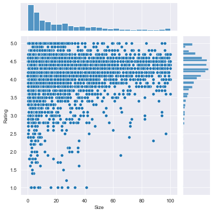
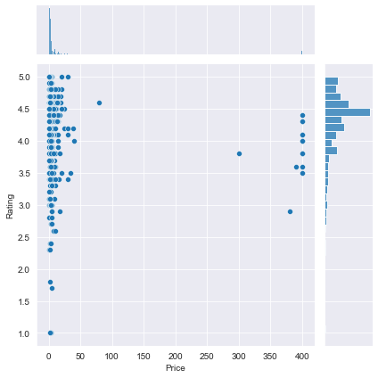
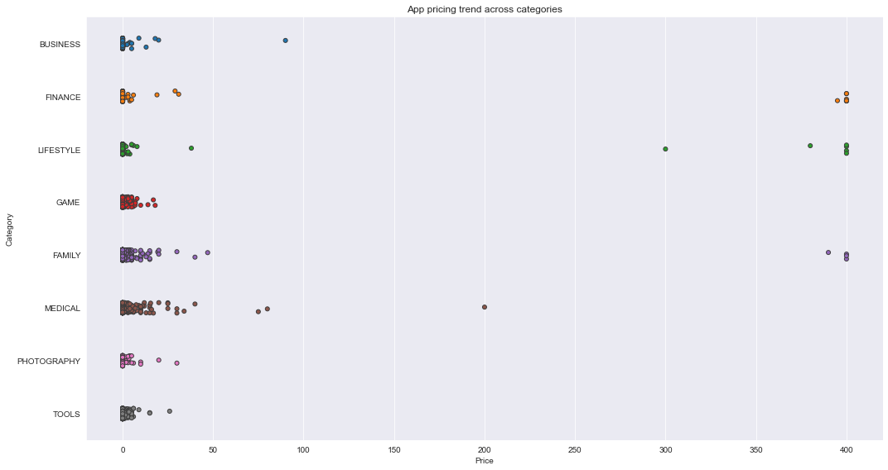
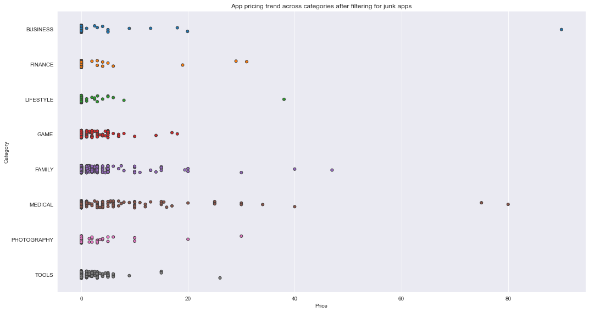

## 1. Google Play Store apps and reviews
<p>Mobile apps are everywhere. They are easy to create and can be lucrative. Because of these two factors, more and more apps are being developed. In this notebook, we will do a comprehensive analysis of the Android app market by comparing over ten thousand apps in Google Play across different categories. We'll look for insights in the data to devise strategies to drive growth and retention.</p>
<p></p>
<p>Let's take a look at the data, which consists of two files:</p>
<ul>
<li><code>apps.csv</code>: contains all the details of the applications on Google Play. There are 13 features that describe a given app.</li>
<li><code>user_reviews.csv</code>: contains 100 reviews for each app, <a href="https://www.androidpolice.com/2019/01/21/google-play-stores-redesigned-ratings-and-reviews-section-lets-you-easily-filter-by-star-rating/">most helpful first</a>. The text in each review has been pre-processed and attributed with three new features: Sentiment (Positive, Negative or Neutral), Sentiment Polarity and Sentiment Subjectivity.</li>
</ul>


```python
# Read in dataset
import pandas as pd
apps_with_duplicates = pd.read_csv('datasets/apps.csv')

# Drop duplicates from apps_with_duplicates
apps = apps_with_duplicates.drop_duplicates()
# Print the total number of apps
print('Total number of apps in the dataset = ', len(apps))

# Have a look at a random sample of 5 rows
n = 5
print(apps.sample(n))
```

    Total number of apps in the dataset =  9659
          Unnamed: 0                           App       Category  Rating  \
    5774        6805               Vip视频免费看-BT磁力搜索          TOOLS     NaN   
    3322        4192  Deaf - Hearing chat device H  COMMUNICATION     4.4   
    3626        4532                 R Programming         FAMILY     NaN   
    6340        7387                       CI Time   PRODUCTIVITY     NaN   
    4296        5250                      Aj.Petra  COMMUNICATION     NaN   
    
          Reviews  Size Installs  Type  Price Content Rating         Genres  \
    5774       20   7.9   1,000+  Free      0       Everyone          Tools   
    3322        9   0.1     500+  Paid  $3.99       Everyone  Communication   
    3626        2   5.9   1,000+  Free      0       Everyone      Education   
    6340        4   2.5     100+  Free      0       Everyone   Productivity   
    4296        5  14.0     100+  Free      0       Everyone  Communication   
    
                Last Updated Current Ver   Android Ver  
    5774        June 8, 2018         1.2    4.0 and up  
    3322    February 8, 2017         3.6    2.2 and up  
    3626   November 21, 2017           1  4.0.3 and up  
    6340      March 17, 2017     1.2.392    4.0 and up  
    4296  September 29, 2017       1.0.1    4.1 and up  


## 2. Data cleaning
<p>Data cleaning is one of the most essential subtask any data science project. Although it can be a very tedious process, it's worth should never be undermined.</p>
<p>By looking at a random sample of the dataset rows (from the above task), we observe that some entries in the columns like <code>Installs</code> and <code>Price</code> have a few special characters (<code>+</code> <code>,</code> <code>$</code>) due to the way the numbers have been represented. This prevents the columns from being purely numeric, making it difficult to use them in subsequent future mathematical calculations. Ideally, as their names suggest, we would want these columns to contain only digits from [0-9].</p>
<p>Hence, we now proceed to clean our data. Specifically, the special characters <code>,</code> and <code>+</code> present in <code>Installs</code> column and <code>$</code> present in <code>Price</code> column need to be removed.</p>
<p>It is also always a good practice to print a summary of your dataframe after completing data cleaning. We will use the <code>info()</code> method to acheive this.</p>


```python
# List of characters to remove
chars_to_remove = ['$', '+', ',']
# List of column names to clean
cols_to_clean = ['Price', 'Installs']

# Loop for each column in cols_to_clean
for col in cols_to_clean:
    # Loop for each char in chars_to_remove
    for char in chars_to_remove:
        # Replace the character with an empty string
        apps[col] = apps[col].apply(lambda x: x.replace(char, ''))
        
# Print a summary of the apps dataframe
print(apps.info())
```

    <class 'pandas.core.frame.DataFrame'>
    Int64Index: 9659 entries, 0 to 9658
    Data columns (total 14 columns):
    Unnamed: 0        9659 non-null int64
    App               9659 non-null object
    Category          9659 non-null object
    Rating            8196 non-null float64
    Reviews           9659 non-null int64
    Size              8432 non-null float64
    Installs          9659 non-null object
    Type              9659 non-null object
    Price             9659 non-null object
    Content Rating    9659 non-null object
    Genres            9659 non-null object
    Last Updated      9659 non-null object
    Current Ver       9651 non-null object
    Android Ver       9657 non-null object
    dtypes: float64(2), int64(2), object(10)
    memory usage: 1.1+ MB
    None


## 3. Correcting data types
<p>From the previous task we noticed that <code>Installs</code> and <code>Price</code> were categorized as <code>object</code> data type (and not <code>int</code> or <code>float</code>) as we would like. This is because these two columns originally had mixed input types: digits and special characters. To know more about Pandas data types, read <a href="https://datacarpentry.org/python-ecology-lesson/04-data-types-and-format/">this</a>.</p>
<p>The four features that we will be working with most frequently henceforth are <code>Installs</code>, <code>Size</code>, <code>Rating</code> and <code>Price</code>. While <code>Size</code> and <code>Rating</code> are both <code>float</code> (i.e. purely numerical data types), we still need to work on <code>Installs</code> and <code>Price</code> to make them numeric.</p>


```python
import numpy as np

# Convert Installs to float data type
apps['Installs'] = apps['Installs'].astype(float)

# Convert Price to float data type
apps['Price'] = apps['Price'].astype(float)

# Checking dtypes of the apps dataframe
print(apps.dtypes)
```

    Unnamed: 0          int64
    App                object
    Category           object
    Rating            float64
    Reviews             int64
    Size              float64
    Installs          float64
    Type               object
    Price             float64
    Content Rating     object
    Genres             object
    Last Updated       object
    Current Ver        object
    Android Ver        object
    dtype: object


## 4. Exploring app categories
<p>With more than 1 billion active users in 190 countries around the world, Google Play continues to be an important distribution platform to build a global audience. For businesses to get their apps in front of users, it's important to make them more quickly and easily discoverable on Google Play. To improve the overall search experience, Google has introduced the concept of grouping apps into categories.</p>
<p>This brings us to the following questions:</p>
<ul>
<li>Which category has the highest share of (active) apps in the market? </li>
<li>Is any specific category dominating the market?</li>
<li>Which categories have the fewest number of apps?</li>
</ul>
<p>We will see that there are <code>33</code> unique app categories present in our dataset. <em>Family</em> and <em>Game</em> apps have the highest market prevalence. Interestingly, <em>Tools</em>, <em>Business</em> and <em>Medical</em> apps are also at the top.</p>


```python
import plotly
plotly.offline.init_notebook_mode(connected=True)
import plotly.graph_objs as go

# Print the total number of unique categories
num_categories = len(set(apps['Category']))
print('Number of categories = ', num_categories)

# Count the number of apps in each 'Category'. 
num_apps_in_category = apps['Category'].value_counts(sort=True, ascending=False)

# Sort num_apps_in_category in descending order based on the count of apps in each category
sorted_num_apps_in_category = num_apps_in_category.sort_values(ascending=False)

data = [go.Bar(
        x = num_apps_in_category.index, # index = category name
        y = num_apps_in_category.values, # value = count
)]

plotly.offline.iplot(data)
```


<script type="text/javascript">window.PlotlyConfig = {MathJaxConfig: 'local'};</script><script type="text/javascript">if (window.MathJax) {MathJax.Hub.Config({SVG: {font: "STIX-Web"}});}</script><script>requirejs.config({paths: { 'plotly': ['https://cdn.plot.ly/plotly-latest.min']},});if(!window._Plotly) {require(['plotly'],function(plotly) {window._Plotly=plotly;});}</script>


    Number of categories =  33


<div id="a6ce36a9-11f3-4a4e-8197-9afbbea04c84" style="height: 525px; width: 100%;" class="plotly-graph-div"></div><script type="text/javascript">require(["plotly"], function(Plotly) { window.PLOTLYENV=window.PLOTLYENV || {};window.PLOTLYENV.BASE_URL="https://plot.ly";Plotly.newPlot("a6ce36a9-11f3-4a4e-8197-9afbbea04c84", [{"x": ["FAMILY", "GAME", "TOOLS", "BUSINESS", "MEDICAL", "PERSONALIZATION", "PRODUCTIVITY", "LIFESTYLE", "FINANCE", "SPORTS", "COMMUNICATION", "HEALTH_AND_FITNESS", "PHOTOGRAPHY", "NEWS_AND_MAGAZINES", "SOCIAL", "BOOKS_AND_REFERENCE", "TRAVEL_AND_LOCAL", "SHOPPING", "DATING", "VIDEO_PLAYERS", "MAPS_AND_NAVIGATION", "EDUCATION", "FOOD_AND_DRINK", "ENTERTAINMENT", "AUTO_AND_VEHICLES", "LIBRARIES_AND_DEMO", "WEATHER", "HOUSE_AND_HOME", "ART_AND_DESIGN", "EVENTS", "PARENTING", "COMICS", "BEAUTY"], "y": [1832, 959, 827, 420, 395, 376, 374, 369, 345, 325, 315, 288, 281, 254, 239, 222, 219, 202, 171, 163, 131, 119, 112, 102, 85, 84, 79, 74, 64, 64, 60, 56, 53], "type": "bar", "uid": "f38c17c9-b8ce-4144-a67f-2bef8445f8c7"}], {}, {"showLink": true, "linkText": "Export to plot.ly", "plotlyServerURL": "https://plot.ly"})});</script><script type="text/javascript">window.addEventListener("resize", function(){window._Plotly.Plots.resize(document.getElementById("a6ce36a9-11f3-4a4e-8197-9afbbea04c84"));});</script>


## 5. Distribution of app ratings
<p>After having witnessed the market share for each category of apps, let's see how all these apps perform on an average. App ratings (on a scale of 1 to 5) impact the discoverability, conversion of apps as well as the company's overall brand image. Ratings are a key performance indicator of an app.</p>
<p>From our research, we found that the average volume of ratings across all app categories is <code>4.17</code>. The histogram plot is skewed to the left indicating that the majority of the apps are highly rated with only a few exceptions in the low-rated apps.</p>


```python
# Average rating of apps
avg_app_rating = apps['Rating'].mean()
print('Average app rating = ', avg_app_rating)

# Distribution of apps according to their ratings
data = [go.Histogram(
        x = apps['Rating']
)]

# Vertical dashed line to indicate the average app rating
layout = {'shapes': [{
              'type' :'line',
              'x0': avg_app_rating,
              'y0': 0,
              'x1': avg_app_rating,
              'y1': 1000,
              'line': { 'dash': 'dashdot'}
          }]
          }

plotly.offline.iplot({'data': data, 'layout': layout})
```

    Average app rating =  4.173243045387994


<div id="9fee0ded-4505-4bbe-a946-524f57ac5c74" style="height: 525px; width: 100%;" class="plotly-graph-div"></div><script type="text/javascript">require(["plotly"], function(Plotly) { window.PLOTLYENV=window.PLOTLYENV || {};window.PLOTLYENV.BASE_URL="https://plot.ly";Plotly.newPlot("9fee0ded-4505-4bbe-a946-524f57ac5c74", [{"x": [4.1, 3.9, 4.7, 4.5, 4.3, 4.4, 3.8, 4.1, 4.4, 4.7, 4.4, 4.4, 4.2, 4.6, 4.4, 3.2, 4.7, 4.5, 4.3, 4.6, 4.0, 4.1, 4.7, null, 4.7, 4.8, 4.7, 4.1, 3.9, 4.1, 4.2, 4.1, 4.5, 4.2, 4.7, 3.8, 4.7, 4.1, 4.7, 4.0, 4.2, 4.5, 4.4, 3.8, 4.2, 4.7, 4.6, 4.2, 4.3, 4.2, 4.0, 3.8, 4.6, 3.9, 4.3, 4.9, 4.4, 4.2, 4.0, 3.9, 4.6, 4.9, 4.3, 4.6, 4.9, 3.9, 4.0, 4.3, 3.9, 4.2, 4.8, 3.6, 4.2, 4.8, 4.8, 4.6, 4.5, 4.3, 4.5, 4.9, 3.9, 4.4, 4.0, 4.3, 3.7, 4.4, 4.3, 3.2, 4.6, 4.6, 4.5, 3.7, 4.6, 4.6, 4.6, 4.0, 4.4, 4.0, 4.7, 4.9, 4.7, 3.9, 3.9, 4.2, 4.6, 4.3, 4.7, 4.7, 4.8, 4.2, 4.3, 4.5, 4.1, null, 4.2, 4.5, 4.4, 4.0, 4.1, 4.1, 4.4, 4.6, 4.5, null, 3.9, 4.4, null, 4.6, 3.8, null, null, 4.0, 4.3, 4.5, null, 4.1, 3.7, 4.7, 4.2, 4.6, 4.5, 4.6, 4.4, 4.2, 4.5, 4.5, 4.5, 4.5, 4.4, 4.5, 4.6, 4.8, 3.9, 4.6, 4.2, 4.1, 4.7, 4.2, 4.3, 3.3, 4.6, 4.8, 4.7, null, 4.1, 4.6, 4.1, 4.6, 4.7, 4.5, 3.9, 4.4, 4.3, 4.2, 4.5, 4.4, 3.4, 4.9, 4.6, 4.4, null, 4.4, 4.4, 4.4, 3.5, null, 4.4, 4.1, 4.3, 4.4, 4.3, 4.3, 4.1, 4.4, 4.3, 3.9, 4.8, 4.5, 4.4, 4.0, 4.3, 4.0, 4.2, 4.5, 4.2, 4.2, 4.6, 4.1, 4.6, 3.1, 3.9, 4.3, 4.1, 4.4, 4.1, 4.1, 4.5, 4.4, 4.4, 4.3, 4.4, 4.6, 4.2, 4.4, 4.7, 3.8, 3.9, null, 4.3, 4.4, 4.7, 4.5, 4.2, 4.7, 4.8, 4.2, 4.3, 4.4, 4.1, 3.8, 4.3, 3.8, 3.5, 4.1, 4.6, 4.3, 4.5, 4.1, 4.5, 4.6, 4.0, 4.2, 4.4, 4.0, 4.2, 4.2, 4.1, 3.8, 3.9, 3.9, 4.5, 4.5, 4.6, 4.7, 4.7, 4.8, 3.9, 4.1, 4.4, 4.6, 4.5, 4.7, 4.4, 4.5, 3.9, 3.2, 3.2, 4.1, 4.5, 4.2, 4.2, 3.7, 4.5, 4.6, 4.5, null, 4.7, 4.4, 3.5, 3.3, 4.5, 4.4, 4.2, 5.0, 4.4, 4.7, 4.4, 4.4, 4.6, 4.0, 4.4, 4.3, 4.3, 4.4, 4.3, 4.0, 4.3, 4.3, 4.4, 4.3, 4.3, 4.3, 4.3, 4.3, 4.0, 4.5, 4.3, 3.7, 4.5, 3.9, 4.4, 3.6, 4.4, 4.2, 4.4, 4.1, 4.4, 4.3, 4.2, 4.2, 4.4, 4.4, 3.9, 4.2, 4.4, 4.6, 4.3, 4.3, 4.4, 3.7, 4.3, 3.9, 4.5, 3.7, 4.3, 4.0, 4.1, 4.2, 4.2, 4.1, 4.4, 4.1, 4.3, 4.3, 4.5, 4.3, 4.2, 4.2, 4.5, 4.3, 4.3, 4.3, 4.2, 4.6, 4.2, 4.5, 4.1, 4.2, 4.1, 4.3, 4.1, 4.2, 4.0, 4.2, 4.2, 4.3, 4.4, 4.2, 4.4, 4.2, 4.8, 4.4, 4.4, 4.4, 4.0, 4.5, 4.4, 4.1, 4.2, 4.5, 4.3, 4.5, 4.0, 4.2, 4.5, 4.6, 4.1, 4.0, 4.2, 4.6, 4.1, 4.3, 4.2, 4.3, 4.1, 4.6, 4.2, 2.6, null, null, null, 3.5, 4.0, 4.1, 3.7, 4.1, 4.2, 4.5, 4.4, 4.2, 4.0, 4.1, 3.1, 4.4, 4.2, 4.1, 3.9, 4.3, 4.4, 3.5, 4.0, 3.3, 4.5, 4.4, 4.1, 3.9, 3.9, 3.6, 4.0, 3.6, 3.4, 4.2, 4.1, 3.4, 3.0, 4.6, 4.1, 3.9, 1.9, 3.5, 2.5, 3.9, 3.4, 3.5, 4.4, 3.8, 4.2, 2.5, 2.8, 4.1, 4.2, 3.5, 4.3, 3.3, 4.1, 4.2, 3.5, 4.2, 4.4, 4.1, 4.2, 4.3, 3.0, 4.0, 3.3, 4.1, 3.7, 4.0, 4.0, 4.1, 3.3, 4.4, 4.3, 3.4, 4.0, 3.6, 4.2, 3.5, 4.0, 4.1, 4.4, 4.2, 4.1, 4.2, 3.9, 4.1, 3.9, 4.0, 4.2, 4.5, 3.9, 3.6, 4.4, 3.5, 4.4, 4.8, 4.6, 4.7, 4.8, null, 2.7, 5.0, null, 4.8, 5.0, 4.8, null, 4.9, 3.0, null, null, 4.7, null, null, 1.0, null, null, null, null, null, null, null, 5.0, 4.7, null, 5.0, null, null, null, 5.0, null, null, null, null, 3.0, 4.1, null, null, null, null, null, null, null, 5.0, 3.7, 4.5, 4.2, null, null, null, 4.3, null, 4.4, 3.4, 4.7, 4.8, 4.7, 3.5, 4.7, 3.8, 2.9, null, 4.7, 4.6, 4.7, 4.6, 4.7, null, 4.5, 4.7, 4.8, 4.6, 4.6, 4.6, 4.2, 4.9, 3.8, 4.2, 4.4, 4.4, 4.3, 4.5, 4.4, 4.6, 3.9, 4.4, 4.3, 4.4, 4.2, 4.4, 4.0, 4.2, 3.8, 4.5, 4.7, 4.5, 4.3, 4.2, 4.3, 4.7, 4.7, 4.6, 4.5, 4.4, 4.6, 4.5, 4.5, 4.4, 4.4, 4.2, 4.5, 4.1, 4.0, 4.1, 4.3, 4.3, 4.3, 4.6, 4.1, 4.6, 4.7, 4.7, 4.3, 4.7, 4.6, 4.6, 4.6, 4.3, 4.2, 4.0, 4.5, 4.2, 4.1, 4.4, 4.0, 4.5, 4.4, 4.0, 4.2, 4.3, 4.2, 4.5, 4.2, 4.6, 4.2, 4.7, 4.4, 4.4, 4.0, 4.6, 4.4, 4.3, 4.1, 4.2, 4.3, 4.3, 4.3, 4.0, 4.2, 4.0, 4.0, 3.8, 4.1, 3.9, 4.1, 4.5, 4.4, 4.0, 4.4, 4.5, 4.3, 4.5, 4.2, 3.5, 4.8, 4.4, 4.1, 4.9, 4.7, 4.7, 4.7, 4.4, 4.0, 4.2, 4.3, 4.5, 3.5, 4.2, 3.1, 4.6, 4.2, 4.3, 4.3, 4.1, 3.8, 3.4, 4.3, 4.4, 4.4, 4.0, 3.7, 3.9, 4.5, 4.4, 4.3, 4.2, 4.2, 4.5, 4.7, 4.5, 4.5, 3.4, 4.2, 4.3, 4.2, 4.6, 4.1, 4.2, 4.2, 4.3, 4.4, 3.9, 4.1, 4.3, 4.6, 3.6, 4.3, 4.3, 4.1, 4.1, 4.2, 3.9, 4.2, 3.7, 4.5, 3.7, 3.8, 4.3, 3.0, 4.1, 4.2, 4.1, 3.9, 4.0, 4.4, 4.2, 4.0, 3.9, 4.0, 4.2, 4.0, 4.3, 3.9, 4.5, 4.1, 4.5, 3.6, 3.8, 3.7, 3.8, 3.7, 4.1, 3.7, 3.9, 3.9, 3.9, 4.1, 3.9, 4.2, 4.3, 4.6, 4.3, 4.6, 4.5, 4.6, 3.9, 4.2, 4.4, 4.2, 4.3, 4.6, 4.3, 4.5, 4.0, 4.0, 4.5, 4.5, 4.0, 4.0, 4.2, 4.4, 4.6, null, 4.6, 4.1, 4.6, 4.4, 4.6, 4.9, 4.5, 4.6, 4.7, 4.3, null, null, 4.2, 4.3, 5.0, 4.4, 5.0, 4.5, null, null, null, 4.5, 4.8, 4.4, 5.0, null, 3.7, null, 4.1, null, 4.8, null, null, 4.6, 4.4, 4.4, 3.6, 3.7, 3.8, 4.2, 4.2, 4.2, 3.3, 3.4, 4.3, 4.2, 4.7, 4.1, 4.7, 4.0, 3.6, 4.0, 3.6, 4.3, 4.2, 4.2, 4.1, 4.0, 4.1, 4.4, 4.7, 4.5, 4.3, 4.6, 4.3, 4.0, 4.5, 4.5, 3.6, 4.2, 4.1, 3.5, 4.4, 4.0, 4.5, 4.2, 4.6, 4.2, 4.8, 4.5, 4.2, 4.3, 4.4, 4.4, 4.6, 4.6, 4.6, 4.4, 4.3, 4.2, 4.2, 3.8, 4.5, 4.6, 4.6, 4.7, 4.6, 4.6, 3.8, 4.3, 4.3, 4.5, 4.6, 4.6, 4.7, 4.5, 4.4, 3.9, 4.5, 4.6, 4.1, 4.5, 4.4, 4.5, 4.6, 4.2, 4.4, 4.1, 3.9, 4.5, 3.7, 4.1, 4.4, 4.6, 4.3, 4.3, 4.4, 4.3, 4.4, 4.1, 4.4, 4.2, 4.3, 4.3, 3.9, 4.1, 4.1, 4.2, 4.5, 4.7, 4.4, 4.6, 4.6, 4.3, 4.0, 4.4, 4.6, 4.2, 4.1, 3.6, null, 4.1, 4.6, null, 4.7, 4.7, 4.7, 4.7, 4.1, 3.4, 3.8, 3.7, 4.2, 3.1, 3.5, 4.7, 4.5, 4.2, 4.3, 4.0, 4.5, 4.6, 4.7, 4.1, 4.3, 3.8, 4.4, 4.3, 4.2, 4.3, 3.8, 4.3, 3.7, 4.5, 3.6, 4.8, 3.3, 4.7, 4.6, 4.6, 3.4, 4.6, 4.0, 4.1, 4.5, 4.4, 4.5, 4.0, 4.1, 4.5, 4.6, 4.1, 4.5, 4.6, 4.5, 4.3, 3.6, 4.4, 4.6, 4.1, 4.3, 3.9, 4.1, 4.3, 4.7, 4.6, 4.4, 4.2, 4.5, 4.2, 4.5, 4.5, 4.3, 4.0, 4.8, 4.0, 4.9, 4.8, 4.9, 4.8, 4.4, 3.3, 4.7, 4.6, 4.8, 4.8, 4.8, 4.5, 4.4, 4.5, 4.5, 4.5, 4.8, 3.9, 4.6, 4.5, 4.5, 4.7, 4.7, 4.4, 4.2, 3.9, 4.2, 4.4, 4.6, 4.6, 4.2, 4.5, 4.7, 4.5, 4.5, 3.7, 4.5, 4.6, 4.6, 4.7, 4.5, 4.5, 4.6, 4.0, 4.3, 4.4, 4.5, 4.2, 4.6, 4.9, 4.5, 4.6, 4.5, 4.6, 4.6, 4.5, 4.5, 4.4, 3.9, 4.6, 4.4, 4.5, 4.5, 4.4, 4.4, 4.4, 4.2, 4.5, 4.5, 4.4, 4.3, 4.6, 4.6, 4.9, 4.4, 4.3, 4.1, 4.6, 4.8, 4.5, 4.7, 4.6, 4.3, 4.6, 4.3, 4.6, 4.6, 4.5, 4.6, 4.6, 4.5, 4.1, 4.5, 4.6, 4.5, 4.8, 4.8, 4.5, 4.1, 4.4, 4.2, 4.5, 4.3, 4.6, 4.0, 4.6, 4.6, 4.4, 4.7, 4.4, 4.4, 4.4, 4.5, 4.0, 4.6, 4.1, 4.0, 4.4, 4.4, 4.1, 3.5, 4.3, 4.5, 4.2, 4.5, 4.1, 4.5, 3.7, 4.3, 4.5, 4.6, 4.7, 4.6, 4.0, 4.4, 4.8, 4.2, 4.1, 4.4, 4.3, 4.5, 4.8, 4.2, 4.5, 4.1, 4.1, 4.0, 4.3, 4.5, null, 4.6, 3.7, 3.7, 4.2, 4.5, 4.3, 3.9, 4.6, 4.3, 4.4, 4.6, 4.5, 3.8, null, 4.4, 4.7, 3.4, 4.3, 4.3, 4.0, 4.0, 3.8, null, 4.3, 3.6, 3.8, 4.5, 4.6, null, 4.5, 4.7, 4.3, 3.7, null, 4.2, 3.4, 3.9, 4.0, 4.0, 4.0, 4.0, 4.1, 3.9, 4.4, 4.4, 4.3, 4.1, 3.9, 4.4, 4.6, null, 4.1, null, null, 3.8, 4.6, 3.5, 4.7, 4.3, 4.5, 4.4, 3.4, 4.3, null, 4.3, 4.6, 4.6, null, 4.2, null, null, 4.6, null, null, 4.4, 3.9, 4.5, 3.8, 4.3, 3.7, 5.0, 3.2, 4.5, 4.7, 4.0, null, 4.1, 3.8, 4.7, 4.5, null, 4.2, null, 4.1, 3.1, 4.1, 4.1, 4.3, 4.0, 4.6, 4.4, 4.4, 4.3, 4.6, 3.2, 4.5, 4.6, 4.6, 4.3, 3.0, 4.4, 4.4, 4.3, 3.5, 4.3, 4.5, 3.7, 4.5, 4.2, 4.3, 4.6, 4.5, 3.9, 4.3, 3.3, 4.7, 4.2, 3.2, 4.4, 3.5, 3.7, 3.8, 3.8, 3.7, 4.6, 4.0, 3.6, 3.8, 4.1, 4.7, 3.9, 4.1, 4.6, 4.2, 4.6, 4.2, 4.4, 4.6, 4.1, 3.9, 4.0, 4.1, 4.1, 4.1, 4.1, 4.4, 4.3, 4.4, 4.2, 4.4, 4.3, 4.1, 4.0, 4.2, 4.1, 3.9, 4.4, 4.6, 4.5, 4.5, 4.8, 4.4, 4.5, 4.5, 4.6, 4.5, 4.5, 4.5, 4.4, 4.7, 4.5, 4.2, 4.4, 4.6, 4.3, 4.3, 4.2, 4.6, 4.4, 4.4, 4.5, 4.4, 4.3, 4.6, 4.3, 4.2, 4.2, 4.5, 4.5, 4.5, 4.7, 4.7, 4.5, 4.4, 4.3, 3.8, 4.6, 4.6, 4.4, 4.3, 4.1, 4.3, 4.4, 4.6, 4.3, 4.4, 4.7, 4.5, 4.4, 4.6, 4.5, 4.4, 4.6, 4.5, 4.7, 4.6, 4.7, 4.5, 4.8, 4.5, 4.7, 4.5, 4.3, 4.5, 4.5, 4.6, 4.7, 4.6, 4.4, 4.5, 4.6, 4.5, 4.5, 4.4, 4.2, 4.5, 4.7, 4.1, 4.4, 4.2, 4.4, 4.7, 4.3, 4.7, 4.2, 4.3, 4.4, 4.1, 4.1, 4.2, 4.7, 4.6, 4.5, 3.1, 4.1, 3.4, 4.4, 4.3, 4.6, 4.4, 4.3, 4.6, 4.2, 4.5, 4.2, 4.5, 4.4, 4.6, 4.5, 4.3, 4.6, 4.4, 4.4, 4.5, 4.6, 4.6, 4.6, 4.1, 4.5, 4.6, 4.4, 4.7, 4.6, 4.3, 4.5, 4.6, 4.2, 4.5, 4.8, 4.1, 4.3, 4.4, 4.0, 4.2, 4.0, 4.2, 4.5, 4.7, 4.2, 4.4, 4.6, 4.9, 4.4, 4.5, 4.6, 4.2, 4.5, 4.6, 4.6, 4.6, 4.3, 4.6, 4.3, 4.3, 4.6, 4.5, 4.2, 4.7, 4.3, 4.0, 4.4, 4.3, 4.6, 4.7, 4.4, 4.4, 4.3, 4.2, 4.5, 4.5, 4.5, 4.6, 4.3, 4.5, 4.4, 4.6, 4.5, 4.5, 4.6, 4.6, 4.3, 4.5, 4.7, 4.5, 4.7, 4.7, 4.6, 4.4, 4.3, 4.5, 4.3, 4.4, 4.2, 4.4, 4.7, 4.2, 4.1, 4.5, 4.5, 4.5, 4.1, 4.3, 4.5, 4.4, 4.5, 4.6, 4.0, 4.3, 4.5, 4.6, 4.5, 4.5, 4.4, 4.7, 4.4, 4.4, 4.6, 4.2, 4.6, 4.6, 4.6, 4.3, 4.6, 4.4, 4.3, 4.7, 4.4, 4.4, 4.5, 4.6, 4.5, 4.3, 4.7, 4.5, 4.5, 4.4, 4.3, 4.6, 4.2, 4.5, 4.3, 4.5, 4.4, 4.4, 4.8, 4.4, 4.3, 4.6, 4.5, 4.5, 4.5, 4.0, 4.6, 4.5, 4.5, 4.4, 4.5, 4.5, 4.2, 4.3, 4.5, 4.2, 4.3, 4.4, 4.6, 4.5, 4.2, 4.5, 4.6, 4.6, 4.1, 4.5, 4.6, 4.6, 4.5, 4.3, 3.8, 4.5, 4.1, 4.8, 3.9, 4.5, 4.4, 4.3, 4.2, 3.0, 4.1, 4.5, 4.6, 4.3, 4.3, 4.5, 4.2, 4.2, 4.4, 4.5, 4.1, 4.2, 4.1, 4.7, 4.3, 4.4, 4.4, 4.3, 4.3, 4.2, 4.2, 4.3, 4.3, 4.1, 4.2, 4.5, 4.3, 4.5, 4.1, 4.2, 4.4, 4.0, 4.1, 4.4, 4.1, 4.0, 4.3, 4.6, 4.3, 4.7, 4.3, 4.4, 4.2, 4.7, 3.9, 4.1, 4.1, 4.1, 4.2, 4.4, 4.3, 4.5, 4.3, 4.3, 4.1, 4.1, 4.1, 4.6, 4.1, 4.4, 4.4, 4.3, 4.0, 4.8, 3.8, 4.7, 4.5, 4.8, 4.4, 4.8, 4.2, 4.2, 4.0, 4.7, 4.7, 3.9, 4.5, 4.1, 4.4, 3.9, 4.4, 3.6, 4.4, 4.1, 3.6, 4.6, 4.3, 4.5, 4.4, 4.1, 3.9, 4.1, 3.9, 4.2, 3.8, 4.3, 3.9, 4.0, 4.0, 4.0, 4.3, 4.3, 4.2, 4.3, 4.2, 4.6, 4.1, 4.5, 4.5, 4.3, 4.2, 4.4, 4.6, 4.5, 4.8, 4.5, 3.2, 4.6, 4.5, 4.1, 4.6, 4.5, 4.4, 4.4, 4.4, 3.8, 4.6, 2.5, 4.0, 5.0, 4.3, 3.4, null, 3.4, 4.3, 4.4, 4.4, 4.2, 5.0, 4.1, 3.9, 4.6, 4.2, 4.4, 4.2, 3.6, 4.5, null, 4.7, 4.6, 4.5, 4.2, 4.2, 4.3, 4.4, 4.1, 4.4, 4.6, 4.4, 4.2, 4.5, null, 2.6, 4.6, 4.8, 4.2, 4.7, 3.0, 3.5, 4.6, 4.8, 4.2, 4.6, 4.4, 4.8, 4.0, 3.7, 4.2, 4.8, 4.7, 3.5, 3.9, 4.2, 4.8, 2.7, 4.2, 4.7, 4.6, 4.5, 4.7, 4.7, 4.5, 4.7, 4.0, 3.4, 3.5, 3.0, 4.7, 4.6, 4.2, 4.8, 4.5, 4.2, 3.8, 3.0, 4.4, 4.5, 4.0, 3.6, 4.4, 4.7, 3.6, 4.5, 4.1, 4.6, 4.7, 4.7, 2.8, 4.3, 4.6, 4.3, 3.4, null, 4.0, 4.8, 4.2, 3.0, 4.5, 3.7, 4.5, 4.5, 3.6, 4.4, 4.4, 4.5, 4.1, 4.6, 4.3, 4.3, 4.7, 4.5, 4.2, 4.4, 3.9, 4.2, 4.1, null, 4.1, 3.5, 4.2, 4.0, 4.3, 4.3, 2.3, 4.5, 4.3, 3.1, 4.4, 2.9, 3.1, 3.7, 4.0, 3.8, 4.4, 4.3, null, null, null, null, 3.7, 5.0, 3.0, 3.7, null, null, null, null, null, null, null, null, null, null, null, null, null, null, 3.7, 5.0, null, null, 5.0, null, 5.0, null, 5.0, null, 5.0, 5.0, null, 5.0, 5.0, 5.0, null, null, null, 4.3, 4.9, null, null, null, null, null, null, null, 5.0, null, null, 4.9, 4.6, 5.0, null, null, null, null, 4.0, null, 5.0, null, 2.6, 4.3, 4.7, 2.5, 4.5, 4.3, 4.4, null, null, 4.5, 3.8, 4.0, 4.5, 3.7, 4.3, 4.4, 3.8, 4.3, 3.8, 5.0, 3.6, 4.0, 4.3, 4.7, 5.0, 4.7, 4.6, 3.1, 4.4, 5.0, 3.6, 2.8, 4.4, 4.6, 4.2, null, 3.8, 3.5, 4.1, 4.5, 4.3, 4.4, 4.4, 4.2, 4.0, 4.3, 4.6, 4.4, 4.2, 4.4, 4.4, 4.3, 4.6, 4.4, 4.5, 4.6, 4.6, 4.6, 4.4, 4.5, 4.5, 4.3, 4.4, 4.6, 4.3, 4.8, 4.2, 4.6, 4.0, 4.6, 4.3, 3.6, 4.0, 4.5, 4.4, 4.5, 4.2, 4.5, 4.3, 4.2, 4.2, 4.3, 4.3, 4.1, 4.5, 4.3, 4.2, 4.1, 4.3, 4.2, 4.1, 4.1, 3.7, 3.9, 3.7, 3.6, 4.1, 4.1, 4.1, 4.3, 4.3, 4.2, 4.5, 4.1, 3.8, 4.4, 4.0, 4.2, 4.0, 4.4, 4.0, 4.4, 4.1, 4.3, 4.0, 4.4, 4.2, 4.0, 4.5, 4.6, 4.3, 4.2, 4.3, 4.6, 4.4, 4.4, 4.5, 4.3, 4.2, 4.2, 4.4, 4.6, 4.2, 3.6, 4.5, 4.4, 3.8, 4.7, 3.6, 4.2, 3.6, 4.3, 4.4, 4.5, 4.1, 4.3, 4.3, 4.7, 4.3, 4.2, 4.2, 4.3, 4.2, 4.3, 4.6, 4.4, 4.3, 3.8, 4.6, 4.5, 4.1, 4.4, 4.3, 3.8, 4.0, 3.3, 4.1, 4.1, 4.2, 4.1, 4.4, 4.1, 4.2, 4.5, 4.3, 4.1, 4.5, 4.4, 4.6, 4.5, 4.6, 4.7, 4.3, 4.4, 4.4, 4.7, 4.1, 4.2, 4.5, 4.2, 4.3, 4.1, 4.6, 4.2, 4.2, 4.2, 4.2, 4.0, 4.4, 4.0, 4.5, 3.9, 4.5, 4.2, 4.3, 4.4, 4.5, 4.6, 4.3, 4.7, 4.4, 4.0, 4.5, 4.1, 4.4, 4.5, 4.4, 4.3, 3.8, 4.5, 4.1, 4.6, 4.8, 4.0, 4.7, 4.7, 4.1, 4.5, 3.6, 4.5, 4.7, 4.7, 4.5, 4.2, 4.5, 4.4, 4.5, 4.5, 4.4, 3.7, 4.3, 4.5, 4.4, 3.3, 4.3, 4.4, 4.5, 4.4, 4.2, 4.5, 4.7, 4.5, 4.6, 4.6, 4.4, 4.3, 4.3, 4.6, 4.4, 4.5, 4.5, 4.2, 4.0, 4.4, 4.7, 4.3, 4.6, 4.4, 4.5, 4.3, 4.3, 4.4, 4.4, 4.6, 4.3, 4.2, 4.3, 3.9, 4.3, 4.4, 4.2, 4.3, 4.3, 4.3, 4.1, 4.4, 4.3, 4.0, 4.0, 4.0, 4.4, 4.3, 4.1, 4.2, 3.9, 4.4, 4.4, 4.1, 4.0, 4.3, 4.2, 4.0, 4.1, 4.1, 4.0, 4.3, 4.5, 4.0, 4.4, 4.1, 4.3, 4.3, 4.2, 4.3, 4.4, 3.8, 4.4, 4.4, 4.6, 4.0, 4.2, 4.6, 4.1, 4.2, 4.6, 4.6, 4.4, 4.7, 4.4, 4.3, 4.5, 4.2, 3.8, 4.4, 4.6, 4.2, 4.5, 4.5, 4.2, 4.1, 4.3, 4.0, 4.3, 4.5, 4.2, 4.3, 4.4, 4.2, 4.1, 4.4, 4.7, 4.6, 4.2, 4.3, 4.3, 4.5, 4.6, 4.5, 4.4, 4.7, 4.2, 4.3, 4.2, 3.9, 3.9, 4.2, 4.3, 4.6, 4.3, 4.0, 4.0, 4.0, 4.6, 4.3, 4.2, 4.3, 4.4, 4.0, 4.6, 4.7, 4.3, 4.0, 4.5, 4.7, 4.4, 4.8, 3.3, 4.3, 3.9, 4.4, 3.9, 4.4, 4.4, 4.1, 4.0, 3.1, 2.9, 4.0, 4.5, 4.3, 4.1, 4.3, 4.5, 4.6, 4.4, 4.2, 4.3, 3.4, 4.6, 4.2, 4.0, 4.1, 4.0, 4.6, 4.5, 4.4, 3.5, 4.0, 4.8, 4.1, 4.6, 4.3, 4.6, 4.5, 4.3, 4.5, 4.0, 4.6, 4.1, 3.5, 4.5, 3.9, 4.6, 4.6, 4.5, 4.5, 4.4, 4.0, 4.2, 4.2, 4.5, 4.1, 4.2, 4.4, 4.4, 4.1, 4.3, 4.5, 4.5, 4.4, 4.5, 4.7, 4.4, 4.1, 4.4, 4.4, 4.3, 4.0, 4.7, 4.3, 4.6, 3.9, 3.6, 4.0, 4.1, 4.2, 3.9, 4.3, 3.1, 3.7, 3.4, 4.4, 3.6, 3.3, 3.7, 3.0, 3.6, 4.8, 3.9, 3.8, 4.3, 4.5, 3.4, 3.7, 4.4, 4.1, 4.5, 4.0, 3.9, 4.4, 4.8, 4.3, 3.7, 4.2, 3.5, 4.3, 4.7, 4.3, 4.1, 3.1, 4.3, 4.1, 4.2, 4.3, 4.3, 4.3, 4.6, 4.4, 4.2, 4.2, 4.4, 4.4, 4.4, 4.4, 4.4, 3.7, 4.4, 3.6, 4.4, 4.0, 4.1, 4.4, 4.4, 4.3, 4.2, 4.3, 4.3, 4.2, 4.4, 4.1, 4.6, 4.4, 4.1, 4.5, 4.5, 4.2, 4.2, 4.2, 4.5, 4.7, 4.0, 4.2, 4.1, 4.4, 4.4, 4.2, 4.2, 4.1, 4.5, 4.6, 4.1, 4.2, 4.1, 4.0, 4.6, 3.1, 4.6, 4.5, 3.2, 4.3, null, 4.6, 4.4, 4.6, 4.5, 4.6, null, 4.4, 4.2, 4.4, 3.1, 3.6, 4.1, 4.2, 3.5, 3.9, 3.0, 3.9, 4.5, 3.4, 4.4, 3.4, 4.3, 3.7, 3.5, 3.8, 3.6, 3.1, 3.8, 4.2, 4.0, 4.3, 4.3, 4.5, 4.5, 4.5, 4.4, 4.4, 4.3, 4.2, 4.7, 4.4, 4.3, 4.4, 4.3, 4.5, 4.7, 4.5, 4.6, 4.7, 4.6, 4.8, 3.9, 4.5, 4.6, 4.5, 4.4, 4.5, 4.0, 4.3, 4.0, 4.4, 4.1, 4.3, 4.1, 4.3, 4.2, 4.2, 4.2, 4.2, 4.3, 4.5, 4.4, 4.5, 4.1, 4.4, 4.5, 4.3, 4.4, 4.1, 4.4, 4.2, 4.1, 4.6, 4.5, 4.3, 4.1, 4.1, 4.2, 4.1, 4.6, 4.5, 4.0, 3.5, 4.4, 4.4, 4.4, 4.1, 4.2, 4.6, 4.4, 4.6, 4.6, 4.5, 4.7, 4.4, 4.5, 4.6, 4.6, 4.0, 4.6, 4.5, 4.7, 4.7, 4.4, 4.3, 4.7, 4.1, 4.7, 4.4, 4.6, 4.5, 4.4, 4.4, 4.3, 4.3, 4.6, 4.7, 4.3, 4.5, 4.6, 4.4, 4.5, 4.7, 4.3, 3.7, 4.7, 4.5, 4.4, 4.3, 4.8, 4.6, 4.1, 4.7, 4.1, 4.2, 4.3, 4.2, 4.0, 4.2, 3.9, 4.3, 4.1, 4.2, 4.4, 4.3, 4.3, 4.4, 4.3, 4.1, 4.2, 4.1, 4.1, 4.2, 4.1, 4.4, 4.1, 4.3, 4.6, 4.1, 4.6, 4.2, 4.1, 4.2, 4.5, 4.3, 4.2, 4.0, 4.2, 4.2, 4.4, 4.4, 4.3, 4.3, 4.6, 4.5, 4.1, 4.3, 4.4, 4.2, 4.2, 4.1, 4.5, 4.7, 4.3, 4.4, 4.4, 3.8, 4.4, 4.3, 4.2, 4.5, 3.2, 4.5, 4.2, 4.4, 4.7, 4.4, 4.0, 4.4, 4.0, 4.6, 4.5, 4.2, 4.0, 4.4, 4.5, 3.9, 4.2, 4.3, 4.2, 4.2, 4.4, 4.7, 4.6, 3.1, 4.4, 4.1, 4.5, 4.6, 4.3, 3.9, 4.5, 4.3, 3.7, 4.5, 4.4, 4.0, 4.0, 4.4, 4.7, 4.6, 4.2, 4.5, 4.6, 4.0, 4.5, 4.4, 4.3, 4.5, 4.5, 4.4, 4.6, 4.3, 4.5, 4.3, 4.1, 4.2, 4.2, 4.6, 4.2, 4.3, 4.3, 4.5, 4.2, 4.6, 4.4, 4.3, 4.6, 4.2, 4.2, 4.2, 4.0, 4.3, 4.6, 4.3, 4.0, 4.2, 4.2, 4.5, 4.2, 4.4, 4.6, 4.3, 4.6, 4.4, 4.6, 4.6, 4.1, 4.4, 4.1, 4.3, 4.1, 4.1, 4.5, 3.9, null, 3.8, null, null, 4.6, 4.7, null, 4.0, null, 4.7, 4.1, 3.7, null, 4.1, 3.7, 4.6, 4.4, 4.6, 4.1, 4.4, 4.7, 4.4, null, 4.8, 4.0, 4.9, null, 4.8, 4.4, 4.7, 4.2, 4.6, 4.6, 4.5, 4.6, 4.1, 3.8, 4.8, 4.8, null, 4.5, 4.0, 4.4, 4.7, null, 3.9, 4.4, 4.4, 4.5, 4.4, 4.8, 4.4, 4.8, 4.5, 4.7, 4.5, 3.5, 4.4, 4.3, 4.4, 4.2, 4.6, 4.4, 4.4, 3.9, 4.3, 4.5, 4.2, 3.7, 4.2, 3.9, 3.6, 4.5, 4.3, 4.3, 4.2, 4.6, 4.5, 4.5, 4.2, 3.9, 4.8, 3.8, 4.5, 4.5, 4.2, 4.0, 4.2, 4.3, 4.3, 4.2, 4.3, 3.6, 3.9, 4.8, 3.9, 3.7, 4.6, 4.4, 4.4, 4.2, 4.1, 3.8, 4.4, 4.5, 4.6, 4.7, 4.3, 4.5, 4.3, 3.7, 3.9, 3.6, 4.5, 4.4, 3.8, 4.6, 4.2, 4.3, 3.8, 4.4, 3.1, 4.6, 4.1, 4.5, 4.0, 4.5, 4.3, null, 3.7, 3.9, 3.5, 3.3, 4.3, 4.4, 4.4, 4.5, 4.4, 4.3, 4.5, 4.3, 4.6, 4.1, 4.2, 3.5, 4.0, 3.8, 4.3, 4.3, 4.1, 4.3, 4.5, 4.4, 4.0, 4.1, 4.6, 4.3, 3.9, 4.5, 4.7, 4.3, 4.5, 3.1, 4.7, 3.8, 4.0, 4.2, 4.0, 4.2, 3.4, 4.6, 4.5, 4.0, 4.4, 4.2, 4.1, 4.4, 4.0, 3.7, 4.6, 4.5, 4.6, 4.5, 3.9, 4.3, 4.4, 4.3, 4.4, 3.6, 4.5, 3.6, 4.1, 4.4, 4.1, 4.2, 4.7, 3.9, 3.9, 4.4, 4.6, 4.0, 4.3, 4.2, 4.3, 4.0, 4.1, 4.6, 4.5, 4.2, 4.3, 4.2, 4.2, 4.0, 4.2, 4.3, 3.9, 4.0, 4.5, 4.1, 4.5, 4.6, 4.2, 4.1, 4.4, 4.4, 4.2, 4.5, 4.2, 4.4, 4.4, 4.0, 4.3, 4.4, 4.2, 4.3, 4.1, 4.4, 4.3, 4.4, 4.2, 4.7, 4.3, 4.5, 3.7, 4.3, 4.2, 4.1, 4.5, 4.8, 4.3, 4.7, 4.3, 4.2, 3.7, 4.6, 4.5, 4.3, 4.5, 4.2, 4.2, 4.3, 4.3, 4.4, 3.7, 4.4, 4.4, 4.2, 3.5, 4.2, 4.2, 4.2, 3.9, 4.3, 3.7, 4.3, 4.3, 4.6, 4.6, 3.9, 4.6, 4.1, 4.8, 4.3, 4.4, 3.3, 4.2, 3.8, 3.7, 4.5, 4.1, 4.4, 3.7, 4.8, 4.3, 4.1, 4.5, 4.4, 4.3, 3.8, 4.5, 3.7, 4.5, 4.6, 4.3, 4.4, 4.3, 4.3, 4.4, 4.2, 4.9, 4.6, 4.6, 3.4, 3.8, 4.7, 4.6, 3.8, 4.4, 3.9, 4.1, 4.5, 3.7, 4.4, 3.8, 3.1, 5.0, 4.4, null, 4.3, 2.9, 3.1, 3.3, 4.1, 4.4, 4.5, 4.3, 4.3, 2.2, 4.2, 4.5, 3.9, 4.1, 3.3, 4.5, 4.1, 4.8, 4.1, 4.5, null, 4.5, 4.3, 4.4, 4.7, 4.4, 4.2, 4.2, 4.5, 4.6, 4.7, 4.8, 4.7, 4.7, 1.7, 4.5, 4.0, 3.6, 2.0, 4.7, 4.1, 4.3, 4.3, 4.5, 4.4, 4.6, 3.7, 4.5, 4.0, 4.8, 4.0, 4.7, 4.8, 4.6, 4.3, 4.2, 4.8, 4.2, 4.2, 4.5, 4.6, 4.5, 4.3, 4.8, 4.2, 4.4, 4.5, 4.2, 4.6, 4.6, 4.5, 4.5, 4.5, 4.4, 4.1, 4.6, 4.5, 4.5, 4.3, 4.3, 3.3, 3.7, 4.5, 4.4, 3.1, 4.0, 3.9, 4.4, 4.8, 3.6, 3.4, 4.7, 4.4, 4.4, 4.5, 4.3, 4.5, 4.0, 4.3, 4.5, 4.0, 4.2, 4.3, 4.6, 4.4, 4.3, 4.2, 4.3, 4.3, 4.6, 3.6, 4.2, 4.2, 4.4, 4.3, 4.9, 4.5, 4.2, 3.8, 4.2, 1.0, 4.4, 4.0, null, 4.4, 4.4, 4.5, null, 3.4, 3.8, null, 3.7, null, 4.1, 4.4, 4.2, 4.5, 4.3, 4.2, 3.6, 4.4, 4.6, 4.5, 4.4, 4.2, 4.3, 1.8, 3.8, 4.4, 3.0, 3.4, 4.6, 3.7, 3.0, 4.6, 3.1, 4.3, 4.3, 3.8, 4.5, 3.6, null, 4.2, 4.5, 4.2, 3.3, 4.3, 4.2, 3.8, 2.9, 4.5, 4.3, 4.9, 4.4, 4.4, 4.4, 2.9, 4.2, 4.0, 4.3, 4.3, 3.9, null, 4.0, 4.6, 3.7, 4.0, 4.6, 4.4, 4.5, 3.0, 3.1, 4.5, 4.5, 4.5, 4.1, 4.6, 4.2, null, 3.9, 3.9, 3.9, 4.2, 3.7, 2.8, 4.1, 4.4, 2.7, 4.7, 4.2, 4.4, 4.0, 4.0, 4.7, 4.3, 4.4, 4.0, 4.3, 4.2, 4.6, 3.3, 2.3, 4.2, 4.1, null, 3.2, 3.5, 4.6, 4.1, 4.1, 4.1, null, 4.7, 3.5, 3.9, null, null, 4.1, 4.7, null, 4.6, 4.5, 4.7, 4.9, null, 4.3, 4.1, 4.4, 4.2, 4.1, 4.6, 4.3, 4.4, 4.5, 4.6, 4.8, 4.3, 4.8, 4.8, 3.7, 4.1, 3.7, 4.2, 4.5, 4.6, null, 4.9, 4.4, 4.6, null, null, 4.0, 4.8, 4.3, 4.4, 4.2, 4.6, null, 4.8, 4.0, 4.3, 4.7, 4.3, 4.0, 4.0, 4.0, 4.1, 4.6, 3.1, 4.9, 4.5, 4.0, 4.0, 3.6, 4.5, 4.2, 4.3, 3.9, 4.3, 4.3, 4.4, 4.3, 4.4, 4.3, 4.4, 3.5, 4.4, 4.4, 4.5, 4.4, 4.4, 3.9, 3.9, 4.3, 4.9, 3.7, 3.3, 3.8, 3.5, 4.2, 3.5, 3.6, 3.9, 4.2, 4.2, 4.0, 3.2, 2.4, 4.5, 4.1, 4.2, 3.7, 4.3, 4.2, 4.1, 3.9, 3.8, 4.4, 3.4, 4.0, 4.4, 3.3, 4.8, 4.5, 3.4, 4.3, 4.3, 4.1, 4.0, 4.4, 3.8, 4.4, 3.8, 4.2, 3.8, 4.8, 4.7, 4.3, 3.5, 3.9, 4.2, 4.6, 4.7, 4.5, 3.8, 4.5, 3.7, 3.5, 4.1, 3.9, 4.1, 4.6, 4.4, 4.6, 4.0, 4.4, 4.4, 4.4, 4.0, 3.8, 3.9, null, 3.7, 4.2, 4.1, 4.3, 4.3, 4.1, 4.4, 3.8, 4.3, 3.8, 4.5, 3.8, 3.9, 4.0, 4.3, 4.4, 4.6, null, 5.0, 4.4, 4.4, 4.2, 4.0, null, 4.2, null, 4.6, 4.1, null, 3.9, 4.6, null, 4.4, 3.9, 4.6, 4.5, 3.0, null, 3.6, 4.4, 4.6, null, 4.3, 5.0, 4.5, 4.1, 4.1, 4.5, null, 4.8, 4.5, null, 4.0, 4.8, 3.7, null, 4.5, 4.7, 2.7, 2.9, 4.2, 4.4, 4.2, 3.4, 2.6, 4.1, 4.3, 4.2, 4.4, null, 4.0, 4.4, 4.1, 4.8, 2.2, 3.8, 3.1, 3.1, 3.8, 3.8, 4.3, 3.6, 4.0, 4.4, 4.6, null, 4.5, 1.8, 4.7, 3.9, 4.4, 3.6, 4.4, 3.9, 3.9, 3.8, null, 4.2, 4.1, 4.4, 4.4, null, null, 5.0, 4.1, 4.5, 4.3, null, 3.9, 3.5, null, 3.2, null, null, null, null, 3.3, 4.8, 4.5, 3.7, 4.8, 4.7, 4.3, 3.8, 4.1, 4.7, null, 4.2, null, null, 4.2, 4.6, 4.6, 4.2, 4.1, 3.5, 4.1, 4.4, 4.5, 4.1, 4.5, 4.3, 4.4, 4.3, 4.3, 3.8, 3.9, 4.1, 4.8, 4.0, 4.3, 4.0, 3.7, 3.3, 4.1, 3.0, 4.1, 3.0, 3.8, 4.0, 4.6, 4.1, 3.6, 4.7, 3.5, 3.1, 3.9, 4.2, 4.4, 4.4, 3.3, 4.8, 4.2, 4.5, 3.8, 4.1, 4.2, 4.2, 4.0, 4.2, 3.8, 4.5, 3.7, 4.3, 4.5, 4.1, 4.2, 4.5, 4.0, 4.3, 4.7, 4.1, 3.2, 3.9, 4.1, 3.4, 3.0, 4.6, 4.6, 4.1, 3.1, 3.4, 4.2, 4.2, 3.0, 2.4, 4.1, 2.9, 4.0, 4.0, 3.8, 2.4, 4.4, 3.7, 4.3, 4.6, 4.2, 4.8, 3.6, 3.2, 4.0, 3.5, 4.4, 2.5, 3.9, 4.4, 4.2, 4.2, 4.3, 4.1, 4.2, 4.2, 3.9, 3.9, 3.8, 4.5, 4.2, 3.7, 4.3, 4.6, 3.3, 3.6, 4.1, 3.8, 3.3, 4.5, 4.8, 4.6, null, 4.3, 4.5, 4.2, 3.8, 4.7, 4.2, 4.3, 4.7, 4.7, 3.6, 4.2, 4.0, 4.3, 4.7, 4.6, 4.8, 3.8, 4.2, 3.2, 4.3, 4.3, 4.4, 1.9, 2.5, 4.2, 4.3, 4.0, 4.5, 4.8, 4.2, 4.7, 4.4, 4.4, 4.4, 4.6, 4.6, 4.2, 4.0, 4.2, 4.5, 4.7, 4.2, 4.4, 3.2, 4.1, 4.0, 4.7, 4.6, 4.6, 4.7, 4.8, 4.6, 4.2, 4.3, 3.3, 4.7, 4.5, 4.0, 4.5, 4.2, 4.6, 4.2, 4.7, 4.7, 4.2, 4.3, 4.3, null, 4.5, 4.4, 4.5, 4.6, 4.3, 3.8, 4.5, 4.5, 3.9, 4.0, 2.7, 4.5, 4.0, 2.9, 4.6, 4.4, 4.6, 4.4, 4.4, 4.2, 4.8, 4.3, 4.6, 4.6, 4.1, 4.4, 4.5, 4.4, 4.2, 4.5, 4.6, 4.5, 4.6, 4.0, 4.5, 4.2, 3.9, 4.7, 4.5, 4.3, 4.2, 3.9, 4.1, 2.2, 4.2, 4.2, 2.8, 3.9, 4.3, 4.8, 4.3, 4.1, 4.2, 4.4, 4.1, 4.6, 4.3, 4.3, 3.8, 4.8, null, 3.8, 3.9, null, 4.3, 4.3, 4.3, 4.1, 4.2, 4.5, 4.6, 3.8, 4.7, 4.5, 4.7, 4.5, 4.8, 4.6, 4.3, 4.8, 3.4, 4.6, 4.5, 4.4, 4.4, 4.6, 4.2, 4.3, 4.3, 3.8, 3.9, 4.3, 4.8, 4.2, 4.5, 4.8, null, 4.6, 4.2, 4.2, 4.0, null, 4.3, 4.8, 4.1, 4.7, null, 4.8, 4.0, 3.5, 3.8, 3.5, 3.3, 3.7, 3.3, 3.4, 1.8, 1.6, 1.9, 3.6, 3.4, 3.2, 2.5, 4.7, 2.6, 2.8, 3.9, 4.2, 3.9, 4.0, 3.5, 3.1, 3.7, 3.6, 3.4, 4.0, 3.7, 1.7, 2.4, 4.3, 3.3, 4.1, 4.1, 3.4, 3.0, 3.0, 2.2, 3.7, 3.7, 4.8, 3.7, 3.6, 3.7, 4.4, 3.8, 3.7, 3.7, 4.8, 4.2, 4.1, 4.1, 4.3, 3.9, 3.8, 4.0, 4.5, 4.6, 4.1, 4.4, 3.7, 3.9, 3.9, 4.5, 4.5, 4.4, 4.3, 4.5, 4.7, 4.7, 4.1, 3.3, 4.2, 4.1, 3.4, 4.3, 4.9, 4.5, 4.1, 4.4, 4.4, 3.4, 4.1, 4.1, 3.5, 3.8, 4.6, 5.0, 4.2, 3.9, 3.7, 4.3, 1.9, 4.2, 4.2, 4.0, 4.4, 4.2, 4.5, 4.3, 4.4, 4.0, 4.2, 4.3, 4.0, 4.3, 3.9, 4.0, 3.7, 4.1, 3.9, 4.2, 4.4, 4.5, 3.9, 3.9, 4.2, 4.5, 4.1, 4.7, null, 4.4, 4.7, 4.7, 4.0, 3.9, null, 3.8, 3.9, 4.4, 4.5, null, 3.8, 3.5, 4.2, 4.7, 2.0, 4.3, 2.8, 3.9, 3.4, 4.5, 4.7, 2.0, 4.4, null, null, null, 4.7, 3.3, 4.1, null, 4.2, 4.4, null, 3.7, null, 3.9, 5.0, 4.1, 4.8, 4.0, null, 4.1, 3.8, 4.6, null, 4.3, 4.1, 4.1, 4.4, 4.2, 4.1, 4.3, 4.3, 4.0, 4.5, 4.1, 3.8, null, 4.5, null, 4.1, null, 3.9, 3.7, null, 4.5, 4.4, null, 3.4, null, null, null, null, 2.3, 4.7, 3.4, 4.7, null, null, 5.0, null, null, null, null, null, null, null, null, 3.6, 5.0, null, null, 4.3, null, null, null, 5.0, null, null, 4.1, 4.1, 4.5, null, null, 3.4, null, null, null, 2.9, 4.6, 5.0, null, null, null, 3.9, 3.9, 5.0, 4.1, 5.0, 3.0, 4.0, 1.0, null, 4.0, null, null, 4.0, null, 3.8, null, null, null, null, null, null, null, null, 3.5, null, null, null, null, null, 2.6, null, 3.4, null, null, 4.5, 3.4, 3.8, 3.0, 4.4, 4.0, 3.9, 4.6, 3.8, 3.8, 4.0, 3.6, 4.4, 3.1, 4.2, 4.6, 4.0, 5.0, 3.3, 4.1, 3.6, 3.2, 4.4, 4.0, 4.4, 4.5, 4.3, 4.7, 4.4, null, 4.4, 4.4, 3.7, 3.3, null, 3.7, 3.0, 2.6, null, null, 3.5, 3.9, 4.6, 3.8, 4.4, 4.5, 4.5, 4.7, 4.4, null, 5.0, null, null, 2.8, null, 4.6, 2.8, 5.0, 5.0, 2.8, null, 3.8, 4.1, null, 4.8, 5.0, 5.0, null, 4.4, null, null, 5.0, 4.1, null, 4.8, null, null, 4.8, 4.0, null, 5.0, 4.6, null, 5.0, null, null, null, 4.5, 5.0, null, null, null, 4.4, 4.0, null, 3.9, 4.1, 4.8, 4.3, 3.9, 4.5, null, 3.7, 4.3, 4.2, 3.7, 3.8, 4.6, null, null, null, 3.3, 3.0, 3.9, 3.9, null, 4.1, null, 4.6, null, null, null, null, 4.4, 3.8, 4.4, null, 4.9, 3.6, 4.3, 3.6, 4.1, 3.4, 4.5, 4.7, 4.5, 4.4, 4.3, 4.6, 4.2, 4.8, 4.6, 4.8, 4.6, 4.6, 4.6, 4.1, 4.7, 4.7, 4.8, 3.6, 4.7, 4.6, 4.5, 4.7, 4.5, 4.3, 4.5, 4.8, 4.7, 4.7, 4.7, 4.7, 4.7, 4.7, 4.7, 4.6, 4.7, 4.7, 4.6, 3.8, 3.9, 4.0, 3.8, 4.1, 2.9, 3.8, 3.5, 4.2, 4.6, 4.4, 4.4, 4.1, 3.9, 3.6, 4.0, 3.8, 4.3, 4.6, 3.6, 3.9, 4.0, 4.2, 4.2, 4.2, 4.5, 4.7, 3.5, 4.5, 4.6, 4.2, 4.1, 4.5, 4.2, 4.5, 4.4, 3.7, 4.4, 4.3, 4.3, 4.5, 3.8, 4.5, 4.5, 4.4, 4.7, 3.5, 4.9, 4.0, 4.1, 4.2, null, 4.4, 4.1, 4.6, 4.6, 4.7, 4.5, null, 4.4, 4.4, 4.2, 4.4, 4.0, 4.2, 4.2, 4.2, 4.8, 3.7, 3.4, 4.3, 4.3, 4.6, 4.2, 4.6, 4.1, 4.6, 4.3, 4.4, 4.7, 4.2, 3.8, 4.3, 3.7, 4.3, 2.9, 4.3, 4.3, 4.0, 3.3, 4.1, 5.0, 3.9, 4.6, 4.0, 3.6, 4.0, 4.5, null, 2.9, 4.2, 4.5, null, 4.6, 4.7, 4.2, 4.7, 4.7, 3.9, 4.7, 3.7, 4.8, 4.0, 4.6, 4.4, 4.7, 3.6, 4.4, 4.6, 2.9, null, 4.5, 5.0, 3.7, null, 3.7, null, 4.2, 3.0, 5.0, 4.4, 4.7, 4.3, 3.9, null, 4.4, 4.3, null, null, null, null, 4.6, 4.5, 3.9, 4.7, 5.0, 5.0, null, 5.0, null, null, null, 2.7, 4.6, 4.4, 4.1, 3.8, 4.4, 4.6, 4.1, 4.5, 4.2, 4.7, 4.3, 4.3, 4.2, 3.8, 4.0, 4.6, 4.3, 4.3, 4.3, 4.7, 4.4, 3.8, 4.6, 4.6, 4.5, 4.5, 3.8, 4.3, 4.3, 3.7, 3.2, 4.0, 3.8, 4.4, 3.8, 3.4, 2.9, 4.5, 3.7, 3.8, 4.1, 4.1, 3.7, 3.6, null, 3.0, 4.1, 3.8, 4.2, 4.4, 4.5, 3.6, 3.6, 3.7, 3.9, null, 4.2, 4.1, 4.5, 2.8, 2.6, 4.3, 4.4, 4.1, 4.0, 4.3, 3.9, 3.5, 3.7, 4.3, 4.3, 4.1, 4.2, 4.3, 4.3, 4.1, 4.4, 4.4, 4.4, 4.3, 2.4, 4.5, 4.5, 4.5, 4.4, 4.6, 3.4, 3.9, 4.3, 4.4, 4.5, 4.4, 4.0, 4.3, 4.2, 4.0, 4.4, 4.6, 4.0, 4.4, 3.5, 4.6, 4.0, 4.0, 4.1, 4.1, 3.3, 3.9, 4.1, 4.2, 4.0, 4.5, 3.8, 3.5, 4.3, 4.6, 4.7, 3.8, 4.7, 4.8, 3.2, 4.5, 3.9, 3.6, 3.7, 4.4, 4.1, 4.0, 3.1, 4.0, 2.8, 3.7, 2.7, 3.9, 3.6, 4.5, 3.5, 4.0, null, 3.8, 3.6, 4.2, 4.4, 4.0, 4.7, null, null, 4.1, 4.0, null, 4.7, null, null, 3.8, 5.0, 4.4, null, null, 4.0, null, 3.8, 4.1, 4.3, null, 4.5, 4.4, 3.4, 4.1, 4.1, 3.8, 4.3, 4.4, 4.4, 3.3, 3.3, 4.4, 3.7, 3.4, 2.3, 3.3, 2.7, null, 4.6, 3.5, 3.4, 4.3, 4.1, 4.7, 4.4, 3.8, 3.0, 4.4, 4.2, 4.5, 3.5, 4.5, 4.5, null, 4.5, 4.0, 4.8, null, 4.3, 1.7, 4.3, 4.2, null, 4.2, 4.3, null, 4.0, 4.2, 4.6, 4.1, 4.6, 4.1, 4.0, null, 3.3, 4.1, null, null, 4.0, null, null, 4.4, 4.2, 3.8, 3.1, null, 5.0, 4.2, 4.7, 4.4, 4.6, 4.4, 2.9, 2.7, null, 4.6, 4.0, 4.8, 5.0, 3.9, 4.2, 4.1, 4.7, 4.2, 4.2, 3.7, 4.1, 4.1, 3.8, 4.6, null, 4.4, 4.2, 4.4, null, null, 4.6, 5.0, null, 4.5, null, 3.5, null, 3.9, 4.4, 3.0, null, 3.1, 4.4, null, 3.0, null, null, 3.7, null, 3.7, 3.9, 4.8, null, null, 4.6, 4.6, 4.5, 4.3, 5.0, 4.3, null, 4.7, 4.0, 3.8, 5.0, 4.8, 4.5, 4.3, null, null, null, null, 3.7, null, null, null, null, null, 4.3, null, 3.8, null, null, 4.5, 4.6, 4.1, 4.2, null, 5.0, null, null, null, null, 3.3, 3.6, 4.0, 4.0, 4.0, 4.2, 4.3, 4.2, 4.5, 4.3, 4.6, 4.4, 4.2, 4.2, 4.2, 3.4, 3.2, 4.0, 4.6, 3.2, 4.4, 4.0, 4.7, null, 3.7, 3.9, 4.2, 4.1, 3.5, 4.8, 4.3, 3.9, null, 3.5, 4.3, 4.4, 4.8, 3.9, 3.8, 4.2, 4.0, 4.0, 4.4, 4.7, 4.5, 4.3, 4.3, 4.1, 2.1, 3.7, 4.4, 4.2, 2.1, 2.4, 4.1, 3.1, 5.0, null, 3.5, 4.2, null, 4.7, null, null, null, 4.8, null, 4.5, 4.6, 4.6, 4.9, 4.8, 4.0, 3.9, 4.1, 4.1, 4.5, 4.2, 4.0, 4.4, 1.9, null, null, 3.7, null, 4.2, 4.0, 4.3, 2.5, 4.4, null, 4.7, 4.6, 4.4, 4.3, 4.4, 3.6, 3.8, 4.4, 4.4, 3.0, 3.7, 5.0, null, 4.2, 4.8, 4.4, 4.1, 4.7, 4.7, 3.3, 4.0, null, null, 1.0, 4.4, 4.2, 4.4, 4.6, 4.3, 4.4, null, 3.7, 2.9, 4.0, 3.3, null, null, 4.2, 4.5, 2.3, 5.0, 3.6, null, 3.9, 4.4, 4.2, 4.8, 4.3, 4.2, 4.4, 4.3, 4.0, 1.4, 3.3, 4.3, null, 4.6, 4.7, 4.2, 3.9, 3.4, 4.3, 4.8, 4.8, 4.5, 3.3, 4.2, 4.9, 4.2, 4.6, 4.1, 4.6, 4.0, 4.2, 5.0, 4.1, 3.7, 4.1, 3.8, 4.7, 3.5, 4.0, 4.2, 3.3, 3.7, 3.4, 3.7, 5.0, 4.4, 5.0, 4.8, 4.4, 4.9, 4.0, 4.4, 4.5, 4.9, 4.4, 5.0, 4.8, 4.6, 4.3, 3.8, 4.3, 4.3, 4.1, 4.5, 4.2, 3.8, 4.3, 4.4, 4.2, 4.2, 3.8, 4.2, 4.0, 4.2, 4.3, 4.3, 4.4, 4.1, 4.5, 4.2, 4.3, 4.4, 4.5, 4.3, null, 4.0, 3.4, 4.4, 3.8, 3.0, 4.1, 4.4, 4.1, 4.1, 4.1, 4.5, 4.1, 2.2, 3.9, 4.0, 4.3, 3.9, 4.0, 4.2, 4.2, 3.6, 4.3, null, null, 4.4, 2.6, 4.1, null, 3.5, 4.2, null, null, 3.7, 4.5, 2.4, null, 2.9, 4.2, 4.2, 4.0, 2.6, 4.4, 4.8, 4.7, 4.4, 4.6, 2.7, 3.8, 1.7, 4.6, 3.3, null, null, 4.6, 2.3, 4.5, null, 4.8, null, 5.0, null, 4.1, null, null, null, null, null, null, 4.9, 3.0, null, null, 4.8, 4.5, 3.4, null, null, null, null, 4.0, 3.7, 2.2, 4.8, null, 5.0, null, null, null, 4.5, null, 4.3, 3.8, null, 4.5, 4.5, null, 4.8, 4.5, 4.4, null, 3.9, 4.3, 4.3, null, 4.0, null, 4.1, 3.7, 3.4, 4.5, 4.4, null, 4.4, 2.4, 4.1, 4.6, 4.3, 4.3, 4.7, null, 4.2, 4.3, 4.3, 4.7, 4.2, 4.1, 4.6, 4.7, 4.3, 4.5, 4.6, 2.9, 4.0, 3.0, 3.9, null, 4.8, 3.9, 4.0, null, null, null, 5.0, null, null, null, 4.0, null, 5.0, null, null, 4.5, 4.8, null, 4.6, 4.2, null, 3.4, 2.6, 2.4, null, 4.6, 3.3, 4.1, 4.6, 3.9, null, null, null, null, null, 4.0, 3.4, 4.5, 4.0, 5.0, 3.6, 3.5, 4.6, 4.9, 3.7, 5.0, 4.0, 3.9, 5.0, 4.0, null, null, 4.9, 4.4, 3.6, 4.7, 4.3, 3.9, 4.5, 4.6, 4.3, 4.6, null, null, 4.5, 4.2, 4.5, 4.0, 4.2, 4.7, 4.4, 4.2, 4.0, 2.3, 4.5, 3.6, 4.4, 3.9, 3.9, 4.8, 4.2, 3.7, 4.0, null, 1.0, null, 4.4, 4.2, 4.7, 3.6, null, 4.1, 3.3, null, null, 5.0, 4.3, 4.7, null, null, null, null, null, 4.0, null, 4.4, 4.6, 5.0, 4.3, 4.3, null, 3.8, 4.1, 4.6, 4.0, 4.7, 3.6, 4.5, 4.0, 4.1, 4.0, 3.8, null, 4.5, 2.8, null, 4.2, 4.8, 5.0, 5.0, null, null, null, 4.3, 4.3, 4.5, 4.5, 5.0, 3.8, 4.4, 5.0, 4.7, null, 4.7, 2.2, 4.6, 4.6, 4.7, 4.6, 4.4, 3.8, 3.6, 4.9, 4.8, null, 4.4, 5.0, 4.8, null, null, 4.6, 5.0, 4.6, 5.0, null, 4.0, 4.3, 4.5, 4.0, 3.2, 4.6, 4.2, 4.8, 3.0, 4.3, 3.9, 3.9, 4.8, 3.5, 4.4, 4.1, 4.2, 4.7, 4.0, 4.4, 4.2, 5.0, 3.5, 3.8, null, 4.5, 4.1, null, 4.3, null, 4.3, 4.4, null, null, null, null, null, 4.0, 4.3, 4.0, 4.9, 4.7, null, null, null, 4.3, 4.2, 4.1, 3.2, 3.9, 4.2, 4.1, 4.9, null, 3.7, 3.5, 4.9, null, 3.3, 4.9, 3.4, null, 4.5, 4.3, 5.0, 3.5, null, null, 4.4, 3.7, null, 4.8, null, 4.3, 4.9, null, null, null, null, null, null, 5.0, 4.3, 4.3, null, null, 4.4, 1.0, 4.5, null, 4.0, 5.0, 4.9, 4.7, 3.9, null, 3.2, 3.5, null, 3.7, 3.0, 4.2, 4.0, 4.1, null, 4.0, 3.1, 4.4, 3.2, 3.9, 4.2, 4.7, 4.0, null, null, 4.0, 3.7, 4.1, 4.4, 4.0, 3.9, 3.6, null, null, 4.6, null, 4.4, 1.9, 4.3, 4.5, 4.1, 3.8, 4.1, 4.6, 3.7, 3.9, 4.4, null, 4.5, null, null, 4.4, 3.5, 4.3, 4.5, 4.5, 4.4, 4.2, 4.3, null, 3.6, 4.0, 3.8, null, null, 4.4, 3.9, 4.1, 4.3, 3.5, null, 4.3, null, 4.7, 4.5, 3.8, 4.5, 4.2, 4.3, 4.1, 4.6, 4.5, 3.0, 2.6, 3.4, 4.0, 3.4, 3.7, 4.5, 3.9, null, 4.0, 4.5, 4.0, 4.4, 1.8, 4.3, 5.0, 5.0, null, 3.2, 4.2, 4.6, 3.8, 3.9, 4.2, null, 4.0, 3.8, 4.1, 3.9, 4.4, 2.1, 1.8, 4.2, 2.0, null, null, 3.4, 3.6, 3.7, 4.7, 4.5, 4.6, 3.6, null, null, 4.4, 4.6, null, null, null, 2.3, null, null, null, 3.0, 5.0, 4.5, 4.4, 4.5, 4.8, 4.3, null, 3.7, 4.5, null, 4.3, null, 4.4, 3.4, 4.5, 1.6, null, null, 4.5, null, null, null, null, null, null, 3.8, 4.3, 4.3, 3.0, 4.0, 4.8, 4.0, 4.5, null, 4.7, 1.9, 4.9, 4.4, 4.7, null, 4.9, 4.8, null, null, 4.5, null, null, 4.6, 4.5, null, 5.0, null, 3.9, null, null, 4.3, null, 4.8, 4.3, 4.6, null, null, 4.1, 4.5, 4.3, 3.8, 2.4, 4.3, 2.8, 4.5, 4.6, 4.1, 4.2, 4.6, 4.3, 4.6, 5.0, 5.0, 3.9, 4.2, 3.9, 4.2, null, null, null, 3.5, null, 4.0, null, 3.7, 3.8, 4.3, null, null, 4.5, 4.6, null, 4.5, 4.3, 4.4, null, null, 4.6, null, 3.9, null, 3.9, 3.1, 3.9, 4.4, 4.4, 4.4, 4.6, 3.9, 4.6, 2.5, 4.6, 2.8, 4.0, 3.4, 3.8, 4.5, 4.8, 3.3, 3.9, 3.5, 4.5, 4.0, null, 3.6, null, 4.7, 3.9, 5.0, 4.6, 3.9, 4.9, 3.6, 3.7, 3.9, 2.7, 3.8, 2.8, 3.5, 4.1, null, 4.7, 4.3, 4.5, 4.1, null, null, 4.8, null, null, null, 3.4, 5.0, null, null, 4.3, 4.4, 1.8, 4.2, 3.3, null, 5.0, null, null, null, 4.8, null, 4.5, 5.0, 4.5, 4.7, null, 4.6, null, null, 4.5, null, null, 3.5, null, null, 3.5, 2.9, null, null, 5.0, null, null, null, null, null, 4.8, 4.7, 4.3, 4.1, 5.0, 5.0, null, null, null, 4.0, null, 4.3, null, 4.1, 5.0, null, 5.0, null, null, null, 4.0, null, null, 3.5, null, null, null, 4.1, null, null, 4.6, null, null, null, 4.1, 4.2, 2.2, 4.3, 4.7, 3.8, null, 4.1, null, 3.1, 4.2, null, 3.0, 4.8, 3.7, 3.1, 4.6, 2.9, 4.2, 4.7, 4.5, 2.8, null, 4.4, 4.4, 4.1, 4.6, 3.0, 4.1, null, 4.4, null, null, null, null, 4.5, 4.5, 3.6, 2.0, 4.0, 4.5, 4.0, 4.3, null, 4.5, 4.8, 4.5, null, null, 4.2, 4.5, 4.6, null, null, 3.9, null, null, 4.3, 3.9, 4.3, 3.7, 4.7, 4.3, 1.7, 4.5, null, 4.7, null, 5.0, null, null, null, 4.6, 2.9, null, 4.8, 2.3, null, 3.8, 4.2, null, 4.4, null, 4.0, 4.1, 3.4, 4.3, 4.0, 4.2, 4.1, 4.7, 4.2, 3.9, 3.8, 4.1, 4.2, 3.8, 4.7, 3.7, 4.3, 4.0, 4.2, 4.6, 4.7, 4.3, 4.2, 3.5, 4.7, 4.7, 4.5, 4.5, 4.7, 4.6, 4.6, 4.9, 4.2, 4.3, 4.4, 4.5, 4.3, 4.4, 4.4, 3.0, 4.8, 4.7, 4.6, 4.0, 3.7, 3.5, 2.7, 4.7, 4.1, 4.5, 4.6, 4.5, 4.4, 4.3, 4.4, 4.5, 4.6, 4.6, 3.1, 4.7, 4.6, 4.7, null, 4.4, 4.8, null, 4.1, null, 4.3, 4.4, 4.7, 4.0, 3.4, 4.6, null, 2.8, null, 3.1, null, 3.9, null, 4.2, null, 4.1, null, 4.2, null, null, 3.3, 4.4, null, 4.4, 4.6, 4.4, 4.5, 4.1, 2.2, 4.2, 4.8, null, null, 3.2, 4.3, 4.6, 4.4, 4.5, null, 3.4, null, null, 3.3, 4.2, null, 2.4, 3.2, 3.1, 3.8, null, 4.8, 3.7, 4.2, 3.7, 3.0, 3.9, 4.0, 5.0, null, 4.0, 2.7, 3.1, 4.1, 4.0, 3.8, 3.8, 4.3, 3.5, 4.5, 3.9, null, 4.5, null, null, 3.3, 4.1, null, null, 5.0, null, 3.7, 4.8, 1.5, 5.0, 4.6, null, null, 5.0, 4.7, null, 4.7, null, 5.0, 4.5, null, 5.0, null, null, 5.0, 4.2, 1.0, 4.5, 4.2, 5.0, 4.2, 4.4, 3.9, 4.6, 3.8, null, null, 4.0, null, null, null, 4.6, null, null, 3.4, null, 5.0, 4.6, null, null, null, null, 5.0, null, null, null, null, 3.0, null, 3.8, 4.2, 4.3, null, null, null, null, null, null, 4.4, 3.2, null, null, null, 3.5, 4.4, 4.5, 3.7, 5.0, 4.5, 4.5, 4.1, null, 3.4, 4.1, null, null, 5.0, 4.2, 4.1, 4.1, null, 4.2, 4.3, null, 5.0, 4.4, null, 4.3, 4.5, null, 4.8, 4.4, null, null, null, 4.4, null, null, null, null, null, 4.7, null, null, null, null, null, 4.3, 4.4, 4.6, 2.8, 5.0, 4.4, 2.0, 5.0, 4.4, 5.0, null, 3.4, 4.4, null, 3.4, null, null, 3.3, 1.5, null, null, null, 5.0, null, 4.3, 4.3, null, null, null, null, 2.2, 4.6, null, null, 5.0, null, null, 4.7, null, null, null, null, null, null, 4.7, 3.5, 4.3, 3.6, 4.3, 3.6, 2.6, 4.7, 4.5, 4.0, 4.6, 5.0, 4.2, null, null, 4.2, null, 4.7, 4.5, 3.6, 3.8, 4.2, 3.8, 3.5, 4.1, null, null, 5.0, null, 4.2, 4.1, null, null, 3.6, 4.3, 4.1, 4.4, null, null, 4.0, 5.0, 5.0, null, 3.8, 4.3, 4.7, 4.5, 4.4, 4.7, 3.7, 4.3, null, 4.0, 3.9, null, 4.9, 3.5, 3.5, null, 4.4, 4.2, null, null, null, 4.3, null, 4.7, 4.5, 4.4, 4.2, 4.4, 3.3, 4.9, 4.5, 4.7, 4.7, 3.9, 4.7, 4.7, null, 4.4, 4.8, 4.8, 4.0, 3.7, 5.0, 3.0, 3.9, null, null, 4.6, 4.6, 4.3, 4.2, null, 5.0, null, 4.5, null, 4.2, null, 1.0, null, 4.6, null, null, null, null, null, null, 4.1, 4.7, null, null, null, 4.4, 4.8, 4.2, null, null, 5.0, 4.6, 4.5, 5.0, 2.9, null, 4.4, null, null, 3.0, 4.5, 2.4, 4.3, 3.9, 1.9, 4.4, 5.0, 4.0, 4.7, 3.9, 5.0, 4.2, 4.2, 2.8, 4.2, 1.0, 3.9, 4.1, 4.1, 3.2, null, 5.0, null, 5.0, 4.3, 4.1, 3.8, 4.0, null, 4.2, 5.0, 4.1, 5.0, null, null, null, 4.1, 3.5, 3.9, 4.2, 3.8, 3.7, 2.8, 4.7, 4.3, 4.1, null, 4.7, 4.2, 4.0, 3.2, 4.6, 5.0, 4.4, 4.5, 4.0, 4.6, 4.7, null, 4.1, 4.5, 4.3, null, 5.0, 5.0, 4.2, 4.0, null, 5.0, 2.7, 4.1, null, null, 4.4, null, 4.3, 4.1, 4.7, 4.4, null, null, 3.6, 4.0, 4.1, 4.0, 4.1, 4.0, null, null, null, null, 5.0, 3.6, 4.1, 4.3, 4.1, 2.6, 2.7, 3.8, 5.0, 4.2, null, 5.0, 2.6, 4.4, 4.3, null, null, 4.7, 2.8, 4.1, null, 3.6, null, null, 4.0, null, null, 5.0, 5.0, 4.7, 4.7, 4.7, 4.6, 4.6, 4.6, 4.6, 3.8, 4.1, 3.4, 4.5, 4.5, 4.5, 4.0, 4.7, 4.4, 4.4, 4.7, 4.7, 4.2, 4.2, 4.0, 3.6, 4.7, 4.4, 4.3, 4.4, 4.4, 4.4, 4.3, 3.3, 3.6, 4.5, 4.3, 3.6, 4.3, 4.4, 4.1, 4.2, 4.8, 4.2, null, 3.7, 4.5, 4.1, 4.6, 4.5, 4.7, 4.3, 4.3, 4.6, 4.1, 4.2, 4.3, 4.2, 4.3, 3.6, 4.2, 4.2, 4.0, 4.6, 4.3, 4.4, 4.5, 4.3, 4.2, 4.7, 4.6, 4.5, 4.1, 4.5, 3.4, 4.2, 3.9, 4.4, 4.1, 4.3, 3.9, 4.0, null, 5.0, 4.2, 4.3, 4.5, 4.5, null, 4.5, 3.5, 3.6, 1.9, 4.3, 3.2, 1.6, 4.2, 4.9, 4.4, 3.6, 3.4, null, 4.7, 2.9, 4.3, 4.4, 4.3, 4.6, 4.6, 4.2, 3.5, null, 2.9, 4.4, 4.7, 4.5, 4.4, 2.0, 4.7, 4.4, 4.4, 4.4, null, 4.5, 3.5, 4.2, 3.7, 4.4, 3.4, 4.3, 3.6, 4.6, 4.6, 4.2, 4.3, 3.8, 1.4, 4.4, null, 4.0, null, 4.6, 3.9, 3.8, 4.7, 4.2, 4.3, 4.1, 4.3, 4.2, null, 3.6, 4.6, null, 4.3, 5.0, 5.0, 5.0, 4.5, 3.8, 3.9, null, null, 4.8, 4.1, 4.0, 4.8, 4.8, 4.4, null, 4.1, null, null, null, 4.4, 4.3, 3.7, 4.3, null, null, 4.3, 2.7, 4.4, null, 4.5, null, 4.2, null, 3.7, null, 5.0, null, 4.2, 3.9, null, 4.5, null, 3.5, 4.7, 4.2, 4.4, 4.7, 4.6, 4.0, null, 2.5, null, null, 3.8, 4.7, 4.5, 4.6, 4.6, 5.0, 3.9, 5.0, null, 2.3, null, 3.6, 4.0, 3.7, 4.2, 4.1, 4.4, 4.6, 4.2, 4.4, 4.3, 4.0, 4.5, 3.9, 3.7, 4.6, null, 3.8, 4.7, null, 3.4, 4.5, 4.1, 4.3, 4.6, 4.3, 4.3, 4.0, null, 3.5, 2.3, null, 3.9, 4.1, 4.5, 4.6, 4.4, 3.1, 4.3, 3.3, 5.0, null, 4.2, 3.8, 3.3, null, 5.0, 1.0, 4.5, 4.6, 4.3, 4.4, 4.1, 4.5, 4.2, 3.7, 4.1, 3.9, 4.5, 3.6, 3.2, 3.5, 3.7, 4.6, 4.8, 4.1, 4.4, 4.3, null, 4.0, 3.1, 4.2, 4.1, null, 3.5, 4.3, 3.8, 4.3, 4.8, 2.3, 4.3, 4.4, 3.6, 5.0, null, 4.3, 4.2, 4.3, 4.7, 3.9, 4.4, 4.4, 4.3, 2.6, 4.3, null, 3.8, 4.2, 4.2, 4.1, 4.0, 4.4, 4.7, null, 2.6, 4.3, 5.0, 3.7, 4.3, 4.1, 4.3, 3.8, 4.5, 5.0, null, null, 3.9, 3.8, 4.6, null, 4.6, 4.7, 5.0, null, 4.5, null, 3.5, 3.3, null, 4.8, 3.9, null, 4.5, null, 3.4, 5.0, 5.0, null, null, 4.8, 3.6, null, 4.3, 4.0, 4.5, 4.6, 4.7, 3.8, 3.4, 4.7, 4.0, 4.6, 2.0, 4.3, 2.0, 3.6, 4.7, 3.5, 4.0, 3.5, 4.3, 4.1, 4.6, 3.8, 4.3, 3.8, 1.0, 3.8, 3.3, 4.8, 3.0, 4.0, 3.6, 3.8, 4.3, 3.9, 4.2, 4.0, 4.6, 4.6, 4.5, 3.7, 4.4, 4.6, 3.9, 4.4, 4.5, 4.5, 4.3, 3.7, 3.9, 3.9, 4.3, 4.1, 4.1, 4.4, 4.4, 4.2, 4.5, 4.6, 4.4, 4.4, 4.4, 3.8, 2.6, 4.2, 4.4, 4.2, 4.0, 4.2, 4.0, 4.4, 4.5, 3.2, 4.3, 3.4, 2.3, 4.4, 4.3, null, 4.3, 3.6, 4.6, 4.2, 4.0, 3.2, 1.7, 2.2, 3.8, 4.8, null, 4.4, 4.5, 4.8, 4.6, 3.7, 4.4, 3.5, 3.8, 3.8, 4.3, null, 4.6, null, 4.5, null, 3.7, null, 4.8, 4.3, 5.0, 3.9, 3.0, null, 5.0, null, 4.4, 4.6, 3.9, 3.3, 4.1, 3.0, 4.2, 4.2, 4.2, 4.0, 3.2, 4.6, 3.2, 4.1, 3.3, 4.4, 4.0, 4.2, 4.1, 4.3, 3.3, 4.7, 4.4, 3.1, 3.1, 3.3, 3.9, 3.4, 3.9, 4.4, 3.9, 3.7, 4.5, 4.7, null, 4.6, null, 5.0, 3.0, null, 3.9, null, 5.0, 3.9, null, null, null, null, null, null, 3.8, null, 3.6, 3.9, 3.8, null, 4.8, null, null, null, null, 4.5, 4.0, 4.7, 4.8, 4.7, 4.7, 4.5, 4.0, null, 3.2, null, null, 4.7, 4.5, null, 4.5, 4.9, 4.2, 5.0, 5.0, null, 5.0, null, null, 4.2, 4.7, null, null, 4.5, null, null, null, 4.5, 4.5, 3.8, 4.5, null, 4.3, 3.9, 3.9, 4.2, 4.5, 4.1, 4.1, 4.6, 3.3, 4.5, 2.2, 4.4, 3.9, 4.5, 2.8, 3.3, null, null, null, 3.1, 3.2, 4.4, 4.1, null, 5.0, null, null, 3.8, null, null, 4.3, 4.6, null, null, 3.7, 4.9, 4.3, 5.0, null, null, 2.9, 4.4, 4.4, null, 4.6, 4.5, 4.0, null, 3.5, 4.8, 4.8, 3.5, 4.6, 4.4, 4.3, 4.7, 4.4, 4.0, 3.5, 4.6, 3.9, 3.5, 4.6, 4.2, 4.6, 4.0, 4.2, 3.8, 4.1, 4.1, 4.2, 4.0, 3.6, 3.3, 4.7, 4.5, 3.9, 4.3, null, 3.9, 4.3, null, null, 3.1, 4.4, 3.7, 4.6, 4.6, 2.7, null, null, 4.1, 4.2, 1.9, 4.6, null, 4.2, null, 4.4, 4.2, 3.9, 2.4, 5.0, 3.9, null, 3.7, 5.0, 4.0, 3.0, 4.1, 4.8, 4.5, 3.5, null, null, null, 4.5, 4.5, 4.3, 4.4, 4.4, 4.2, 4.5, 4.3, 4.3, 4.2, 4.9, 4.1, 1.4, 4.0, 5.0, null, 4.2, 4.3, 3.8, 4.1, 4.2, 4.1, 4.3, 3.6, 4.3, 4.6, 4.4, 5.0, 4.4, 4.5, null, 4.7, null, 5.0, null, null, 3.4, 3.1, 4.5, 5.0, 4.3, 4.4, 4.3, 4.0, 4.5, 4.0, 4.1, 3.8, 4.6, 4.1, 4.3, 4.3, 4.2, 4.3, 4.4, 3.9, 4.5, 3.5, 4.2, 4.1, 4.1, 4.7, 4.5, 3.3, 4.2, null, null, 4.6, null, 4.3, 4.3, 4.0, 4.7, 5.0, null, null, null, null, null, null, null, 5.0, 4.9, null, null, null, null, null, null, 4.3, null, null, null, null, null, 4.5, null, 4.1, 4.3, null, null, null, 4.5, null, null, 3.9, 3.7, 4.2, 3.6, 3.6, 2.1, 4.7, 3.2, 3.0, 4.3, 3.0, 4.3, 3.9, 3.3, 4.3, 4.0, 3.7, 2.8, 4.4, 5.0, 3.9, 4.2, 4.8, 4.0, null, 3.0, 4.5, 2.6, 5.0, null, null, 5.0, 4.1, null, 4.5, 5.0, 4.7, 4.5, 4.4, 4.4, 4.3, 4.2, 3.0, 4.1, 4.2, 4.2, 4.0, 4.3, 4.1, 3.6, 4.3, 5.0, 3.9, null, 4.1, 3.8, 5.0, 3.7, 4.3, 4.2, 4.3, 2.5, 4.3, null, 4.3, 4.2, 4.6, 4.0, 2.9, null, 4.5, 3.8, null, 4.7, 3.9, 4.5, 4.2, 4.4, 4.8, 4.2, 4.5, 4.5, 4.6, 4.1, 4.3, 4.7, 4.4, 4.2, 4.3, 4.5, 4.8, 4.5, 4.6, 4.7, 4.4, 4.1, 4.3, 4.2, 4.2, 3.6, 2.8, 3.9, 3.8, 4.4, 3.7, 2.7, 3.8, 3.2, 3.9, 2.3, 4.1, 4.3, 3.1, 4.6, 4.1, 4.4, 3.2, 4.5, 3.7, null, null, null, 4.4, 4.5, 5.0, 4.8, null, 4.6, 4.0, 4.1, null, 4.1, null, null, 4.8, null, null, null, 4.3, 2.8, null, null, 4.7, 4.5, 4.2, 4.3, 3.8, 3.8, 4.2, 3.8, 4.0, 4.0, 4.6, 4.0, 4.3, 4.3, 3.9, 5.0, 4.0, 4.1, 3.9, 4.2, 4.3, 4.5, 4.4, 4.1, 4.5, 4.6, 4.1, 3.9, 4.7, 3.9, 4.3, 2.9, 4.4, 3.7, 4.4, 4.1, null, 2.8, 4.9, 3.4, 2.8, 2.5, 4.7, 3.1, null, 3.2, 4.3, 3.9, 3.6, 3.2, null, 3.5, 3.3, null, null, null, null, 2.4, 4.4, 2.8, 5.0, null, 4.4, null, null, null, null, null, null, null, 5.0, null, 3.3, 2.9, 4.1, 4.6, null, 2.2, 4.3, 5.0, 2.5, null, 3.0, 3.7, 5.0, null, null, null, null, 5.0, null, null, 4.1, null, null, null, 4.1, 2.6, 4.6, 4.5, null, 4.5, null, 3.3, null, 4.4, 4.7, 4.7, 4.0, 4.5, 4.3, 4.6, 4.7, 4.4, 4.0, 4.2, 4.1, 4.3, 4.7, 4.1, 3.1, 4.0, 4.4, 4.4, 4.6, 4.0, 4.6, 4.3, 4.3, 3.9, 4.5, 4.7, 4.3, 4.6, 4.2, 4.3, 4.2, 4.1, 4.6, 4.4, 3.7, 4.4, 3.9, 4.3, 4.3, 4.5, 4.5, 4.5, 4.7, 4.3, 4.4, 4.5, 4.3, 4.3, 4.2, 4.2, 4.3, 4.2, 4.7, 4.1, 4.3, 4.1, 3.8, 4.5, 4.1, null, 4.3, 4.5, 4.1, 4.4, 4.3, 4.4, 4.3, null, 4.1, 4.6, 4.7, 4.2, 3.7, 4.7, 4.4, 4.7, 4.2, 4.6, 4.5, 4.8, 3.7, 4.3, 4.2, 4.1, 2.3, 4.3, 4.6, 4.5, 4.0, 4.2, 4.6, 4.2, 4.5, 4.4, 4.0, null, 2.8, 3.8, 4.1, 3.8, 3.4, 4.5, 4.3, 3.1, 4.6, 3.3, 3.9, 4.2, 4.9, 3.9, 3.7, 4.6, 4.4, 4.0, null, 4.2, 4.6, 4.4, 4.6, 4.5, 3.7, 4.1, 4.2, 4.0, 4.5, 4.6, 4.5, 4.4, 3.3, 4.2, 4.2, 4.0, 4.0, 4.0, 3.5, 4.5, 3.9, 3.9, 4.1, 4.4, 4.2, 4.4, 4.3, 4.1, 4.0, 4.3, 4.5, 4.6, 3.7, 3.8, 3.4, 4.3, 3.8, 4.7, 4.4, 4.4, 4.1, 4.4, 4.0, 3.9, 4.3, 4.2, 3.3, 4.0, 4.6, 4.1, 4.1, 3.4, 3.4, 4.1, 4.0, 3.4, 3.2, 3.8, 3.8, 3.9, 3.6, 3.8, 3.9, 3.2, 1.0, 4.6, null, 3.6, 4.9, null, 2.6, 3.9, null, 3.5, 3.2, null, 3.3, null, null, 3.8, 3.9, 4.6, 1.8, null, 4.3, 3.9, null, 4.8, 3.7, 4.0, 4.1, 4.6, 4.0, null, 4.8, null, 4.0, 3.5, null, 3.0, 4.6, 1.6, 3.8, 1.7, 4.6, 5.0, 4.6, 4.4, 4.5, 3.8, 4.0, 4.1, null, 5.0, null, null, null, null, 5.0, 1.0, null, null, 4.4, 4.7, 4.6, 2.4, null, 4.5, null, null, 4.4, 4.3, 5.0, 4.1, 3.8, 3.9, 3.1, 4.7, 3.5, 4.5, 4.6, 4.5, 4.5, 4.4, 4.4, 4.2, 4.6, 4.5, 3.8, 4.3, 4.6, 4.3, 3.6, 4.2, 4.7, 4.3, 4.7, 4.8, 3.1, 4.5, 4.4, 4.5, 4.5, null, 4.7, 4.1, 4.4, 4.3, 4.6, 3.4, null, 4.7, 3.6, 3.7, 2.1, 2.0, 3.5, 4.3, 2.4, 4.5, 2.8, null, 4.5, null, 2.8, 3.9, 3.2, 3.1, 2.4, 4.6, 2.9, 4.0, 3.7, 2.3, 2.9, 4.6, 4.3, 5.0, 4.2, 4.6, 4.5, 4.2, 4.8, 3.5, 4.6, 3.5, 3.6, null, 5.0, 3.0, null, null, 2.9, 3.7, 4.6, null, 4.2, 3.2, 2.5, 4.4, 4.3, 2.7, 4.0, 4.5, 3.4, 4.3, 4.3, null, 4.3, null, null, 4.0, 4.9, 3.4, 4.9, 4.3, 4.7, 4.8, 4.3, 4.3, 4.0, null, 3.5, null, 5.0, 4.7, null, 4.2, 4.4, 4.2, 5.0, null, 5.0, 2.0, null, 3.7, null, null, null, 3.9, 4.5, null, null, null, 3.1, 4.5, 4.7, null, 4.4, 3.8, 4.2, 4.5, null, 4.5, 4.6, 4.2, 4.5, 4.2, 4.2, 4.1, 4.3, 5.0, 4.6, 4.0, 4.4, null, 4.5, 3.6, 4.6, null, 4.0, 4.6, 4.5, 4.5, null, null, null, 4.8, 5.0, 4.4, null, 4.0, 3.5, 5.0, 4.0, 4.2, 4.0, 3.9, 4.5, 3.6, 4.2, 3.0, 3.0, 4.0, 3.4, 4.9, null, null, null, null, 4.0, 4.4, 4.1, 4.4, 4.0, null, 4.5, 4.2, 3.9, null, 3.6, 5.0, 4.4, 3.6, 4.7, 4.2, 4.5, 4.7, null, null, 4.3, 4.2, 4.4, null, 4.7, 4.4, null, 4.1, 4.5, 4.1, 4.0, null, null, 4.3, 4.2, null, 4.2, null, 4.1, 4.2, null, 5.0, 4.0, 4.0, 4.5, null, 4.1, null, 4.7, 4.4, 4.9, 3.6, 4.2, null, 4.4, null, 4.5, 4.2, null, null, 4.2, null, 4.5, 4.4, 4.4, 4.5, 3.9, 4.3, 4.4, null, 4.5, 4.0, 4.5, 4.0, 4.4, 4.3, 2.5, 4.4, 3.8, 4.4, 4.2, 4.1, 4.2, 3.9, 4.5, 4.1, 4.4, 4.3, 4.5, 3.4, 3.4, 4.4, 4.2, 4.4, 3.5, 4.1, 4.6, 1.7, 3.3, 5.0, 4.8, null, 4.6, 3.3, null, 4.2, null, 3.5, 3.7, 5.0, null, null, 4.6, 4.1, 3.5, 5.0, null, 3.7, 4.0, null, null, 4.2, null, 4.5, 3.8, 2.5, 4.0, null, 4.0, 4.1, null, null, 3.4, 3.6, 3.4, 3.9, 4.6, 4.3, 4.7, 5.0, 3.9, 3.9, 4.2, 4.3, 3.5, null, 4.1, 4.2, 4.4, 4.5, 3.8, 3.4, null, 3.9, 4.5, null, null, 3.0, null, 4.1, 4.6, null, 3.9, 4.7, 4.5, 3.4, 5.0, 5.0, 5.0, 4.0, null, null, 4.0, null, 4.9, 5.0, null, 4.6, null, 4.8, 4.1, 4.1, null, null, 4.7, null, 5.0, 4.4, 3.3, 4.0, 3.5, 2.8, null, 3.6, 3.2, 3.6, 3.7, 3.3, 3.1, 4.1, 3.1, 3.5, 3.6, 5.0, 2.3, null, 3.1, 2.9, 3.0, 2.9, 3.9, 5.0, null, 3.4, 5.0, null, 4.8, null, 4.2, null, null, null, 5.0, null, 4.3, 4.6, 4.7, null, 4.4, 4.8, null, null, 4.1, null, 4.6, 4.6, 4.0, 2.9, 4.1, null, null, null, null, 4.2, null, 4.3, 4.4, 2.4, 4.2, null, null, null, 3.1, null, 3.0, 4.7, 3.4, null, 4.7, 4.7, 4.2, 5.0, 4.5, 3.3, 4.4, null, 4.2, 4.2, 4.7, 4.3, 4.8, 4.2, 4.0, 4.2, 4.1, 4.6, 4.6, 3.8, 4.4, 4.0, 3.9, 3.5, 5.0, 4.6, null, 3.6, 4.2, null, null, 3.8, null, 3.4, 3.8, 4.2, 4.2, 3.7, 4.0, 4.4, 4.5, 3.7, 4.2, 3.9, 4.0, 3.7, 4.2, 4.0, 3.9, 4.1, 4.3, 4.5, 4.5, 3.3, 4.4, 4.2, 4.2, 4.1, 4.1, 4.4, 4.1, 3.9, 3.9, 4.4, 3.8, 3.0, 3.4, 4.3, null, null, 5.0, null, 4.1, null, 2.4, 3.9, null, null, null, 4.0, null, 3.0, null, 4.4, 3.4, 2.9, 5.0, 4.5, 3.7, 3.0, null, 4.0, 3.2, 3.6, 3.2, 3.7, 4.7, 4.4, 3.9, 4.3, 4.9, 2.6, 5.0, 4.1, 4.0, 4.1, null, 3.3, 4.2, 4.0, 4.3, null, 4.4, 5.0, 4.3, 4.4, null, null, null, 3.9, 4.3, 4.0, 3.8, 4.5, null, 3.8, 4.4, 4.3, 4.7, 3.9, 4.2, 3.8, 4.3, 3.8, 4.2, 4.5, 4.2, 3.6, 4.0, null, 3.5, 4.4, 3.5, 4.1, 4.8, 4.4, 4.3, 4.0, 4.2, 4.4, 3.5, 4.3, 4.7, 5.0, 3.8, 5.0, 4.8, 4.9, 4.3, null, 5.0, null, 4.9, 4.9, 4.9, 4.5, null, 4.5, 5.0, 5.0, 3.0, null, null, 4.9, 5.0, 5.0, null, 4.1, null, 4.1, 4.3, 4.3, 4.1, 4.7, null, 4.9, 5.0, 5.0, null, 4.6, 4.2, 3.7, 5.0, 4.3, 4.0, 4.3, 4.0, 4.0, 3.1, 3.4, 4.2, 4.2, 4.1, 3.4, null, 4.0, null, 3.9, 4.8, 4.1, 4.3, 4.3, 4.4, null, 4.4, 4.5, 4.5, 4.8, 4.4, 4.5, 4.6, 4.6, 4.5, null, 4.7, 4.5, 4.2, 4.2, 4.7, 4.1, 4.1, 4.6, 4.4, 4.5, 3.8, 3.9, 3.5, 3.8, 4.2, 4.6, 3.7, 3.6, 3.4, 4.0, 4.3, 4.5, 4.4, 4.5, 4.1, 4.4, 4.3, 4.5, 4.5, 4.5, 4.3, 4.1, 4.6, 4.3, 4.0, 4.4, 4.4, null, 4.6, 4.6, 4.3, 4.3, 4.2, 4.5, 4.0, 4.6, 3.8, 4.3, 4.3, 4.9, 4.0, 4.5, 4.5, 4.2, 4.4, 4.4, 4.0, 4.3, 4.4, 4.4, 4.0, 4.7, 4.2, 4.4, 4.1, 4.3, 3.5, 4.7, null, 2.6, 4.2, null, null, null, null, null, null, null, null, 5.0, null, 4.3, null, null, null, null, null, 4.4, 4.3, null, null, null, 4.3, 4.5, null, 4.6, 4.6, 4.7, null, 4.2, 4.5, 4.3, 4.5, 3.5, 4.3, 4.6, 4.5, 4.4, null, null, null, 3.4, 4.3, 3.8, 4.5, null, null, null, 5.0, 4.9, null, null, 5.0, null, null, 4.2, 4.3, 4.4, 2.3, 4.7, null, null, null, 4.4, 4.3, 4.4, null, 4.0, 3.6, null, 4.1, 4.6, 3.9, 4.4, null, 3.7, 3.9, null, 4.3, 4.1, 3.6, 3.5, 3.9, 3.9, 3.8, 4.0, null, 4.5, 3.6, 3.9, 4.3, 4.0, 4.2, 3.7, 3.9, 4.2, 3.5, 4.0, 3.8, 4.1, 4.2, 4.1, 4.4, 3.7, null, 4.7, 3.8, 4.0, 4.2, 3.8, 3.9, 4.0, 3.1, 5.0, 3.5, 4.1, 4.5, 4.7, 4.1, null, 3.9, 4.0, 4.3, 3.1, null, 4.2, 4.4, 3.2, null, 3.3, 4.3, 4.7, 4.3, 4.2, 4.7, 4.3, 4.2, 4.2, 4.2, 4.1, 4.2, 4.3, 4.4, 4.3, 3.5, 4.3, 1.8, 4.2, 4.2, 4.6, 4.0, 4.3, 5.0, 3.8, 4.3, 3.0, 5.0, 4.7, 4.6, 4.4, 4.7, 5.0, 4.8, 3.0, 4.6, 4.6, null, 4.6, 4.5, 4.3, 4.2, 4.7, 4.9, 4.3, 4.4, 3.6, 4.6, 4.5, null, 3.9, 4.3, 4.8, 3.7, 4.5, 4.3, 4.4, 4.0, 4.7, 4.3, 4.5, 4.2, 4.2, 4.5, 4.2, 4.1, 4.2, 4.6, 4.5, 3.9, 3.6, 4.6, null, 3.4, 4.2, 3.4, 3.6, 4.2, 3.5, 4.3, null, 3.9, 4.3, 3.6, null, 3.9, 4.3, 3.7, null, 3.8, null, 4.1, 4.1, 4.7, 4.1, null, 1.9, 3.6, 3.8, null, 4.5, 2.7, null, 4.5, null, 5.0, 4.0, 4.2, null, null, 4.4, null, 4.0, null, 3.1, null, null, 5.0, null, null, null, null, null, null, null, null, null, 4.7, 3.7, 3.9, null, null, 3.0, null, null, null, null, null, 4.2, 3.0, null, null, null, null, 4.2, 3.7, 4.6, 4.5, 4.6, 4.7, 4.3, 2.3, 2.8, 2.8, 3.6, 3.0, 3.2, 3.5, 3.8, 3.5, 4.2, null, 4.5, 3.4, 3.0, 4.4, 4.0, null, 4.3, null, 4.1, 3.6, 3.7, 4.2, 3.7, 4.3, null, null, 3.3, 4.4, 3.5, 4.0, 4.9, 4.0, null, 4.6, 3.6, 3.9, 3.9, 4.0, 4.2, 4.4, null, null, 4.3, null, null, null, null, 3.7, null, 4.3, null, null, 3.4, null, 3.5, null, 4.2, 4.2, null, 3.6, null, 3.9, 3.8, 3.8, 4.0, 4.5, 3.8, 4.9, 3.8, 3.5, 3.0, 4.5, 4.7, 3.8, 3.3, 4.0, 3.7, 3.9, 3.5, 4.4, 4.0, 4.0, 4.6, 4.4, 4.5, 4.3, 4.4, 4.3, 4.1, 4.2, 2.7, 4.2, 2.3, 3.9, 4.1, 2.9, 3.3, 4.2, 2.9, 3.5, 2.8, null, 4.3, 3.5, 4.6, 4.2, 4.2, 3.7, 4.7, 3.9, 4.3, 4.4, 4.0, 4.4, 3.7, 4.3, 3.5, null, 4.3, 4.0, 4.5, 4.2, 4.3, 4.1, 2.5, 2.7, null, null, null, null, 1.2, null, null, null, 4.7, 4.9, 4.7, null, null, 4.4, 4.7, 4.0, null, 4.7, 4.3, null, 4.7, null, 4.4, null, null, null, null, null, null, 4.6, null, null, null, 4.4, 4.4, 4.4, 4.6, 3.1, 4.3, 3.7, null, 4.1, 4.2, 4.4, 4.1, 3.6, 4.4, 3.8, 4.0, 3.2, 2.8, 3.1, 2.9, 4.1, 3.3, 3.5, 4.2, 2.8, 2.1, 4.4, 4.4, 4.2, 4.1, 3.3, 3.5, 4.7, 3.1, 4.3, 4.1, 4.2, 2.5, 3.9, 3.0, 3.2, 4.3, 4.3, 4.2, 4.3, 2.2, 3.9, 2.8, 4.4, 4.6, 4.4, 3.9, 2.9, 4.1, 5.0, 4.6, 3.7, null, 4.4, 3.9, 3.6, 3.4, null, 4.3, 4.4, null, 4.3, 4.3, null, null, null, null, 4.5, 4.3, 4.1, 4.4, 3.5, 4.1, 3.8, 4.2, 4.3, 4.5, 4.0, 4.3, 3.4, 4.0, 4.3, 4.7, 4.5, 4.3, 4.1, 4.1, 4.4, null, 3.8, 3.9, 4.2, 4.2, 3.7, 4.3, 4.2, 3.6, 4.3, 4.3, 4.3, 4.5, 4.3, 4.7, 3.8, 4.0, 4.1, null, 3.9, 4.3, 3.4, null, 4.2, 4.5, 4.4, 4.2, 4.7, 4.6, 4.4, 4.4, 4.8, 4.6, 4.3, 4.4, 4.4, 3.3, 4.5, 4.6, 4.3, 4.9, 4.3, null, 4.5, 4.9, 3.7, 4.5, 4.6, 4.5, 4.1, 4.8, null, 5.0, 3.4, 4.5, 4.5, 4.5, 4.5, 4.5, 4.5, 4.1, 4.1, 3.6, 4.7, 4.6, 4.9, 4.6, 4.1, 4.5, 3.9, 3.9, 4.6, 3.8, 4.7, 3.9, 4.1, 3.9, 4.0, 4.3, 4.0, 4.4, 4.1, 5.0, 4.8, null, 4.6, 5.0, 4.2, 4.7, 4.0, 4.4, 4.9, 3.5, 4.1, 4.2, 4.4, null, 4.5, 3.1, null, 4.5, 4.6, 4.3, 4.4, 4.6, 4.3, 4.8, 2.8, 4.1, 1.0, 3.0, 5.0, null, null, null, null, null, null, null, 5.0, 4.1, null, null, null, 4.4, 3.0, null, 3.8, null, 3.9, null, null, null, 5.0, null, null, null, 4.5, null, null, null, 5.0, null, null, 3.3, null, 4.5, 4.9, null, null, null, null, null, null, 4.3, 4.5, 4.1, 4.8, 3.8, 4.1, 3.9, null, 4.2, 4.2, 4.8, 4.1, 4.1, 4.0, 3.9, 4.1, 4.1, 4.2, 3.7, 3.9, 3.9, 3.6, 3.7, 3.6, 4.3, 3.9, 4.5, 2.6, 4.4, null, 1.0, null, null, null, null, 4.2, 4.8, 5.0, 4.3, 4.4, 4.5, null, 4.9, null, null, null, 5.0, null, null, 4.2, 4.2, null, null, 4.0, 2.1, null, 4.2, null, 2.5, 4.4, 4.4, 4.6, null, null, 4.4, 4.2, 4.5, 3.3, 3.9, null, 4.5, 4.1, 4.8, 4.6, 4.4, 3.8, 3.7, 4.2, 3.7, 4.3, 4.5, 3.5, 4.0, 4.5, 2.9, 3.9, 3.6, 4.6, 2.1, 4.7, 4.5, 4.1, 4.5, 3.7, 2.9, 4.0, 4.2, 3.7, 3.6, 3.9, 3.4, 3.5, 3.4, 3.9, 3.0, 3.6, 3.2, 4.1, 4.1, 4.2, 4.2, null, 4.7, null, 4.6, 4.5, null, 4.3, 4.5, 4.5, 4.4, 4.3, null, null, null, null, 4.2, null, 3.7, null, 4.3, 4.0, 3.5, 4.2, 4.4, 4.2, 4.4, null, 3.8, 3.9, 4.0, 3.8, 3.6, 4.2, null, 3.8, null, 3.7, 4.0, 4.2, 4.4, null, null, 4.4, 4.9, null, 5.0, null, 4.8, null, null, null, null, null, null, null, null, 4.0, null, null, null, null, null, null, null, null, 4.0, null, null, 4.9, null, 3.8, null, 4.9, null, null, null, null, null, 1.5, null, 5.0, null, 4.8, null, 3.9, 3.7, 4.6, 4.7, 4.6, 4.3, 4.2, 4.6, 4.7, 4.6, 2.0, 3.6, 3.2, 3.8, 4.0, 3.8, 3.8, 4.4, 4.4, 4.4, 3.8, 4.3, 4.6, 1.0, 3.2, 4.7, 4.3, 4.5, 4.1, 4.9, 4.1, 4.2, 3.5, 4.2, 5.0, 3.8, 4.7, null, null, 4.5, null, 5.0, 3.3, 5.0, null, 4.0, 4.5, 3.2, 4.5, 4.2, null, 3.7, 3.8, 5.0, null, 4.1, 2.9, null, null, null, 4.7, 5.0, 3.2, null, 3.8, 3.8, 4.6, 4.6, 4.4, 4.8, 4.2, 3.3, 3.9, 4.5, 3.9, 4.3, 4.4, 3.9, 3.4, 4.6, null, null, 4.2, null, null, 4.8, 5.0, null, null, 5.0, null, null, null, 3.8, null, 2.9, 4.6, 3.8, null, null, null, 4.1, null, 4.5, null, 4.2, null, 2.5, 3.5, 4.6, 4.4, 4.6, 4.3, 4.2, 4.2, 4.1, 4.2, 4.3, 4.5, 4.4, 5.0, 4.6, null, null, null, null, null, 5.0, null, null, null, null, null, 3.4, null, null, 4.6, 4.5, null, null, 3.8, 4.1, 4.4, 4.4, 4.4, 4.2, 4.2, 3.9, 4.2, 5.0, 4.0, 4.3, 4.6, 3.6, 4.4, 4.1, 4.2, 4.3, 3.9, 4.3, 3.5, null, null, null, 4.0, 3.8, 3.6, 4.3, 4.2, 5.0, 3.4, null, null, null, 3.5, null, 3.7, 4.2, null, 3.6, 4.2, 4.3, 4.4, 2.7, 4.1, null, 4.4, null, null, 4.5, null, 3.4, 2.9, 4.8, null, 4.0, 3.9, null, null, null, null, 5.0, 3.9, 4.0, 3.6, 4.1, 4.3, 3.8, 4.2, 4.3, 4.2, 4.2, 4.1, null, 4.0, 4.1, 4.0, 4.2, 4.4, null, 4.2, 4.7, 4.6, null, 4.7, 4.1, 4.9, 4.0, 4.3, 4.2, 4.3, null, null, null, 4.7, 4.8, null, 4.1, null, 4.0, 4.2, null, 4.0, null, 3.3, 5.0, null, null, null, null, null, 4.0, 4.2, 3.4, 4.6, 3.8, null, 3.8, 4.8, 4.0, null, 4.5, 5.0, null, 4.5, 4.5], "type": "histogram", "uid": "428fd7b8-76c7-4866-9087-16521703e176"}], {"shapes": [{"line": {"dash": "dashdot"}, "type": "line", "x0": 4.173243045387994, "x1": 4.173243045387994, "y0": 0, "y1": 1000}]}, {"showLink": true, "linkText": "Export to plot.ly", "plotlyServerURL": "https://plot.ly"})});</script><script type="text/javascript">window.addEventListener("resize", function(){window._Plotly.Plots.resize(document.getElementById("9fee0ded-4505-4bbe-a946-524f57ac5c74"));});</script>


## 6. Size and price of an app
<p>Let's now examine app size and app price. For size, if the mobile app is too large, it may be difficult and/or expensive for users to download. Lengthy download times could turn users off before they even experience your mobile app. Plus, each user's device has a finite amount of disk space. For price, some users expect their apps to be free or inexpensive. These problems compound if the developing world is part of your target market; especially due to internet speeds, earning power and exchange rates.</p>
<p>How can we effectively come up with strategies to size and price our app?</p>
<ul>
<li>Does the size of an app affect its rating? </li>
<li>Do users really care about system-heavy apps or do they prefer light-weighted apps? </li>
<li>Does the price of an app affect its rating? </li>
<li>Do users always prefer free apps over paid apps?</li>
</ul>
<p>We find that the majority of top rated apps (rating over 4) range from 2 MB to 20 MB. We also find that the vast majority of apps price themselves under \$10.</p>


```python
%matplotlib inline
import seaborn as sns
sns.set_style("darkgrid")
import warnings
warnings.filterwarnings("ignore")

# Select rows where both 'Rating' and 'Size' values are present (ie. the two values are not null)
apps_with_size_and_rating_present = apps[(apps['Rating'].notna() & apps['Size'].notna())]

# Subset for categories with at least 250 apps
large_categories = apps_with_size_and_rating_present.groupby('Category').filter(lambda x: len(x) >= 250)

# Plot size vs. rating
plt1 = sns.jointplot(x = large_categories['Size'], y = large_categories['Rating'])

# Select apps whose 'Type' is 'Paid'
paid_apps = apps_with_size_and_rating_present[apps['Type'] == 'Paid']

# Plot price vs. rating
plt2 = sns.jointplot(x = paid_apps['Price'], y = paid_apps['Rating'])
```


    

    


    

    


## 7. Relation between app category and app price
<p>So now comes the hard part. How are companies and developers supposed to make ends meet? What monetization strategies can companies use to maximize profit? The costs of apps are largely based on features, complexity, and platform.</p>
<p>There are many factors to consider when selecting the right pricing strategy for your mobile app. It is important to consider the willingness of your customer to pay for your app. A wrong price could break the deal before the download even happens. Potential customers could be turned off by what they perceive to be a shocking cost, or they might delete an app they’ve downloaded after receiving too many ads or simply not getting their money's worth.</p>
<p>Different categories demand different price ranges. Some apps that are simple and used daily, like the calculator app, should probably be kept free. However, it would make sense to charge for a highly-specialized medical app that diagnoses diabetic patients. Below, we see that <em>Medical and Family</em> apps are the most expensive. Some medical apps extend even up to \$80! All game apps are reasonably priced below \$20.</p>


```python
import matplotlib.pyplot as plt
fig, ax = plt.subplots()
fig.set_size_inches(15, 8)

# Select a few popular app categories
popular_app_cats = apps[apps.Category.isin(['GAME', 'FAMILY', 'PHOTOGRAPHY',
                                            'MEDICAL', 'TOOLS', 'FINANCE',
                                            'LIFESTYLE','BUSINESS'])]

# Examine the price trend by plotting Price vs Category
ax = sns.stripplot(x = popular_app_cats['Price'], y = popular_app_cats['Category'], jitter=True, linewidth=1)
ax.set_title('App pricing trend across categories')

# Apps whose Price is greater than 200
apps_above_200 = apps[apps['Price'] > 200]
apps_above_200[['Category', 'App', 'Price']]
```


<div>
<style scoped>
    .dataframe tbody tr th:only-of-type {
        vertical-align: middle;
    }

    .dataframe tbody tr th {
        vertical-align: top;
    }

    .dataframe thead th {
        text-align: right;
    }
</style>
<table border="1" class="dataframe">
  <thead>
    <tr style="text-align: right;">
      <th></th>
      <th>Category</th>
      <th>App</th>
      <th>Price</th>
    </tr>
  </thead>
  <tbody>
    <tr>
      <th>3327</th>
      <td>FAMILY</td>
      <td>most expensive app (H)</td>
      <td>399.99</td>
    </tr>
    <tr>
      <th>3465</th>
      <td>LIFESTYLE</td>
      <td>💎 I'm rich</td>
      <td>399.99</td>
    </tr>
    <tr>
      <th>3469</th>
      <td>LIFESTYLE</td>
      <td>I'm Rich - Trump Edition</td>
      <td>400.00</td>
    </tr>
    <tr>
      <th>4396</th>
      <td>LIFESTYLE</td>
      <td>I am rich</td>
      <td>399.99</td>
    </tr>
    <tr>
      <th>4398</th>
      <td>FAMILY</td>
      <td>I am Rich Plus</td>
      <td>399.99</td>
    </tr>
    <tr>
      <th>4399</th>
      <td>LIFESTYLE</td>
      <td>I am rich VIP</td>
      <td>299.99</td>
    </tr>
    <tr>
      <th>4400</th>
      <td>FINANCE</td>
      <td>I Am Rich Premium</td>
      <td>399.99</td>
    </tr>
    <tr>
      <th>4401</th>
      <td>LIFESTYLE</td>
      <td>I am extremely Rich</td>
      <td>379.99</td>
    </tr>
    <tr>
      <th>4402</th>
      <td>FINANCE</td>
      <td>I am Rich!</td>
      <td>399.99</td>
    </tr>
    <tr>
      <th>4403</th>
      <td>FINANCE</td>
      <td>I am rich(premium)</td>
      <td>399.99</td>
    </tr>
    <tr>
      <th>4406</th>
      <td>FAMILY</td>
      <td>I Am Rich Pro</td>
      <td>399.99</td>
    </tr>
    <tr>
      <th>4408</th>
      <td>FINANCE</td>
      <td>I am rich (Most expensive app)</td>
      <td>399.99</td>
    </tr>
    <tr>
      <th>4410</th>
      <td>FAMILY</td>
      <td>I Am Rich</td>
      <td>389.99</td>
    </tr>
    <tr>
      <th>4413</th>
      <td>FINANCE</td>
      <td>I am Rich</td>
      <td>399.99</td>
    </tr>
    <tr>
      <th>4417</th>
      <td>FINANCE</td>
      <td>I AM RICH PRO PLUS</td>
      <td>399.99</td>
    </tr>
    <tr>
      <th>8763</th>
      <td>FINANCE</td>
      <td>Eu Sou Rico</td>
      <td>394.99</td>
    </tr>
    <tr>
      <th>8780</th>
      <td>LIFESTYLE</td>
      <td>I'm Rich/Eu sou Rico/أنا غني/我很有錢</td>
      <td>399.99</td>
    </tr>
  </tbody>
</table>
</div>


    

    


## 8. Filter out "junk" apps
<p>It looks like a bunch of the really expensive apps are "junk" apps. That is, apps that don't really have a purpose. Some app developer may create an app called <em>I Am Rich Premium</em> or <em>most expensive app (H)</em> just for a joke or to test their app development skills. Some developers even do this with malicious intent and try to make money by hoping people accidentally click purchase on their app in the store.</p>
<p>Let's filter out these junk apps and re-do our visualization.</p>


```python
# Select apps priced below $100
apps_under_100 = popular_app_cats[popular_app_cats['Price'] < 100]

fig, ax = plt.subplots()
fig.set_size_inches(15, 8)

# Examine price vs category with the authentic apps (apps_under_100)
ax = sns.stripplot(x ='Price', y = 'Category', data = apps_under_100, jitter = True, linewidth = 1)
ax.set_title('App pricing trend across categories after filtering for junk apps')
```


    Text(0.5, 1.0, 'App pricing trend across categories after filtering for junk apps')


    

    


## 9. Popularity of paid apps vs free apps
<p>For apps in the Play Store today, there are five types of pricing strategies: free, freemium, paid, paymium, and subscription. Let's focus on free and paid apps only. Some characteristics of free apps are:</p>
<ul>
<li>Free to download.</li>
<li>Main source of income often comes from advertisements.</li>
<li>Often created by companies that have other products and the app serves as an extension of those products.</li>
<li>Can serve as a tool for customer retention, communication, and customer service.</li>
</ul>
<p>Some characteristics of paid apps are:</p>
<ul>
<li>Users are asked to pay once for the app to download and use it.</li>
<li>The user can't really get a feel for the app before buying it.</li>
</ul>
<p>Are paid apps installed as much as free apps? It turns out that paid apps have a relatively lower number of installs than free apps, though the difference is not as stark as I would have expected!</p>


```python
trace0 = go.Box(
    # Data for paid apps
    y = apps[apps['Type'] == 'Paid']['Installs'],
    name = 'Paid'
)

trace1 = go.Box(
    # Data for free apps
    y = apps[apps['Type'] == 'Free']['Installs'],
    name = 'Free'
)

layout = go.Layout(
    title = "Number of downloads of paid apps vs. free apps",
    yaxis = dict(title = "Log number of downloads",
                type = 'log',
                autorange = True)
)

# Add trace0 and trace1 to a list for plotting
data = [trace0, trace1]
plotly.offline.iplot({'data': data, 'layout': layout})
```


<div id="1924011b-8af4-4712-9f49-cd5c8d1e8592" style="height: 525px; width: 100%;" class="plotly-graph-div"></div><script type="text/javascript">require(["plotly"], function(Plotly) { window.PLOTLYENV=window.PLOTLYENV || {};window.PLOTLYENV.BASE_URL="https://plot.ly";Plotly.newPlot("1924011b-8af4-4712-9f49-cd5c8d1e8592", [{"name": "Paid", "y": [100000.0, 100000.0, 100000.0, 10000.0, 1000.0, 50.0, 100.0, 100.0, 100.0, 1000.0, 1000.0, 500000.0, 100000.0, 100000.0, 100000.0, 10000.0, 50000.0, 100000.0, 10000.0, 100000.0, 100000.0, 100000.0, 100000.0, 100000.0, 100000.0, 100000.0, 100000.0, 100000.0, 100000.0, 5000.0, 5000.0, 1000.0, 500.0, 100000.0, 10000.0, 10000.0, 1000.0, 1000.0, 1000.0, 100.0, 100.0, 1000.0, 5000.0, 5000.0, 1000.0, 10000.0, 10000.0, 5000.0, 1000.0, 10000.0, 10000.0, 50000.0, 10000000.0, 1000000.0, 100000.0, 10000.0, 10000.0, 10000.0, 10000.0, 10000.0, 5000.0, 5000.0, 100000.0, 50000.0, 1000.0, 10000.0, 50000.0, 1000.0, 1000.0, 10000.0, 1000.0, 1000.0, 1000.0, 100.0, 5000.0, 5000.0, 500.0, 1000.0, 10000.0, 1000.0, 100.0, 1000.0, 500.0, 5000.0, 1000.0, 500.0, 1000.0, 5000.0, 10000.0, 1000.0, 10000.0, 100.0, 1000.0, 5000.0, 10000.0, 1000.0, 1000.0, 100.0, 50000.0, 1000.0, 1000.0, 5000.0, 5000.0, 1000.0, 10000.0, 50.0, 1000.0, 10000.0, 1000.0, 1000.0, 500.0, 500.0, 1000.0, 5000.0, 1000.0, 100.0, 1.0, 50.0, 10.0, 1.0, 1000000.0, 100000.0, 100000.0, 50000.0, 1000000.0, 1000000.0, 10000.0, 10000.0, 100000.0, 100000.0, 100000.0, 100.0, 100.0, 5000.0, 1000.0, 100.0, 1000.0, 500.0, 50000.0, 10000.0, 10000.0, 10000000.0, 100000.0, 100000.0, 100000.0, 10000.0, 10.0, 100000.0, 500000.0, 5.0, 10.0, 10.0, 500.0, 5000.0, 1000.0, 1000.0, 100.0, 100.0, 5000.0, 5000.0, 500.0, 5000.0, 10.0, 500.0, 100.0, 5000.0, 500.0, 100.0, 10000.0, 50000.0, 1.0, 1000000.0, 10.0, 10000.0, 500.0, 1000.0, 100.0, 1000.0, 10000.0, 10000.0, 100000.0, 1000.0, 5000.0, 100000.0, 10000.0, 1000.0, 10000.0, 1000.0, 10000.0, 100000.0, 1000.0, 5000.0, 10000.0, 10000.0, 10000.0, 10000.0, 100.0, 100.0, 5000.0, 100.0, 5.0, 100.0, 1000.0, 100.0, 10.0, 500.0, 1.0, 100.0, 10000.0, 10.0, 0.0, 100.0, 100.0, 1.0, 100.0, 5000.0, 500.0, 10.0, 5000.0, 100.0, 50.0, 1000.0, 50000.0, 100000.0, 100000.0, 50000.0, 100.0, 1000.0, 1000.0, 100.0, 10000.0, 100000.0, 10000.0, 5000.0, 5000.0, 10000.0, 1000.0, 10000.0, 5000.0, 10000.0, 100000.0, 50.0, 50000.0, 50000.0, 10000.0, 500.0, 1000.0, 10000.0, 5000.0, 10000.0, 1000.0, 10000.0, 5000.0, 50.0, 10000.0, 1000.0, 100000.0, 10000.0, 50000.0, 1000.0, 1000000.0, 10000.0, 100.0, 10.0, 50000.0, 10000.0, 500000.0, 1000.0, 10000.0, 10000.0, 50000.0, 10000.0, 10000.0, 100000.0, 1000.0, 10000.0, 5000.0, 100.0, 1000.0, 10000.0, 1000.0, 10.0, 100000.0, 1000.0, 5000.0, 100.0, 500.0, 5000.0, 1.0, 100.0, 5000.0, 1000.0, 100.0, 500.0, 50000.0, 100.0, 10.0, 100.0, 50.0, 10.0, 50.0, 10.0, 10.0, 0.0, 10000.0, 100000.0, 10000.0, 10000.0, 50000.0, 1000.0, 1000.0, 5000.0, 1000.0, 10000.0, 5000.0, 1000.0, 10000.0, 10000.0, 5000.0, 5000.0, 1000.0, 100000.0, 100000.0, 1000.0, 1000.0, 10.0, 100.0, 500.0, 100.0, 5.0, 10.0, 0.0, 10.0, 1000000.0, 1.0, 1000.0, 1000000.0, 50000.0, 500000.0, 1000000.0, 100000.0, 100000.0, 100000.0, 10000.0, 1000.0, 5000.0, 100.0, 1000.0, 100.0, 10000.0, 100000.0, 1000.0, 10.0, 1.0, 1.0, 10.0, 1.0, 1000.0, 1000.0, 1000.0, 500.0, 1000.0, 1.0, 5.0, 100.0, 10.0, 0.0, 5000.0, 1000.0, 1000.0, 100.0, 50.0, 50000.0, 10.0, 50.0, 100000.0, 100000.0, 1000.0, 1000.0, 1000.0, 5000.0, 50000.0, 500.0, 5000.0, 10.0, 100000.0, 50000.0, 10000.0, 100.0, 100000.0, 50000.0, 100000.0, 50000.0, 1.0, 10.0, 500.0, 100.0, 100.0, 10000.0, 50.0, 5.0, 10.0, 100.0, 50.0, 100.0, 500.0, 10000.0, 500.0, 1000.0, 500.0, 1000.0, 1000.0, 10.0, 5000.0, 1000.0, 100000.0, 1000.0, 1000.0, 100.0, 10.0, 1000.0, 1000.0, 100.0, 1000.0, 50.0, 1000.0, 1.0, 1000000.0, 100000.0, 5000.0, 0.0, 50000.0, 10.0, 50.0, 1000.0, 1000.0, 10000.0, 10.0, 5.0, 500.0, 100000.0, 1000.0, 1000.0, 100000.0, 1000.0, 500000.0, 10000.0, 100.0, 1000.0, 1000.0, 1000.0, 100.0, 100.0, 100.0, 500.0, 500.0, 10000.0, 100.0, 1000.0, 10000.0, 10000.0, 100.0, 50.0, 1000.0, 1.0, 1000.0, 1000.0, 1000.0, 10.0, 5000.0, 500.0, 50000.0, 5.0, 1000.0, 50.0, 10.0, 10.0, 1000.0, 1000000.0, 100000.0, 10000.0, 10000.0, 50000.0, 1000.0, 10000.0, 10.0, 10.0, 5.0, 1000000.0, 100.0, 10.0, 10.0, 10.0, 100000.0, 10000.0, 10000.0, 100.0, 10000.0, 100000.0, 100000.0, 100000.0, 10000.0, 10000.0, 50000.0, 10000.0, 10000.0, 5000.0, 100.0, 100.0, 1000.0, 10.0, 100.0, 10.0, 500.0, 100.0, 100.0, 100.0, 500000.0, 100.0, 10.0, 10.0, 100.0, 100.0, 1000.0, 50.0, 100.0, 100.0, 50000.0, 1000.0, 1000.0, 100.0, 100.0, 5000.0, 100.0, 100.0, 10000.0, 5000.0, 5000.0, 100.0, 10.0, 10.0, 1.0, 1000.0, 500.0, 10000.0, 1000.0, 100000.0, 10.0, 10.0, 10.0, 1000.0, 10.0, 1000.0, 1.0, 5.0, 10.0, 100000.0, 100000.0, 10000.0, 10000.0, 500.0, 50.0, 500.0, 10.0, 10.0, 1.0, 50000.0, 50.0, 5000.0, 10.0, 10000.0, 10.0, 10.0, 10.0, 100.0, 100.0, 10000.0, 50.0, 1000.0, 100.0, 10.0, 500000.0, 1000.0, 1.0, 50000.0, 10.0, 1000.0, 5.0, 50.0, 5000.0, 10000.0, 10.0, 5000.0, 1000.0, 50000.0, 50000.0, 10000.0, 10000.0, 100000.0, 10000.0, 100000.0, 100000.0, 100000.0, 1000.0, 10000.0, 500.0, 50000.0, 100000.0, 100.0, 1000.0, 10000.0, 50000.0, 100000.0, 50000.0, 1000000.0, 100.0, 50.0, 10000.0, 10.0, 50.0, 1000000.0, 100000.0, 1000.0, 10000.0, 100000.0, 5000.0, 10000.0, 1000.0, 100.0, 10000.0, 5000.0, 100000.0, 100.0, 10.0, 500.0, 50.0, 50.0, 50.0, 10.0, 100.0, 50.0, 500.0, 10000.0, 10000.0, 10.0, 1.0, 1.0, 1000000.0, 500000.0, 1000000.0, 1000000.0, 5.0, 1000.0, 1000.0, 500.0, 100.0, 10000.0, 1000.0, 50.0, 0.0, 50000.0, 50.0, 10000.0, 1000.0, 500000.0, 1000.0, 100000.0, 10000.0, 1000.0, 10000.0, 1000.0, 5000.0, 1000.0, 100000.0, 10000.0, 1000.0, 100.0, 100.0, 1000000.0, 500.0, 50000.0, 1000.0, 50.0, 100.0, 100000.0, 50.0, 500.0, 0.0, 100000.0, 10.0, 500000.0, 500.0, 50000.0, 1000.0, 10000.0, 0.0, 10.0, 0.0, 100.0, 10000.0, 0.0, 1000000.0, 10000.0, 100000.0, 100000.0, 500000.0, 10000.0, 50000.0, 5000.0, 5000.0, 1000.0, 5000.0, 5000.0, 5000.0, 5000.0, 50.0, 100.0, 500.0, 100000.0, 100.0, 50000.0, 100.0, 10000.0, 10000.0, 10000.0, 1000.0, 1000.0, 1000.0, 100.0, 5000.0, 100.0, 100000.0, 10000.0, 1000.0, 1000.0, 5000.0, 5000.0, 100000.0, 10.0, 10.0, 10.0, 10.0, 10.0, 10.0, 5.0, 10.0, 50.0, 100000.0, 1000000.0, 100.0, 1.0, 100.0, 1000.0, 10000.0, 10000.0, 50.0], "type": "box", "uid": "9ab1edcf-3a81-4845-8745-b2b1c34d3dc1"}, {"name": "Free", "y": [10000.0, 500000.0, 5000000.0, 50000000.0, 100000.0, 50000.0, 50000.0, 1000000.0, 1000000.0, 10000.0, 1000000.0, 1000000.0, 10000000.0, 100000.0, 100000.0, 5000.0, 500000.0, 10000.0, 5000000.0, 10000000.0, 100000.0, 100000.0, 500000.0, 100000.0, 50000.0, 10000.0, 500000.0, 100000.0, 10000.0, 100000.0, 100000.0, 50000.0, 100000.0, 100000.0, 10000.0, 100000.0, 500000.0, 5000000.0, 10000.0, 500000.0, 10000.0, 100000.0, 10000000.0, 100000.0, 10000.0, 10000000.0, 100000.0, 100000.0, 100000.0, 100000.0, 1000000.0, 100000.0, 1000000.0, 100000.0, 100000.0, 100000.0, 50000.0, 100000.0, 100000.0, 100000.0, 10000.0, 100000.0, 1000000.0, 100000.0, 100000.0, 10000.0, 50000.0, 5000000.0, 100000.0, 5000000.0, 5000000.0, 500000.0, 10000000.0, 100000.0, 500000.0, 50000.0, 100000.0, 1000000.0, 100000.0, 1000000.0, 50000.0, 1000000.0, 500000.0, 100000.0, 1000000.0, 1000000.0, 100000.0, 100000.0, 1000000.0, 100000.0, 100000.0, 1000000.0, 1000000.0, 1000000.0, 1000000.0, 500000.0, 500000.0, 100000.0, 500000.0, 1000000.0, 100000.0, 500000.0, 1000000.0, 500000.0, 100000.0, 1000000.0, 50000.0, 1000000.0, 10000.0, 1000000.0, 100000.0, 10000.0, 50000.0, 100000.0, 10000.0, 10000.0, 10000.0, 10000000.0, 500000.0, 1000000.0, 50000.0, 10000.0, 1000000.0, 50000.0, 500000.0, 500000.0, 100000.0, 10000.0, 5000.0, 10000.0, 10000.0, 100000.0, 5000.0, 100000.0, 10000.0, 10000.0, 1000000.0, 50000.0, 10000.0, 100000000.0, 50000.0, 100000.0, 10000000.0, 100000000.0, 10000000.0, 10000000.0, 10000000.0, 100000.0, 1000000.0, 10000000.0, 500000.0, 1000000.0, 1000000000.0, 5000000.0, 100000.0, 10000000.0, 500000.0, 10000000.0, 1000000.0, 1000000.0, 500000.0, 1000000.0, 500000.0, 10000.0, 5000000.0, 100000.0, 5000000.0, 500000.0, 1000000.0, 500000.0, 500000.0, 1000000.0, 5000000.0, 10000000.0, 100000.0, 100000.0, 100000.0, 50000.0, 500000.0, 10000000.0, 50000.0, 1000000.0, 1000000.0, 1000000.0, 500000.0, 100000.0, 10000000.0, 10000000.0, 50000000.0, 10000000.0, 5000000.0, 1000000.0, 50000000.0, 5000000.0, 100000000.0, 1000000.0, 1000000.0, 500000.0, 10000000.0, 5000000.0, 1000000.0, 50000000.0, 10000000.0, 1000000.0, 10000000.0, 5000000.0, 5000000.0, 5000000.0, 5000000.0, 100000.0, 1000000.0, 1000000.0, 1000000.0, 10000000.0, 5000000.0, 1000000.0, 5000000.0, 100000.0, 10000000.0, 1000000.0, 1000000.0, 100000.0, 5000000.0, 1000000.0, 100000.0, 50000000.0, 5000000.0, 100000.0, 1000000.0, 1000000.0, 10000000.0, 10000000.0, 1000000.0, 50000.0, 5000000.0, 5000000.0, 100000.0, 100000.0, 1000000.0, 500000.0, 100000.0, 500000.0, 500000.0, 1000000.0, 1000000.0, 1000000.0, 100000.0, 100000.0, 1000000.0, 1000000.0, 10000000.0, 100000.0, 100000.0, 5000000.0, 50000.0, 1000000.0, 500000.0, 10000000.0, 10000.0, 10000000.0, 500000.0, 1000000.0, 500000.0, 50000.0, 50000.0, 50000.0, 1000000.0, 10000.0, 10000.0, 10000.0, 10000.0, 10000.0, 100000.0, 5000000.0, 100000.0, 1000000.0, 100000.0, 1000000.0, 1000000.0, 1000000.0, 1000000.0, 100000.0, 5000000.0, 50000.0, 100000.0, 10000.0, 10000.0, 5000.0, 500000.0, 1000000.0, 5000.0, 1000.0, 5000000.0, 10000.0, 50000.0, 1000000.0, 100000.0, 1000000000.0, 1000000000.0, 10000000.0, 1000000000.0, 100000000.0, 1000000000.0, 1000000000.0, 500000000.0, 5000000.0, 100000000.0, 100000000.0, 100000000.0, 500000000.0, 50000000.0, 5000000.0, 5000000.0, 100000000.0, 10000000.0, 10000000.0, 10000000.0, 10000000.0, 100000000.0, 1000000.0, 1000000.0, 10000000.0, 5000000.0, 10000000.0, 10000000.0, 100000000.0, 5000000.0, 100000000.0, 100000000.0, 10000000.0, 1000000.0, 100000000.0, 100000000.0, 500000000.0, 10000000.0, 1000000.0, 100000.0, 10000000.0, 10000000.0, 10000000.0, 500000000.0, 5000000.0, 5000000.0, 10000000.0, 10000000.0, 5000000.0, 50000000.0, 1000000000.0, 100000000.0, 1000000.0, 10000000.0, 10000000.0, 10000000.0, 10000000.0, 10000000.0, 500000000.0, 10000000.0, 1000000.0, 100000000.0, 100000000.0, 1000000.0, 50000000.0, 1000000.0, 50000000.0, 1000000.0, 1000000.0, 1000000.0, 10000000.0, 500000.0, 500000.0, 10000000.0, 10000000.0, 1000000.0, 1000000.0, 5000000.0, 10000000.0, 10000000.0, 1000000.0, 1000000.0, 10000000.0, 10000000.0, 5000000.0, 10000000.0, 5000000.0, 1000000.0, 1000000.0, 5000000.0, 1000000.0, 100000000.0, 1000000.0, 5000000.0, 10000000.0, 1000000.0, 1000000.0, 1000000.0, 10000000.0, 50000000.0, 10000.0, 5000000.0, 1000000.0, 500000.0, 1000000.0, 5000000.0, 10000000.0, 10000000.0, 10000000.0, 100000.0, 500000.0, 5000000.0, 1000000.0, 10000000.0, 1000000.0, 10000000.0, 5000000.0, 5000000.0, 100000.0, 500000.0, 1000000.0, 1000000.0, 10000.0, 1000000.0, 1000000.0, 100000.0, 10000000.0, 1000000.0, 100000.0, 500000.0, 5000.0, 500000.0, 5000000.0, 1000000.0, 100000.0, 1000000.0, 1000000.0, 100000.0, 100000.0, 500000.0, 500000.0, 500000.0, 100000.0, 500000.0, 500000.0, 100000.0, 50000.0, 1000000.0, 1000000.0, 100000.0, 100000.0, 100000.0, 10000.0, 100000.0, 1000000.0, 100000.0, 10000000.0, 500000.0, 100000.0, 1000000.0, 50000.0, 5000000.0, 500000.0, 100000.0, 100000.0, 500000.0, 100000.0, 10000.0, 100000.0, 1000000.0, 50000.0, 10000.0, 1000000.0, 100000.0, 10000.0, 10000.0, 500000.0, 500000.0, 500000.0, 10000.0, 100000.0, 100000.0, 500000.0, 1000000.0, 10000.0, 10000000.0, 10000.0, 100000.0, 10000.0, 1000000.0, 50000.0, 10000.0, 500000.0, 5000000.0, 1000000.0, 1000.0, 5000.0, 1000.0, 500.0, 5000.0, 10000.0, 100.0, 10000.0, 1000.0, 100.0, 1000.0, 1000.0, 1000.0, 100.0, 500.0, 500.0, 5000.0, 100.0, 100.0, 50.0, 5000.0, 50.0, 500.0, 10.0, 500.0, 500.0, 100.0, 1000.0, 10.0, 100.0, 10.0, 500.0, 500.0, 10.0, 100.0, 100.0, 10.0, 10.0, 100.0, 50.0, 100.0, 100.0, 10.0, 500.0, 1000.0, 500.0, 50.0, 1.0, 10.0, 1000.0, 1.0, 50.0, 100.0, 10000.0, 500.0, 1000.0, 10.0, 5.0, 10.0, 100.0, 1000.0, 500000.0, 500.0, 10000.0, 50000.0, 10000.0, 5000.0, 10000.0, 1000.0, 10000.0, 5000.0, 100000000.0, 10000000.0, 100000.0, 5000000.0, 10000000.0, 100000.0, 5000000.0, 1000000.0, 500000.0, 500000.0, 1000000.0, 1000000.0, 5000000.0, 1000000.0, 500000.0, 5000000.0, 500000.0, 1000000.0, 10000000.0, 10000000.0, 1000000.0, 5000000.0, 50000.0, 1000000.0, 1000000.0, 1000000.0, 1000000.0, 1000000.0, 500000.0, 1000000.0, 5000000.0, 1000000.0, 500000.0, 500000.0, 100000.0, 10000000.0, 100000.0, 5000000.0, 10000000.0, 10000000.0, 1000000.0, 5000000.0, 1000000.0, 5000000.0, 5000000.0, 10000000.0, 1000000.0, 1000000.0, 1000000.0, 1000000.0, 10000.0, 50000.0, 1000000.0, 1000000.0, 1000000.0, 1000000.0, 1000000.0, 1000000.0, 1000000.0, 1000000.0, 1000000.0, 1000000.0, 100000.0, 1000000.0, 100000.0, 10000.0, 10000.0, 50000.0, 500000.0, 100000.0, 100000.0, 100000.0, 10000.0, 100000.0, 100000.0, 50000.0, 50000.0, 100000.0, 100000.0, 5000000.0, 10000000.0, 1000000.0, 1000000.0, 5000000.0, 5000000.0, 1000000.0, 500000.0, 1000000.0, 1000000.0, 10000000.0, 1000000.0, 500000.0, 1000000.0, 1000000.0, 50000.0, 1000000.0, 100000.0, 100000.0, 100000.0, 100000.0, 10000000.0, 100000.0, 10000.0, 10000000.0, 10000000.0, 500000.0, 5000000.0, 500000.0, 1000000.0, 1000000.0, 1000000.0, 100000.0, 1000000.0, 100000.0, 1000000.0, 100000000.0, 1000000.0, 1000000.0, 10000000.0, 50000000.0, 10000000.0, 5000000.0, 5000000.0, 10000000.0, 5000000.0, 1000000000.0, 100000000.0, 5000000.0, 1000000.0, 5000000.0, 5000000.0, 1000000.0, 1000000.0, 10000000.0, 100000000.0, 5000000.0, 10000000.0, 1000000.0, 10000000.0, 50000000.0, 5000000.0, 10000000.0, 1000000.0, 10000000.0, 1000000.0, 10000000.0, 50000000.0, 1000000.0, 100000000.0, 50000000.0, 1000000.0, 5000000.0, 50000000.0, 100000000.0, 1000000.0, 100000.0, 1000000.0, 1000000.0, 10000000.0, 100000.0, 100000.0, 1000000.0, 500000.0, 100000.0, 100000.0, 1000000.0, 1000000.0, 10000000.0, 1000000.0, 10000000.0, 10000000.0, 10000000.0, 50000.0, 1000000.0, 10000000.0, 1000000.0, 5000000.0, 1000000.0, 5000000.0, 1000000.0, 10000000.0, 10000000.0, 1000000.0, 1000000.0, 1000000.0, 1000000.0, 1000000.0, 500000.0, 5000000.0, 10000000.0, 500000.0, 1000000.0, 1000000.0, 10000000.0, 1000000.0, 10000000.0, 10000000.0, 1000000.0, 10000000.0, 1000000.0, 10000000.0, 100000.0, 1000000.0, 10000.0, 100000.0, 100000.0, 5000000.0, 100000.0, 1000000.0, 1000000.0, 1000000.0, 1000000.0, 10000000.0, 10000000.0, 10000000.0, 100000.0, 5000000.0, 500000.0, 50000.0, 5000000.0, 1000000.0, 10000.0, 1000000.0, 100000.0, 10000.0, 1000000.0, 100000.0, 100000.0, 100000.0, 50000.0, 1000.0, 1000000.0, 10000.0, 500.0, 50000.0, 100.0, 100.0, 100000.0, 100000.0, 500.0, 100000.0, 100.0, 100000.0, 100.0, 1000.0, 5000.0, 100000.0, 1000.0, 100000.0, 100.0, 1000.0, 50000.0, 5000.0, 100000.0, 100.0, 1000.0, 1000.0, 100.0, 500.0, 10000000.0, 1000000.0, 5000000.0, 5000000.0, 5000000.0, 10000000.0, 500000.0, 5000000.0, 10000000.0, 1000000.0, 1000000.0, 10000000.0, 5000000.0, 1000000.0, 1000000.0, 10000000.0, 1000000.0, 5000000.0, 1000000.0, 1000000.0, 5000000.0, 1000000.0, 5000000.0, 1000000.0, 1000000.0, 10000000.0, 10000000.0, 1000000.0, 50000000.0, 10000000.0, 1000000.0, 1000000.0, 1000000.0, 10000000.0, 1000000.0, 100000000.0, 5000000.0, 1000000.0, 5000000.0, 1000000.0, 10000000.0, 10000.0, 1000000.0, 100000.0, 100000.0, 100000.0, 1000000.0, 1000000.0, 1000000.0, 1000000.0, 5000000.0, 500000.0, 1000000.0, 100000.0, 500000.0, 1000000.0, 1000000.0, 100000.0, 100000.0, 1000000.0, 1000000.0, 50000.0, 1000000.0, 100000.0, 100000.0, 1000000.0, 5000000.0, 1000000.0, 100000.0, 1000000.0, 100000.0, 1000000.0, 1000000.0, 50000.0, 1000000.0, 5000000.0, 500000.0, 1000000.0, 1000000.0, 1000000.0, 5000000.0, 1000000.0, 100000.0, 500000.0, 1000000.0, 1000000.0, 500000.0, 1000000.0, 5000000.0, 500000.0, 1000000.0, 5000000.0, 5000000.0, 50000.0, 100000.0, 1000000.0, 500000.0, 1000000.0, 500000.0, 1000000.0, 100000.0, 100000.0, 1000000.0, 1000000.0, 5000000.0, 50000.0, 10000000.0, 10000.0, 5000000.0, 1000000.0, 5000000.0, 1000000.0, 10000000.0, 10000000.0, 1000000.0, 10000000.0, 50000.0, 10000000.0, 1000000.0, 10000.0, 100000.0, 1000000.0, 10000000.0, 1000000.0, 500000.0, 10000000.0, 500000.0, 50000.0, 1000000.0, 1000000.0, 1000000.0, 500000.0, 5000000.0, 1000000.0, 5000000.0, 1000000.0, 10000000.0, 100000.0, 10000000.0, 5000000.0, 5000000.0, 1000000.0, 10000000.0, 5000000.0, 1000000.0, 1000000.0, 1000000.0, 1000000.0, 100000.0, 100000.0, 1000000.0, 50000.0, 500000.0, 500000.0, 100000.0, 1000000.0, 1000000.0, 100000.0, 100000.0, 5000000.0, 500000.0, 100000.0, 1000000.0, 10000.0, 50000.0, 5000000.0, 1000000.0, 1000000.0, 10000000.0, 1000000.0, 1000000.0, 1000000.0, 5000000.0, 10000000.0, 10000000.0, 50000.0, 100000.0, 1000000.0, 1000000.0, 100000.0, 10000000.0, 100000.0, 1000000.0, 10000000.0, 1000000.0, 5000000.0, 5000000.0, 10000000.0, 10000000.0, 500000.0, 5000000.0, 1000000.0, 10000000.0, 10000000.0, 10000000.0, 10000000.0, 10000000.0, 10000000.0, 1000000.0, 10000000.0, 1000000.0, 100000.0, 500000.0, 100000.0, 500000.0, 5000000.0, 1000000.0, 10000000.0, 50000.0, 10000000.0, 500000.0, 100000.0, 1000000.0, 10000000.0, 500000.0, 10000000.0, 5000000.0, 1000000.0, 50000000.0, 100000.0, 5000000.0, 10000000.0, 1000000.0, 100000.0, 10000000.0, 1000000.0, 500000.0, 100000.0, 10000000.0, 1000000.0, 5000000.0, 1000000.0, 500000.0, 1000000.0, 1000000.0, 1000000.0, 10000000.0, 10000000.0, 5000000.0, 1000000.0, 10000000.0, 500000.0, 10000000.0, 10000000.0, 1000000.0, 5000000.0, 1000000.0, 10000000.0, 10000000.0, 5000000.0, 1000000.0, 5000000.0, 1000000.0, 5000000.0, 1000000.0, 100000.0, 1000000.0, 500000.0, 500000.0, 100000.0, 1000000.0, 500000.0, 100000.0, 100000.0, 1000000.0, 5000000.0, 5000000.0, 500000.0, 10000000.0, 100000.0, 1000000.0, 1000000.0, 1000000.0, 1000000.0, 5000000.0, 1000000.0, 1000000.0, 1000000.0, 500000.0, 10000000.0, 500000.0, 1000000.0, 100000000.0, 10000000.0, 5000000.0, 5000000.0, 500000.0, 1000000.0, 1000000.0, 1000000.0, 10000000.0, 50000.0, 50000.0, 5000000.0, 5000000.0, 1000000.0, 1000000.0, 10000000.0, 10000000.0, 1000000.0, 500000.0, 1000000.0, 1000000.0, 100000.0, 10000000.0, 1000000.0, 100000.0, 50000.0, 500000.0, 1000000.0, 100000.0, 5000000.0, 100000.0, 500000.0, 100000.0, 1000000.0, 500000.0, 100000.0, 500000.0, 1000000.0, 500000.0, 500000.0, 1000000.0, 500000.0, 5000000.0, 1000000.0, 1000000.0, 10000000.0, 100000.0, 1000000.0, 10000000.0, 5000000.0, 1000000.0, 1000000.0, 1000000.0, 10000000.0, 10000.0, 10000000.0, 500000.0, 100000.0, 1000000.0, 1000000.0, 1000000.0, 1000000.0, 1000000.0, 100000.0, 5000000.0, 1000000.0, 1000000.0, 1000000.0, 5000.0, 5000000.0, 10000.0, 100000.0, 500000.0, 1000000.0, 100000.0, 1000000.0, 100000.0, 100000.0, 1000000.0, 500000.0, 500000.0, 5000000.0, 500000.0, 5000.0, 100000.0, 10000.0, 50000.0, 100000.0, 10000.0, 100000.0, 1000000.0, 100000.0, 500000.0, 1000000.0, 50000.0, 1000000.0, 500000.0, 1000000.0, 1000000.0, 500000.0, 500000.0, 50000.0, 50000.0, 10000.0, 100000.0, 1000.0, 100000.0, 10000.0, 100000.0, 5000000.0, 50000.0, 10000000.0, 1000.0, 100000.0, 50000.0, 100000.0, 50000.0, 100000.0, 10000.0, 50000.0, 50000.0, 100000.0, 100000.0, 10000000.0, 10000.0, 100000.0, 10000.0, 10000.0, 5000.0, 500000.0, 5000000.0, 100000.0, 1000000.0, 10000.0, 1000000.0, 1000.0, 500000.0, 1000000.0, 100000.0, 1000000.0, 10000.0, 1000000.0, 500000.0, 500000.0, 100000.0, 50000.0, 500000.0, 500000.0, 1000000.0, 100000.0, 5000000.0, 10000000.0, 100000.0, 10000000.0, 5000000.0, 1000000.0, 5000000.0, 1000000.0, 10000000.0, 1000000.0, 1000000.0, 5000000.0, 10000000.0, 500000.0, 5000000.0, 10000000.0, 1000000.0, 1000000.0, 10000000.0, 5000000.0, 1000000.0, 10000000.0, 50000000.0, 1000000.0, 500000.0, 500000.0, 1000000.0, 5000000.0, 1000000.0, 1000000.0, 100000.0, 1000000.0, 1000000.0, 10000000.0, 1000000.0, 1000000.0, 10000000.0, 500000.0, 10000000.0, 1000000.0, 1000000.0, 100000.0, 100000.0, 10000000.0, 500000.0, 1000000.0, 1000000.0, 1000000.0, 100000.0, 1000000.0, 1000000.0, 10000000.0, 100000.0, 500000.0, 10000.0, 100000.0, 5000000.0, 500000.0, 500000.0, 10000.0, 1000000.0, 10000000.0, 100000.0, 50000.0, 5000.0, 100000.0, 1000000.0, 100000.0, 50000.0, 1000000.0, 100000.0, 1000000.0, 5000000.0, 500000.0, 500000.0, 1000000.0, 500000.0, 1000000.0, 100000.0, 1000000.0, 100000.0, 100000000.0, 1000000000.0, 500000000.0, 10000000.0, 10000000.0, 50000000.0, 100000000.0, 100000000.0, 500000000.0, 500000000.0, 100000000.0, 5000000.0, 100000000.0, 100000000.0, 100000000.0, 100000000.0, 1000000.0, 100000000.0, 50000000.0, 5000000.0, 100000000.0, 1000000.0, 100000000.0, 50000000.0, 50000000.0, 10000000.0, 50000000.0, 100000000.0, 100000000.0, 10000000.0, 10000000.0, 10000000.0, 100000000.0, 5000000.0, 10000000.0, 50000000.0, 100000000.0, 50000000.0, 10000000.0, 10000000.0, 10000000.0, 100000000.0, 100000000.0, 10000000.0, 100000000.0, 100000000.0, 100000000.0, 100000000.0, 10000000.0, 100000000.0, 50000000.0, 10000000.0, 10000000.0, 100000000.0, 50000000.0, 500000000.0, 5000000.0, 10000000.0, 100000000.0, 100000000.0, 10000000.0, 100000000.0, 10000000.0, 100000000.0, 100000000.0, 10000000.0, 50000000.0, 1000000.0, 50000000.0, 100000000.0, 100000000.0, 100000000.0, 10000000.0, 50000000.0, 10000000.0, 1000000.0, 10000000.0, 5000000.0, 5000000.0, 100000000.0, 1000000.0, 1000000.0, 10000000.0, 10000000.0, 500000.0, 1000000.0, 100000000.0, 5000000.0, 5000000.0, 10000000.0, 50000000.0, 50000000.0, 10000000.0, 10000000.0, 10000000.0, 50000000.0, 10000000.0, 5000000.0, 10000000.0, 1000000.0, 1000000.0, 10000000.0, 10000000.0, 5000000.0, 10000000.0, 10000000.0, 1000000.0, 5000000.0, 5000000.0, 5000000.0, 10000000.0, 5000000.0, 5000000.0, 1000000.0, 5000000.0, 10000000.0, 1000000.0, 1000000.0, 5000000.0, 1000000.0, 10000000.0, 10000000.0, 10000000.0, 1000000.0, 1000000.0, 5000000.0, 10000000.0, 5000000.0, 10000000.0, 100000.0, 1000000.0, 1000000.0, 100000.0, 100000000.0, 10000000.0, 10000000.0, 10000000.0, 50000000.0, 5000000.0, 10000000.0, 10000000.0, 10000000.0, 10000000.0, 500000.0, 1000000.0, 5000000.0, 50000000.0, 5000000.0, 10000000.0, 500000.0, 50000000.0, 5000000.0, 1000000.0, 100000000.0, 1000000.0, 10000000.0, 5000000.0, 50000000.0, 100000000.0, 50000000.0, 50000000.0, 50000000.0, 10000000.0, 100000000.0, 10000000.0, 10000000.0, 50000000.0, 10000000.0, 50000000.0, 50000000.0, 10000000.0, 10000000.0, 10000000.0, 10000000.0, 100000.0, 10000000.0, 10000000.0, 100000000.0, 1000000.0, 1000000.0, 5000000.0, 10000000.0, 10000000.0, 10000000.0, 10000000.0, 100000000.0, 5000000.0, 5000000.0, 10000000.0, 100000.0, 50000000.0, 5000000.0, 50000000.0, 10000000.0, 10000000.0, 5000000.0, 10000000.0, 10000000.0, 10000000.0, 10000000.0, 5000000.0, 10000000.0, 1000000.0, 10000000.0, 10000000.0, 10000000.0, 5000000.0, 10000000.0, 100000000.0, 50000000.0, 10000000.0, 1000000.0, 5000000.0, 5000000.0, 1000000.0, 1000000.0, 5000000.0, 1000000.0, 1000000.0, 500000.0, 500000.0, 5000000.0, 1000000.0, 10000000.0, 500000.0, 1000000.0, 50000000.0, 10000000.0, 1000000.0, 10000000.0, 1000000.0, 5000000.0, 500000.0, 1000000.0, 1000000.0, 10000000.0, 10000000.0, 10000000.0, 10000000.0, 1000000.0, 1000000.0, 10000000.0, 100000.0, 5000000.0, 100000.0, 10000.0, 5000000.0, 100000.0, 1000000.0, 5000000.0, 1000000.0, 1000000.0, 1000000.0, 1000000.0, 5000000.0, 500000.0, 500000.0, 1000000.0, 1000000.0, 50000.0, 1000000.0, 1000000.0, 10000000.0, 100000.0, 100000.0, 500000.0, 500000.0, 1000000.0, 100000.0, 1000000.0, 5000000.0, 500000.0, 10000000.0, 1000000.0, 1000000.0, 100000.0, 50000.0, 50000000.0, 500000.0, 10000000.0, 500000.0, 1000000.0, 10000000.0, 1000000.0, 5000000.0, 1000000.0, 1000000.0, 10000000.0, 10000000.0, 50000000.0, 10000000.0, 5000000.0, 100000.0, 10000000.0, 10000000.0, 1000000.0, 1000000.0, 10000000.0, 1000000.0, 10000000.0, 10000000.0, 5000000.0, 1000000.0, 50000000.0, 1000000.0, 10000000.0, 500000.0, 500000.0, 500000.0, 100000.0, 100000.0, 1000000.0, 10000.0, 10000000.0, 500000.0, 10000000.0, 5000000.0, 1000000.0, 1000000.0, 1000000.0, 100000.0, 100000.0, 50000.0, 500000.0, 100000.0, 5000000.0, 1000.0, 100000.0, 50000.0, 10000000.0, 1000000.0, 1000000.0, 1000000.0, 100000.0, 100000.0, 5000000.0, 100000.0, 10000000.0, 5000000.0, 5000000.0, 10000000.0, 5000000.0, 5000000.0, 10000000.0, 1000000.0, 10000000.0, 5000000.0, 1000000.0, 5000000.0, 1000000.0, 1000000.0, 1000000.0, 1000000.0, 5000000.0, 5000000.0, 10000000.0, 1000000.0, 1000000.0, 1000000.0, 1000000.0, 1000000.0, 500000.0, 50000.0, 5000000.0, 1000000.0, 1000000.0, 100000.0, 500000.0, 10000.0, 1000000.0, 500000.0, 500000.0, 5000000.0, 50000.0, 500000.0, 1000000.0, 500000.0, 100000.0, 100000.0, 100000.0, 100000.0, 500000.0, 100000.0, 1000000.0, 1000000.0, 50000.0, 1000000.0, 100000.0, 100000.0, 100000.0, 100000.0, 1000000.0, 50000.0, 100000.0, 100000.0, 1000.0, 500000.0, 10000.0, 1000000.0, 1000.0, 100000.0, 500000.0, 100000.0, 50000.0, 500000.0, 10000.0, 1000000.0, 100000.0, 5000.0, 100000.0, 100000.0, 100000.0, 5000.0, 100000.0, 100000.0, 100000.0, 50000.0, 5000.0, 10000.0, 10000.0, 50000.0, 10000.0, 100000.0, 100000.0, 50000.0, 10000.0, 50000.0, 10000.0, 10000.0, 50000.0, 100000.0, 5000.0, 1000.0, 100000.0, 100000.0, 100000.0, 5000.0, 10000.0, 1000.0, 5000.0, 10000.0, 5000.0, 1000.0, 10000.0, 10000.0, 5000.0, 50000.0, 1000.0, 100000.0, 500.0, 100.0, 500.0, 1000.0, 50.0, 100.0, 100.0, 10.0, 10.0, 100.0, 100.0, 10.0, 100.0, 50.0, 10.0, 100.0, 1000.0, 10.0, 100.0, 10.0, 500.0, 50.0, 100.0, 10.0, 5.0, 10.0, 50.0, 10.0, 1.0, 50.0, 100.0, 10.0, 10.0, 5.0, 10.0, 10.0, 1.0, 100.0, 5000.0, 5.0, 10.0, 10.0, 10.0, 5.0, 50.0, 1.0, 10.0, 50.0, 5.0, 100.0, 100.0, 10.0, 5.0, 100.0, 10.0, 100.0, 10.0, 5.0, 5.0, 10.0, 100000.0, 10000.0, 1000.0, 10000.0, 1000.0, 100000.0, 10000.0, 500.0, 10000.0, 50000.0, 1000.0, 100000.0, 5000.0, 1000000.0, 10000.0, 5000.0, 10000.0, 10000.0, 10000.0, 100.0, 5000.0, 10000.0, 10000.0, 50000.0, 1000.0, 1000.0, 1000.0, 50000.0, 50000.0, 100.0, 1000.0, 50000.0, 10000.0, 1000.0, 10000.0, 500.0, 100000.0, 5000.0, 1000000000.0, 1000000000.0, 500000000.0, 10000000.0, 100000000.0, 1000000.0, 500000000.0, 100000.0, 100000000.0, 10000000.0, 1000000000.0, 1000000.0, 1000000.0, 1000000.0, 5000000.0, 100000.0, 1000000.0, 5000000.0, 5000000.0, 1000000.0, 5000000.0, 10000000.0, 5000000.0, 1000000.0, 500000.0, 5000000.0, 50000.0, 10000000.0, 1000000.0, 5000000.0, 1000000.0, 1000000.0, 10000000.0, 10000000.0, 10000000.0, 10000000.0, 10000000.0, 1000000.0, 100000000.0, 1000000.0, 10000000.0, 5000000.0, 5000000.0, 100000000.0, 10000000.0, 10000000.0, 10000000.0, 100000000.0, 50000000.0, 10000000.0, 50000000.0, 10000000.0, 5000000.0, 10000000.0, 5000000.0, 500000.0, 100000.0, 1000000.0, 500000.0, 10000000.0, 500000.0, 5000000.0, 50000000.0, 1000000.0, 10000000.0, 5000000.0, 1000000.0, 10000000.0, 1000000.0, 50000000.0, 10000000.0, 10000000.0, 100000.0, 50000000.0, 10000000.0, 10000000.0, 100000.0, 10000000.0, 10000000.0, 10000000.0, 100000000.0, 10000000.0, 10000000.0, 10000000.0, 5000000.0, 100000000.0, 10000000.0, 100000000.0, 50000000.0, 100000000.0, 50000000.0, 50000000.0, 1000000.0, 10000000.0, 5000000.0, 5000000.0, 1000000.0, 1000000.0, 10000000.0, 50000000.0, 10000000.0, 10000000.0, 1000000.0, 5000000.0, 10000000.0, 1000000.0, 10000000.0, 1000000.0, 10000000.0, 50000000.0, 10000000.0, 10000000.0, 10000000.0, 10000000.0, 10000000.0, 10000000.0, 10000000.0, 10000000.0, 50000000.0, 10000000.0, 10000000.0, 10000000.0, 10000000.0, 100000000.0, 5000000.0, 1000000.0, 5000000.0, 1000000.0, 1000000.0, 1000000.0, 1000000.0, 10000000.0, 500000.0, 500000.0, 1000000.0, 10000000.0, 10000000.0, 1000000.0, 10000000.0, 10000000.0, 50000000.0, 5000000.0, 10000000.0, 1000000.0, 10000000.0, 10000000.0, 50000.0, 1000000.0, 5000000.0, 1000000.0, 1000000.0, 1000000.0, 100000.0, 500000.0, 500000.0, 500000.0, 5000000.0, 100000.0, 1000000.0, 5000000.0, 5000000.0, 1000000.0, 1000000.0, 1000000.0, 5000000.0, 500000.0, 10000000.0, 10000000.0, 1000000.0, 1000000.0, 10000000.0, 10000000.0, 1000000.0, 500000.0, 1000000.0, 10000000.0, 100000.0, 1000000.0, 100000.0, 5000000.0, 1000000.0, 500000.0, 1000000.0, 5000000.0, 1000000.0, 500000.0, 50000.0, 1000000.0, 1000000.0, 1000000000.0, 50000000.0, 5000000.0, 10000000.0, 10000000.0, 10000000.0, 50000000.0, 1000000.0, 100000000.0, 1000000.0, 100000.0, 5000000.0, 1000000.0, 5000000.0, 1000000.0, 1000000.0, 5000000.0, 50000000.0, 500000.0, 10000000.0, 10000000.0, 50000000.0, 500000.0, 1000000.0, 1000000.0, 100000000.0, 1000000.0, 100000000.0, 50000000.0, 10000000.0, 1000000.0, 1000000.0, 5000000.0, 10000000.0, 1000000.0, 1000000.0, 5000000.0, 10000000.0, 10000000.0, 100000000.0, 10000000.0, 100000000.0, 10000000.0, 1000000.0, 5000000.0, 5000000.0, 10000000.0, 10000000.0, 10000000.0, 50000000.0, 10000000.0, 5000000.0, 100000000.0, 10000000.0, 1000000.0, 100000000.0, 50000000.0, 1000000.0, 100000000.0, 1000000.0, 1000000.0, 1000000.0, 1000000.0, 5000000.0, 100000000.0, 10000000.0, 1000000.0, 10000000.0, 5000000.0, 5000000.0, 10000000.0, 10000000.0, 10000000.0, 5000000.0, 1000000.0, 10000000.0, 10000000.0, 100000000.0, 10000000.0, 1000000.0, 50000000.0, 5000000.0, 10000000.0, 10000000.0, 100000000.0, 50000000.0, 50000000.0, 50000000.0, 10000000.0, 5000000.0, 10000000.0, 1000000.0, 10000000.0, 1000000.0, 10000000.0, 50000000.0, 50000000.0, 50000000.0, 50000000.0, 10000000.0, 100000000.0, 100000000.0, 10000000.0, 100000000.0, 100000000.0, 5000000.0, 10000000.0, 50000000.0, 10000000.0, 1000000.0, 10000000.0, 5000000.0, 10000000.0, 10000000.0, 10000000.0, 100000.0, 10000000.0, 5000000.0, 50000000.0, 10000000.0, 10000000.0, 500000.0, 10000000.0, 1000000.0, 5000000.0, 5000000.0, 5000000.0, 10000000.0, 1000000.0, 10000000.0, 5000000.0, 5000000.0, 5000000.0, 5000000.0, 5000000.0, 1000000.0, 1000000.0, 10000000.0, 5000000.0, 10000000.0, 10000000.0, 5000000.0, 100000.0, 1000000.0, 1000000.0, 1000000.0, 5000000.0, 100000.0, 500000.0, 500000.0, 500000.0, 1000000.0, 10000000.0, 100000.0, 5000000.0, 100000.0, 100000.0, 500000.0, 10000000.0, 100000.0, 1000000.0, 500000.0, 100000.0, 10000000.0, 1000000.0, 5000000.0, 100000.0, 1000000.0, 1000000.0, 100000.0, 1000000.0, 100000.0, 1000000.0, 1000000.0, 100000.0, 50000.0, 500000.0, 100000.0, 1000000.0, 100000.0, 1000000.0, 1000000.0, 1000000.0, 1000000.0, 1000000.0, 1000000.0, 1000000.0, 10000.0, 50000.0, 100000.0, 1000000.0, 100000.0, 1000000.0, 10000.0, 500000.0, 5000000.0, 100000.0, 5000000.0, 500000.0, 500000.0, 500000.0, 10000.0, 10000000.0, 50000000.0, 100000.0, 10000000.0, 5000000.0, 1000000.0, 5000000.0, 10000000.0, 10000000.0, 50000000.0, 5000000.0, 1000000.0, 500000.0, 1000000.0, 10000000.0, 10000000.0, 500000.0, 10000000.0, 100000000.0, 1000000.0, 5000000.0, 100000000.0, 10000000.0, 1000000000.0, 5000000.0, 5000000.0, 100000000.0, 10000000.0, 5000000.0, 10000000.0, 50000000.0, 10000000.0, 1000000000.0, 10000000.0, 10000000.0, 1000000.0, 1000000.0, 1000000.0, 5000000.0, 500000.0, 100000.0, 5000000.0, 5000000.0, 1000000.0, 1000000.0, 10000000.0, 10000000.0, 10000000.0, 10000000.0, 5000000.0, 5000000.0, 10000000.0, 1000000.0, 50000000.0, 5000000.0, 1000000.0, 5000000.0, 1000000.0, 1000000.0, 5000000.0, 1000000.0, 5000000.0, 10000000.0, 10000000.0, 10000000.0, 1000000.0, 100000.0, 1000.0, 100000.0, 5000000.0, 10000000.0, 1000000.0, 1000000.0, 1000000.0, 100000.0, 1000000.0, 5000000.0, 1000000.0, 1000000.0, 1000000.0, 1000000.0, 5000000.0, 1000000.0, 1000000.0, 1000000.0, 10000000.0, 5000000.0, 1000000.0, 1000000.0, 1000000.0, 1000000.0, 100000.0, 5000000.0, 1000000.0, 1000000.0, 5000000.0, 5000000.0, 10000000.0, 1000000.0, 100000.0, 1000000.0, 10000000.0, 1000000.0, 5000000.0, 1000000.0, 1000000.0, 500000.0, 500000.0, 1000000.0, 10000000.0, 1000000000.0, 500000000.0, 10000000.0, 50000000.0, 50000000.0, 100000000.0, 1000000.0, 10000000.0, 100000000.0, 100000000.0, 10000000.0, 50000000.0, 50000000.0, 10000000.0, 10000000.0, 5000000.0, 10000000.0, 1000000.0, 10000000.0, 100000.0, 500000000.0, 10000000.0, 10000000.0, 1000000.0, 5000000.0, 10000000.0, 100000000.0, 10000000.0, 10000000.0, 10000000.0, 500000000.0, 100000000.0, 10000000.0, 10000000.0, 10000000.0, 10000000.0, 10000000.0, 100000000.0, 10000000.0, 1000000.0, 500000.0, 10000000.0, 10000000.0, 50000.0, 100000.0, 100000.0, 10000000.0, 10000000.0, 1000000.0, 5000000.0, 1000000.0, 10000000.0, 50000000.0, 10000000.0, 100000000.0, 10000000.0, 50000000.0, 10000000.0, 5000000.0, 50000000.0, 10000000.0, 5000000.0, 5000000.0, 50000000.0, 5000000.0, 10000000.0, 5000000.0, 5000000.0, 1000000.0, 1000000.0, 1000000.0, 1000000.0, 10000000.0, 10000000.0, 1000000.0, 5000000.0, 1000000.0, 100000.0, 1000000.0, 100000.0, 50000000.0, 5000000.0, 1000000.0, 1000000.0, 50000000.0, 10000000.0, 1000000.0, 1000000.0, 5000000.0, 5000000.0, 10000000.0, 10000000.0, 50000000.0, 100000000.0, 10000000.0, 10000000.0, 1000000.0, 100000000.0, 10000000.0, 1000000.0, 1000000.0, 10000000.0, 5000000.0, 1000000.0, 1000000.0, 10000000.0, 10000000.0, 100000000.0, 10000000.0, 1000000.0, 1000000.0, 10000000.0, 100000000.0, 10000000.0, 10000000.0, 1000000.0, 50000000.0, 1000000.0, 100000000.0, 5000000.0, 100000.0, 5000000.0, 5000000.0, 1000000.0, 100000000.0, 500000.0, 1000000.0, 1000000.0, 1000000.0, 50000000.0, 1000000.0, 10000000.0, 10000000.0, 10000000.0, 10000000.0, 10000000.0, 10000000.0, 10000000.0, 100000000.0, 10000000.0, 10000000.0, 500000.0, 10000000.0, 10000000.0, 1000000.0, 1000000.0, 50000000.0, 1000000.0, 10000000.0, 100000000.0, 500000.0, 1000000.0, 1000000.0, 10000000.0, 5000000.0, 5000000.0, 500000.0, 500000.0, 5000000.0, 100000.0, 500000.0, 100000.0, 10000000.0, 50000000.0, 5000000.0, 1000000.0, 1000000.0, 1000000.0, 5000000.0, 10000000.0, 5000000.0, 10000000.0, 5000000.0, 10000000.0, 5000000.0, 1000000.0, 10000000.0, 10000000.0, 10000000.0, 10000000.0, 10000000.0, 10000000.0, 10000000.0, 5000000.0, 100000000.0, 1000000.0, 5000000.0, 50000000.0, 1000000.0, 1000000.0, 1000000.0, 1000000.0, 5000000.0, 1000000.0, 10000000.0, 1000000.0, 10000000.0, 10000000.0, 10000000.0, 10000000.0, 100000000.0, 1000000.0, 10000000.0, 1000000.0, 500000000.0, 10000000.0, 100000000.0, 10000000.0, 1000000000.0, 10000000.0, 10000000.0, 100000000.0, 10000000.0, 100000000.0, 5000000.0, 1000000.0, 10000000.0, 100000000.0, 50000000.0, 100000000.0, 10000000.0, 100000000.0, 5000000.0, 100000000.0, 10000000.0, 10000000.0, 1000000.0, 500000000.0, 10000000.0, 10000000.0, 500000000.0, 100000000.0, 10000000.0, 5000000.0, 5000000.0, 5000000.0, 100000000.0, 10000000.0, 50000000.0, 10000000.0, 100000000.0, 5000000.0, 50000000.0, 100000000.0, 50000000.0, 50000000.0, 50000000.0, 100000000.0, 1000000.0, 50000000.0, 1000000.0, 500000.0, 1000000.0, 1000000.0, 10000000.0, 1000000.0, 10000000.0, 1000000.0, 10000000.0, 1000000.0, 1000000.0, 10000000.0, 5000000.0, 10000000.0, 1000000.0, 10000000.0, 1000000.0, 50000000.0, 100000.0, 5000000.0, 10000000.0, 1000000.0, 1000000.0, 100000000.0, 10000000.0, 100000000.0, 100000000.0, 100000000.0, 5000000.0, 1000000.0, 5000000.0, 1000000.0, 10000000.0, 1000000.0, 5000000.0, 10000000.0, 1000000.0, 500000.0, 1000000.0, 1000000.0, 1000000.0, 1000000.0, 5000000.0, 5000000.0, 1000000.0, 10000000.0, 5000000.0, 10000000.0, 5000000.0, 100000.0, 1000000.0, 1000000.0, 1000000.0, 5000000.0, 500000000.0, 10000.0, 5000000.0, 10000.0, 1000000.0, 10000.0, 10000.0, 100000.0, 10000.0, 5000.0, 1000000.0, 50000.0, 50000.0, 100000.0, 1000000.0, 100000.0, 10000.0, 1000000.0, 1000000.0, 10000.0, 50000.0, 10000.0, 50000.0, 1000000.0, 500000.0, 100000.0, 100000.0, 100000.0, 100000.0, 10000.0, 100000.0, 1000000.0, 5000.0, 500000.0, 100000.0, 10000.0, 500000.0, 10000.0, 100000.0, 1000000.0, 100000.0, 100000.0, 10000.0, 100000.0, 1000000.0, 1000000.0, 100000.0, 100000.0, 1000000.0, 100000.0, 10000.0, 1000000.0, 50000000.0, 1000000.0, 50000000.0, 10000.0, 10000000.0, 1000000.0, 10000000.0, 1000000.0, 1000000.0, 1000000.0, 10000000.0, 5000000.0, 500000.0, 10000000.0, 1000000.0, 5000000.0, 5000000.0, 1000000.0, 10000000.0, 5000000.0, 1000000.0, 5000000.0, 1000000.0, 50000000.0, 1000000.0, 100000.0, 10000000.0, 1000000.0, 10000000.0, 500000.0, 1000000.0, 10000000.0, 1000000.0, 500000.0, 500000.0, 5000000.0, 100000.0, 1000000.0, 1000000000.0, 1000000.0, 10000000.0, 1000000.0, 1000000.0, 100000000.0, 10000000.0, 100000000.0, 100000.0, 500000.0, 100000000.0, 10000000.0, 50000000.0, 1000000.0, 1000000.0, 10000000.0, 1000000.0, 5000000.0, 1000000.0, 10000000.0, 10000000.0, 50000000.0, 1000000000.0, 10000000.0, 1000000.0, 50000000.0, 50000000.0, 1000000.0, 50000000.0, 5000000.0, 1000000.0, 5000000.0, 1000000.0, 1000000.0, 1000000.0, 10000000.0, 10000000.0, 10000000.0, 500000000.0, 1000000.0, 500.0, 1000000.0, 1000000.0, 1000000.0, 10000.0, 100000.0, 10000000.0, 1000000.0, 10000000.0, 10000000.0, 1000000.0, 1000000.0, 10000000.0, 1000000.0, 1000000.0, 5000000.0, 1000000.0, 10000000.0, 5000000.0, 10000000.0, 1000000.0, 10000000.0, 50000000.0, 1000000.0, 500000.0, 1000000.0, 10000000.0, 10000000.0, 100000.0, 1000000000.0, 10000000.0, 10000000.0, 500000000.0, 10000000.0, 500000.0, 500000.0, 1000000.0, 1000000.0, 1000000.0, 1000000.0, 5000000.0, 5000000.0, 50000.0, 1000000.0, 1000000.0, 1000000.0, 1000000.0, 5000000.0, 500000000.0, 1000000.0, 1000000.0, 5000000.0, 1000000.0, 1000000.0, 500000.0, 1000000.0, 10000.0, 1000000.0, 5000000.0, 1000000.0, 100000.0, 1000000.0, 100000.0, 5000000.0, 1000000.0, 1000000.0, 1000000.0, 5000000.0, 10000000.0, 100000.0, 1000000.0, 1000000.0, 1000000.0, 1000000.0, 10000000.0, 100000.0, 1000000.0, 5000000.0, 500000.0, 1000000.0, 1000000.0, 10000000.0, 10000000.0, 10000000.0, 10000000.0, 1000000.0, 1000000.0, 1000000.0, 1000000.0, 10000000.0, 5000000.0, 1000000.0, 100000000.0, 5000000.0, 10000000.0, 10000000.0, 5000000.0, 5000000.0, 1000000.0, 100000000.0, 50000000.0, 500000.0, 10000000.0, 1000000.0, 1000000.0, 1000000.0, 10000000.0, 1000000.0, 100000.0, 5000000.0, 5000000.0, 5000000.0, 5000000.0, 1000000.0, 1000000.0, 1000000.0, 1000000.0, 100000.0, 100000.0, 1000000.0, 1000000.0, 5000000.0, 1000000.0, 1000000.0, 5000000.0, 1000000.0, 1000000.0, 5000000.0, 1000000.0, 5000000.0, 1000000.0, 1000000.0, 10000000.0, 100000.0, 5000000.0, 1000000.0, 1000000.0, 10000000.0, 50000.0, 1000000.0, 1000000.0, 5000000.0, 50000000.0, 1000000.0, 1000000.0, 500000.0, 10000000.0, 50000000.0, 5000000.0, 1000000.0, 10000.0, 10000000.0, 50000000.0, 500000.0, 10000.0, 10000.0, 500000.0, 50000000.0, 500000.0, 100000000.0, 1000000.0, 500000.0, 10000000.0, 50000000.0, 50000.0, 10000000.0, 100000000.0, 100000000.0, 10000000.0, 100000000.0, 500000.0, 500000.0, 10000000.0, 50000000.0, 10000000.0, 10000000.0, 1000000.0, 5000000.0, 5000000.0, 500000.0, 10000000.0, 500000.0, 5000000.0, 500000.0, 1000000.0, 1000000.0, 100000000.0, 5000000.0, 1000000.0, 100000000.0, 1000000.0, 1000000.0, 10000000.0, 50000.0, 100000000.0, 10000.0, 10000.0, 10000000.0, 50000000.0, 10000.0, 500000.0, 1000000.0, 50000000.0, 50000.0, 50000.0, 50000000.0, 100000000.0, 1000.0, 5000.0, 50000000.0, 100000.0, 50000.0, 1000.0, 500.0, 50000.0, 100000.0, 10000000.0, 1000000.0, 50000.0, 10000000.0, 50000.0, 1000.0, 100000.0, 500000000.0, 10000.0, 1000000.0, 10000.0, 100000.0, 1000.0, 5000.0, 50000.0, 5000.0, 10000.0, 100000.0, 5000.0, 10000.0, 100000.0, 100000.0, 50000.0, 1000.0, 100000.0, 5000.0, 5000.0, 50000.0, 5000.0, 10000.0, 10000.0, 5000.0, 100000000.0, 10000000.0, 10000000.0, 100000000.0, 50000000.0, 50000000.0, 100000000.0, 100000000.0, 100000.0, 50000000.0, 50000000.0, 10000000.0, 100000000.0, 1000000.0, 100000000.0, 500000.0, 100000000.0, 50000000.0, 100000000.0, 1000000.0, 10000000.0, 10000000.0, 5000000.0, 100000.0, 1000000.0, 10000000.0, 5000000.0, 10000000.0, 500000.0, 500000.0, 10000000.0, 100000000.0, 100000.0, 500000.0, 500000.0, 1000000.0, 100000.0, 5000000.0, 500000.0, 10000000.0, 1000000.0, 50000000.0, 500000.0, 1000000.0, 100000000.0, 100000.0, 5000.0, 50000.0, 100000.0, 50000.0, 50000.0, 500000.0, 1000.0, 50000.0, 500000.0, 5000.0, 50000000.0, 100000.0, 5000.0, 500.0, 500000.0, 10000.0, 50000.0, 500000.0, 5000.0, 10000.0, 50000000.0, 5000000.0, 100000000.0, 100000.0, 1000000.0, 100000.0, 10000.0, 50000000.0, 100000.0, 500000.0, 100000.0, 10000.0, 50000.0, 50000.0, 50000.0, 50000.0, 1000.0, 10000.0, 5000000.0, 100000.0, 10000000.0, 100000.0, 100000000.0, 5000.0, 1000000.0, 1000.0, 500000.0, 10000.0, 5000.0, 1000000.0, 5000.0, 1000.0, 10000.0, 10000.0, 10000000.0, 50000.0, 1000000.0, 100.0, 1000.0, 10000.0, 50000.0, 50000.0, 10000.0, 1000000.0, 100000000.0, 10000000.0, 500000.0, 5000000.0, 500000.0, 1000000.0, 1000000.0, 1000000.0, 100000000.0, 500000.0, 10000000.0, 10000000.0, 1000000.0, 5000000.0, 5000000.0, 5000000.0, 10000000.0, 1000000.0, 1000000.0, 100000000.0, 10000000.0, 100000.0, 10000.0, 10000.0, 10000000.0, 50000000.0, 1000.0, 10000.0, 100000.0, 10000000.0, 1000.0, 50000.0, 1000.0, 10000000.0, 1000.0, 500.0, 1000.0, 10000.0, 1000.0, 100.0, 1000.0, 10000.0, 10000.0, 10000.0, 500.0, 100000000.0, 50000.0, 500000.0, 100000.0, 50000000.0, 10000000.0, 100000.0, 1000.0, 100000.0, 100000.0, 100000.0, 100000.0, 5000.0, 1000000.0, 500000.0, 100000.0, 1000.0, 1000.0, 1000.0, 100000.0, 10000.0, 5000.0, 100.0, 5000.0, 1000.0, 10000.0, 5000.0, 1000000.0, 100000.0, 10000.0, 10000.0, 10000.0, 10000.0, 50000000.0, 5000000.0, 50000000.0, 500000.0, 100000000.0, 1000000.0, 50000.0, 50000.0, 100000.0, 10000000.0, 1000000.0, 500000.0, 1000000.0, 100000000.0, 10000000.0, 100000.0, 100000.0, 50000.0, 10000000.0, 10000000.0, 100000.0, 50000000.0, 10000000.0, 1000000.0, 10000.0, 1000000.0, 1000000.0, 50000000.0, 100000.0, 10000.0, 100000.0, 10000.0, 100000.0, 5000.0, 50000.0, 5000.0, 100000.0, 10000000.0, 100000.0, 10000.0, 10000.0, 10000.0, 10000.0, 10000.0, 10000000.0, 10000.0, 1000000.0, 5000000.0, 1000000.0, 1000000.0, 500000.0, 1000000.0, 10000.0, 10000000.0, 10000.0, 50000.0, 1000000.0, 100000.0, 100000.0, 10000.0, 1000000.0, 5000000.0, 5000000.0, 1000000.0, 1000000.0, 500000.0, 50000.0, 1000000.0, 50000.0, 100000.0, 100000.0, 10000.0, 50000.0, 10000.0, 1000000.0, 100000.0, 1000000.0, 10000000.0, 50000.0, 100000.0, 50000.0, 50000.0, 1000000.0, 500000.0, 1000000.0, 100000.0, 100000.0, 500000.0, 10000000.0, 100000.0, 50000.0, 10000000.0, 10000000.0, 1000.0, 100000.0, 1000000.0, 5000.0, 10000000.0, 10000.0, 50000.0, 500.0, 5000.0, 10000.0, 100000000.0, 1000.0, 100000.0, 1000.0, 10000.0, 100000.0, 10000.0, 500.0, 1000.0, 10000.0, 1000.0, 10000.0, 10000.0, 100000.0, 500000.0, 1000000.0, 500000.0, 500000.0, 10000.0, 50000.0, 1000000.0, 1000000.0, 1000000.0, 10000000.0, 500.0, 500000.0, 100000.0, 1000.0, 5000.0, 10000.0, 100000.0, 10000.0, 500000.0, 10000.0, 100000.0, 100000.0, 50000000.0, 10000000.0, 1000.0, 1000.0, 10000.0, 10000.0, 5000.0, 5000.0, 100000.0, 100000.0, 10000.0, 1000.0, 1000.0, 1000.0, 500000.0, 100000.0, 1000000.0, 5000.0, 1000.0, 1000.0, 10000.0, 10000.0, 5.0, 10000.0, 1000.0, 10.0, 100000.0, 1000.0, 50.0, 1.0, 10.0, 5000.0, 50.0, 5000.0, 1000.0, 5000.0, 100000.0, 100.0, 100000.0, 500.0, 10.0, 1000000.0, 100000000.0, 1000000.0, 1000000.0, 100000.0, 10000000.0, 100000000.0, 10000000.0, 1000000.0, 100000000.0, 1000000.0, 50000000.0, 500000.0, 50000.0, 50000.0, 1000000.0, 100000000.0, 10000000.0, 10000000.0, 1000000.0, 1000000.0, 10000.0, 100000.0, 1000000.0, 1000000.0, 10000000.0, 5000000.0, 10000000.0, 500000.0, 50000000.0, 10000000.0, 10000.0, 10000000.0, 5000000.0, 10000000.0, 1000.0, 5000000.0, 100000.0, 1000000.0, 5000.0, 50000.0, 1000000.0, 1000000.0, 1000000.0, 500000.0, 5000000.0, 10000000.0, 10000000.0, 500000.0, 10000.0, 100000.0, 10000.0, 50000.0, 50000.0, 50000.0, 100000.0, 1000.0, 500000.0, 10000.0, 100000.0, 500000.0, 5000.0, 10000.0, 10000.0, 100000.0, 10000.0, 100000.0, 50000.0, 10000000.0, 10000.0, 500000.0, 5000.0, 10000.0, 100000.0, 100000.0, 100000.0, 100000.0, 100000.0, 500000.0, 100000.0, 5000.0, 10000.0, 10000000.0, 1000000.0, 50000000.0, 100000.0, 5000000.0, 1000000.0, 100000.0, 500000.0, 10000000.0, 10000000.0, 50000000.0, 1000000.0, 50000000.0, 100000.0, 100000000.0, 500000.0, 5000.0, 100000.0, 1000000.0, 100000.0, 100000.0, 100000000.0, 1000000.0, 10000.0, 10000.0, 1000.0, 100000.0, 500000.0, 5000.0, 5000.0, 10000.0, 100000.0, 100000.0, 5000.0, 5000.0, 5000.0, 50000000.0, 50000.0, 50000000.0, 10000.0, 5000.0, 100000.0, 10000000.0, 10000.0, 1000000.0, 10000.0, 1000000.0, 5000.0, 5000000.0, 50000.0, 10000000.0, 10000000.0, 5000000.0, 10000.0, 50000000.0, 5000000.0, 100000.0, 5000000.0, 100000.0, 5000000.0, 100000.0, 50000.0, 10000000.0, 1000000.0, 1000000.0, 100000.0, 1000000.0, 5000000.0, 10000000.0, 500000.0, 10000.0, 1000000.0, 100000.0, 1000000.0, 1000000.0, 500000.0, 50000.0, 100000.0, 500000.0, 1000000.0, 100000.0, 1000000.0, 1000000.0, 1000000.0, 100000.0, 100000.0, 500000.0, 100000.0, 100000.0, 1000000.0, 500000.0, 10000000.0, 100000000.0, 50000000.0, 10000000.0, 10000000.0, 10000000.0, 1000000.0, 5000000.0, 5000000.0, 100000000.0, 10000000.0, 1000000.0, 100000000.0, 10000000.0, 10000000.0, 10000000.0, 5000000.0, 50000000.0, 1000000.0, 1000000.0, 10000000.0, 1000000.0, 5000000.0, 100000.0, 10000000.0, 1000000.0, 1000000.0, 5000000.0, 50000.0, 10000.0, 100000.0, 100000.0, 500000.0, 1000000.0, 10000.0, 1000000.0, 10000.0, 5000000.0, 10000.0, 1000000.0, 500000.0, 100000.0, 5000.0, 1000000.0, 10000.0, 5000000.0, 500000.0, 10000000.0, 1000.0, 1000000.0, 10000000.0, 5000000.0, 10000000.0, 10000000.0, 1000000.0, 100000.0, 100000.0, 100000.0, 10000000.0, 5000.0, 10000000.0, 1000000.0, 50000000.0, 1000000.0, 10000.0, 100000.0, 500000.0, 10000.0, 100000.0, 1000.0, 100000.0, 500.0, 50000.0, 50000000.0, 10000.0, 1000000.0, 1000.0, 100000000.0, 10000.0, 1000000.0, 1000.0, 1000.0, 1000000.0, 1000000.0, 10000.0, 1000000.0, 100000.0, 500000.0, 100000.0, 1000000.0, 500000.0, 100000.0, 5000.0, 10000.0, 1000000.0, 50000.0, 100000.0, 10000.0, 10000.0, 10000.0, 100000.0, 5000.0, 50000.0, 5000.0, 50000.0, 1000000.0, 100000.0, 10000.0, 100000.0, 100000.0, 50000.0, 10000.0, 10000.0, 10000.0, 100000.0, 10000000.0, 1000000.0, 100000.0, 100000.0, 50000.0, 1000.0, 50000.0, 100000.0, 10000.0, 1000000.0, 500000.0, 10000000.0, 500000.0, 1000000.0, 1000000.0, 500000.0, 10000000.0, 1000000.0, 50000.0, 1000000.0, 50000.0, 1000000.0, 50000.0, 1000000.0, 10000.0, 1000000.0, 10000.0, 100000.0, 100000.0, 1000.0, 100000.0, 1000000.0, 5000000.0, 500000.0, 50000.0, 50000.0, 100000.0, 100000.0, 100000.0, 100000.0, 100000.0, 1000000.0, 5000000.0, 50000.0, 100000.0, 5000.0, 10000.0, 100000.0, 1000000.0, 500000.0, 50000.0, 500000.0, 1000000.0, 100000.0, 1000000.0, 1000000.0, 50000.0, 50000.0, 500000.0, 100000.0, 1000000.0, 1000.0, 10000.0, 5000000.0, 1000.0, 1000.0, 100000.0, 100000.0, 10000.0, 10000.0, 10000.0, 10000.0, 10.0, 10000000.0, 10000.0, 10000.0, 1000000.0, 500000.0, 100.0, 50000.0, 10000.0, 1000.0, 5000000.0, 1000.0, 10000.0, 10000000.0, 10000.0, 10000.0, 100.0, 1000.0, 10000.0, 10000.0, 1000.0, 5000000.0, 10000000.0, 5000.0, 100.0, 500.0, 10000.0, 5000.0, 50.0, 100000000.0, 10000000.0, 100.0, 500000.0, 100.0, 5000000.0, 1000.0, 1000000.0, 1000.0, 1000000.0, 100.0, 5000000.0, 1000.0, 10000000.0, 100.0, 10000000.0, 10000000.0, 5000000.0, 100000000.0, 10000000.0, 1000000.0, 1000000.0, 500000.0, 1000000.0, 10000.0, 10000.0, 1000.0, 5000.0, 500.0, 10000.0, 1000.0, 10000.0, 1000.0, 1000.0, 100000.0, 100.0, 5000.0, 1000.0, 100.0, 10.0, 100.0, 1000.0, 10000.0, 1000.0, 100.0, 1000.0, 100.0, 50.0, 100.0, 1000.0, 10.0, 50.0, 50.0, 50.0, 100.0, 500.0, 10000.0, 100.0, 100.0, 100.0, 10000.0, 100.0, 1000.0, 5.0, 500.0, 10.0, 50000.0, 100.0, 100000.0, 100.0, 100.0, 1000.0, 50.0, 100.0, 50.0, 10000.0, 50000.0, 100.0, 50.0, 100.0, 100.0, 10000.0, 100.0, 100000.0, 100.0, 5000.0, 100.0, 50.0, 100.0, 100.0, 100.0, 100.0, 500.0, 50.0, 100000.0, 50.0, 1.0, 50.0, 100.0, 100.0, 100.0, 100.0, 10.0, 100000.0, 100.0, 100.0, 50.0, 1.0, 50.0, 100.0, 10.0, 50000.0, 50.0, 100.0, 1000000.0, 100000.0, 50000.0, 1000000.0, 1000.0, 50000.0, 1000000.0, 10000.0, 100000.0, 10000.0, 50000.0, 1000000.0, 10000.0, 1000000.0, 10000.0, 5000.0, 100.0, 1000.0, 1000.0, 100.0, 1000.0, 100000.0, 100000.0, 500.0, 1000000.0, 1000.0, 100000.0, 5000.0, 10000.0, 5000000.0, 10000000.0, 100.0, 100000.0, 100.0, 100.0, 5000.0, 500.0, 1000.0, 10000.0, 10000.0, 50000.0, 100000.0, 10000.0, 1000000.0, 1000.0, 100.0, 10.0, 100.0, 1000000.0, 10.0, 500.0, 10000.0, 500.0, 500.0, 10.0, 1000.0, 1000.0, 100.0, 100.0, 10.0, 10.0, 10000.0, 100.0, 100.0, 100.0, 50.0, 5000.0, 100.0, 5.0, 1000.0, 50.0, 100000.0, 5.0, 5.0, 10.0, 500000.0, 10.0, 100.0, 500.0, 100000.0, 100000.0, 100.0, 500000.0, 50000.0, 1000.0, 10000.0, 1000.0, 5000.0, 100.0, 10000.0, 10000000.0, 50000.0, 10000.0, 500.0, 1000000.0, 500.0, 500.0, 100.0, 1000.0, 100.0, 10000000.0, 10000.0, 10.0, 5000.0, 10.0, 500.0, 1000.0, 1000.0, 10.0, 100.0, 5000.0, 10000.0, 5000000.0, 100.0, 5000000.0, 1000.0, 50000.0, 10000000.0, 50000.0, 50000.0, 1000.0, 10000.0, 10000.0, 10000.0, 10000000.0, 50000.0, 500000.0, 10000000.0, 10000000.0, 10000000.0, 1000000.0, 100000.0, 1000000.0, 50000.0, 1000000.0, 100000.0, 1000000.0, 5000000.0, 100000.0, 5000000.0, 500000.0, 10000.0, 50000.0, 500000.0, 1000000.0, 1000000.0, 1000000.0, 100000.0, 50000.0, 10000000.0, 50000.0, 50000.0, 100000.0, 10000000.0, 100000.0, 10000.0, 1000000.0, 1000.0, 10000.0, 10000.0, 100000.0, 100000.0, 100000.0, 100000.0, 500000.0, 10000.0, 1000000.0, 1000000.0, 100000.0, 10000000.0, 10000000.0, 5000000.0, 10000000.0, 10000000.0, 10000000.0, 1000000.0, 5000000.0, 5000000.0, 5000000.0, 10000000.0, 5000000.0, 1000000.0, 10000000.0, 1000000.0, 100000.0, 1000000.0, 5000.0, 1000.0, 1000000.0, 10000.0, 100.0, 10000000.0, 100000.0, 1000000.0, 1000000.0, 10000000.0, 100000000.0, 10000000.0, 10000000.0, 5000000.0, 1000000.0, 5000000.0, 5000000.0, 10000000.0, 5000000.0, 100000.0, 10000000.0, 1000000.0, 10000000.0, 10000000.0, 100000.0, 10000000.0, 5000000.0, 1000000.0, 1000000.0, 10000000.0, 50000000.0, 10000.0, 100000.0, 100000.0, 10000000.0, 5000000.0, 10000000.0, 10000.0, 10000000.0, 1000000.0, 5000.0, 1000.0, 100000.0, 10000.0, 10000.0, 10000.0, 10000.0, 5000.0, 100.0, 5000.0, 1000.0, 5000.0, 1000.0, 10000.0, 500000.0, 100000.0, 100000.0, 10000.0, 10000.0, 5000.0, 10000.0, 10000.0, 10000.0, 5000.0, 1000.0, 50000.0, 1000000.0, 1000.0, 5000.0, 5000.0, 1000.0, 1000.0, 1000000.0, 100000.0, 50000.0, 500000.0, 100000.0, 10.0, 100.0, 10.0, 500.0, 500.0, 10000.0, 1000.0, 50.0, 1000.0, 10.0, 10.0, 5.0, 10.0, 5000.0, 10000.0, 1000000.0, 10000000.0, 50000000.0, 10000000.0, 5000000.0, 1000000.0, 10000000.0, 5000000.0, 10000000.0, 1000000.0, 5000000.0, 5000000.0, 10000.0, 100000.0, 1000000.0, 1000000.0, 50000.0, 10000000.0, 1000000.0, 5000000.0, 100000.0, 1000.0, 10000000.0, 100000.0, 50000.0, 5000000.0, 100000.0, 100000.0, 50000000.0, 10000.0, 100000.0, 10000.0, 10000.0, 10000.0, 1000000.0, 5000.0, 10000.0, 5000.0, 10000.0, 1000000.0, 1000000.0, 5000.0, 10000.0, 50000.0, 1000.0, 100000.0, 1000.0, 5000.0, 1000000.0, 10000.0, 50000.0, 10000.0, 1000000.0, 5000000.0, 50.0, 100000.0, 100000.0, 100000.0, 10000.0, 10000000.0, 10000000.0, 100000.0, 50000.0, 500000.0, 1000.0, 5000000.0, 10000000.0, 10000000.0, 5000000.0, 5000000.0, 10000000.0, 500000000.0, 5000000.0, 10000000.0, 5000000.0, 5000000.0, 5000000.0, 1000000.0, 50000000.0, 5000000.0, 1000000.0, 50000000.0, 5000000.0, 500000.0, 1000000.0, 1000000.0, 10000000.0, 10000000.0, 1000000.0, 5000000.0, 5000000.0, 1000000.0, 5000000.0, 1000000.0, 100000.0, 5000000.0, 1000000.0, 1000000.0, 1000000.0, 100000.0, 10000000.0, 100000.0, 1000000.0, 500000.0, 100000.0, 5000000.0, 100000.0, 100000.0, 500000.0, 10000.0, 100000.0, 50000.0, 1000000.0, 100000000.0, 1000000.0, 1000000.0, 10000.0, 1000.0, 1000000.0, 100000.0, 50000.0, 100000.0, 10000.0, 1000.0, 100000.0, 100000.0, 100000.0, 1000.0, 10000.0, 100.0, 100000.0, 10000.0, 1000.0, 50000.0, 10000.0, 1000.0, 100.0, 1000.0, 1000000.0, 500000.0, 1000.0, 10000.0, 5000.0, 5000.0, 100000.0, 1000.0, 10000.0, 10000.0, 100.0, 1000000.0, 1000.0, 1000000.0, 10000.0, 50000.0, 10000.0, 100000000.0, 100000.0, 100000.0, 10000.0, 5000.0, 1000.0, 10000000.0, 1000.0, 10000.0, 100000.0, 5000.0, 100000.0, 1000000.0, 50000.0, 1000.0, 1000.0, 10000000.0, 50000.0, 50000.0, 10000.0, 1000.0, 50000000.0, 10000000.0, 50000.0, 10000.0, 10000.0, 5000.0, 1000.0, 10000.0, 1000000.0, 5000.0, 50.0, 10000000.0, 1000000.0, 100.0, 100000.0, 100000.0, 1000.0, 1000000.0, 5000.0, 100000.0, 100000.0, 500.0, 100000.0, 50000.0, 500.0, 1000000.0, 1000.0, 100000.0, 50000.0, 10.0, 100000.0, 5.0, 100.0, 500.0, 100.0, 5000.0, 50000.0, 1000000.0, 5000000.0, 1000.0, 1000.0, 100000.0, 5000.0, 10000000.0, 10000000.0, 100000.0, 1000000.0, 10.0, 100000.0, 1000.0, 100.0, 1000000.0, 100000.0, 10000.0, 100000.0, 500000.0, 10000.0, 1000000.0, 10000.0, 10000.0, 100000.0, 100.0, 5000.0, 100000.0, 50000.0, 100.0, 1000.0, 1000.0, 50.0, 500.0, 5000.0, 10.0, 5000.0, 5.0, 10000.0, 1000000.0, 10.0, 50000.0, 50000.0, 50.0, 10000.0, 100.0, 100.0, 1000.0, 100000.0, 10000.0, 1000.0, 1000.0, 50.0, 500000.0, 500.0, 1000.0, 1000.0, 100.0, 500000.0, 50.0, 100.0, 5000.0, 5000.0, 100.0, 5000.0, 100.0, 500.0, 1000.0, 10.0, 500000.0, 1.0, 1000.0, 100.0, 10000.0, 100.0, 10000.0, 10.0, 10000.0, 10.0, 10000.0, 100000.0, 10000.0, 10.0, 1000.0, 1000.0, 10.0, 5.0, 1.0, 10000.0, 1000000.0, 10000000.0, 5000000.0, 10000000.0, 10000000.0, 10000000.0, 10000000.0, 5000000.0, 5000000.0, 10000000.0, 100000.0, 10000.0, 1000000.0, 1000000.0, 100000.0, 500000.0, 5000.0, 10000.0, 10000.0, 10000.0, 10000.0, 1000.0, 500.0, 500.0, 100000.0, 10000.0, 1000.0, 10000.0, 500.0, 10000.0, 50000.0, 1000.0, 10000.0, 10000.0, 1000.0, 100.0, 1000.0, 10000.0, 10000.0, 1000000.0, 100000.0, 1000.0, 5000.0, 10000.0, 100000.0, 10000.0, 10000.0, 50000.0, 5000.0, 5000.0, 500000.0, 100.0, 10000.0, 10000.0, 1.0, 10000.0, 100.0, 1000.0, 10000.0, 100000.0, 10000.0, 10000.0, 10000.0, 50000.0, 1000.0, 100000.0, 10000.0, 50000.0, 50000.0, 50000.0, 10000.0, 100.0, 1000.0, 500.0, 5000.0, 1000000.0, 100000.0, 10000000.0, 100000.0, 100000000.0, 10.0, 100000.0, 10000000.0, 500000.0, 1000.0, 1000.0, 5000.0, 50000.0, 100.0, 500.0, 100.0, 500.0, 1000000.0, 1000.0, 5000.0, 10000.0, 50.0, 10000.0, 500.0, 1000.0, 1000.0, 1000.0, 100.0, 1000.0, 500.0, 100.0, 1000.0, 100.0, 50.0, 500.0, 500.0, 100.0, 1000.0, 100.0, 5000000.0, 1000000.0, 10000.0, 5000.0, 1000000.0, 500000.0, 500000.0, 10000.0, 10000.0, 5000.0, 500000.0, 50000.0, 10.0, 1000.0, 5000.0, 10000.0, 100000.0, 1000.0, 10000.0, 1000.0, 1000.0, 10000.0, 500.0, 500.0, 100.0, 1000.0, 100000.0, 50000.0, 5000.0, 50000.0, 10000.0, 500.0, 10000.0, 500000.0, 100000.0, 5000.0, 100.0, 100000.0, 100000.0, 5000.0, 500000.0, 10000.0, 1000000.0, 100000.0, 500.0, 5000.0, 100.0, 10.0, 500.0, 100.0, 100000.0, 100000.0, 10000000.0, 500000.0, 100000.0, 100.0, 50000.0, 100000.0, 10000000.0, 100000.0, 1000.0, 10000.0, 5000000.0, 100000.0, 1000000.0, 1000.0, 50000000.0, 50000000.0, 100000.0, 50000000.0, 5000000.0, 5000.0, 5000.0, 100000.0, 10000000.0, 10000.0, 100000.0, 10000000.0, 10000000.0, 1000000.0, 5000000.0, 1000000.0, 10000000.0, 100.0, 10000000.0, 10000.0, 10000.0, 10000.0, 50000.0, 1000000.0, 50000.0, 100000.0, 5000000.0, 10000000.0, 10000.0, 1000.0, 100000.0, 50000.0, 5000000.0, 100000.0, 1000000.0, 500000.0, 1000.0, 1000.0, 1000.0, 1000.0, 100000.0, 5000.0, 1000000.0, 1000.0, 10000.0, 50.0, 10.0, 50.0, 50000.0, 100.0, 100000.0, 1000000.0, 100000.0, 1000.0, 10000.0, 1000.0, 500.0, 1000.0, 10000.0, 100000.0, 1000.0, 100.0, 1000.0, 10000.0, 5.0, 1000.0, 10000.0, 10000000.0, 1000.0, 1000.0, 500.0, 1000.0, 100.0, 5000.0, 100.0, 1000.0, 10.0, 100.0, 100.0, 10.0, 100.0, 1000.0, 10.0, 1000.0, 1000.0, 100000.0, 50000.0, 100.0, 500.0, 500.0, 1000.0, 1000000.0, 1000000.0, 500.0, 1000.0, 500.0, 100.0, 1000.0, 100.0, 10.0, 1000.0, 100.0, 1000000.0, 5000000.0, 1000.0, 10.0, 10000000.0, 100000.0, 100.0, 5000000.0, 1000.0, 10000.0, 10.0, 500000.0, 50.0, 1000000.0, 5000000.0, 100000.0, 10000.0, 10.0, 100000.0, 100000.0, 10000000.0, 50000.0, 50.0, 100000.0, 1000000.0, 500000.0, 1000000.0, 5000000.0, 10000.0, 100000.0, 500.0, 100000.0, 1000000.0, 10000.0, 1000.0, 1000.0, 10000.0, 10.0, 500.0, 1000.0, 100000.0, 10.0, 10.0, 1000.0, 10.0, 100.0, 500.0, 1000.0, 100000.0, 100.0, 10.0, 1.0, 10.0, 1000.0, 1000.0, 10.0, 5000.0, 10000.0, 5000.0, 1000.0, 50000.0, 50000.0, 100.0, 1000.0, 10000.0, 500.0, 5000.0, 1.0, 10.0, 50.0, 100.0, 500.0, 100000.0, 500000.0, 100000.0, 10000.0, 1000.0, 5000.0, 10000.0, 100000000.0, 1000.0, 10000.0, 100.0, 10000.0, 10000.0, 100.0, 10000.0, 1000.0, 1000.0, 10000.0, 10000000.0, 5000.0, 5000.0, 1000000.0, 1000000.0, 50.0, 10000000.0, 10000000.0, 10.0, 10000000.0, 50000000.0, 5000000.0, 5000000.0, 10000000.0, 1000000.0, 10000000.0, 100000.0, 500000.0, 10000.0, 10000.0, 50000.0, 10000.0, 100.0, 500.0, 1000.0, 5000.0, 50000.0, 100.0, 1000.0, 100.0, 10000.0, 500000.0, 10000.0, 5000000.0, 100.0, 50000.0, 10000000.0, 10.0, 500.0, 100.0, 1000000.0, 500.0, 100.0, 100000.0, 500.0, 10.0, 5.0, 10000000.0, 10.0, 10000000.0, 10.0, 1000000.0, 1000000.0, 5.0, 100000.0, 10000.0, 100000.0, 100000.0, 100000.0, 500000.0, 100000.0, 100000.0, 5000000.0, 5000000.0, 1000.0, 100000.0, 5000.0, 5000.0, 5000.0, 50.0, 100.0, 50.0, 100.0, 100000.0, 1000.0, 10000.0, 500.0, 100.0, 100000000.0, 100000.0, 1000.0, 1000.0, 10.0, 10000.0, 1000.0, 10000.0, 1000.0, 1000.0, 10000.0, 5000.0, 10000.0, 50000.0, 10000.0, 10000.0, 10000.0, 100.0, 5000.0, 100.0, 100.0, 10000.0, 1000.0, 10000.0, 50.0, 5.0, 500000.0, 10000.0, 10000.0, 100000.0, 10000.0, 10000.0, 100000.0, 1000000.0, 1000000.0, 5000.0, 10000.0, 100000.0, 100000.0, 50000.0, 10000.0, 100000.0, 100000.0, 1000.0, 10000.0, 1000.0, 100.0, 10000.0, 500000.0, 50000.0, 5000.0, 10.0, 10000.0, 100.0, 1000.0, 100.0, 100.0, 5.0, 10000.0, 1000.0, 1000.0, 100.0, 50.0, 10.0, 10.0, 10000.0, 100000.0, 50000.0, 1000000.0, 50000.0, 100000.0, 100.0, 100.0, 10000.0, 100.0, 10000.0, 10000.0, 50000.0, 100.0, 100000.0, 1000.0, 1000.0, 100.0, 1000.0, 10.0, 10000.0, 100000.0, 5.0, 500.0, 100.0, 100000.0, 1000.0, 500.0, 1.0, 500.0, 10.0, 500.0, 10.0, 100.0, 1000000.0, 1000000.0, 1000.0, 50.0, 10000.0, 100.0, 100.0, 10.0, 10.0, 500.0, 500000.0, 5000.0, 100000.0, 500000.0, 100.0, 100000.0, 100000.0, 10000.0, 100.0, 10000.0, 5000.0, 10000.0, 1000.0, 100.0, 10000.0, 10000.0, 5000.0, 1000.0, 100.0, 10.0, 5000.0, 50000.0, 10000.0, 5000.0, 5000.0, 10000.0, 1000.0, 5000.0, 1000.0, 1000.0, 50.0, 5000.0, 50000.0, 1000.0, 10000.0, 1000.0, 10000.0, 10000.0, 10000.0, 5000.0, 1000.0, 1000.0, 50.0, 10.0, 1000000.0, 10000.0, 50000000.0, 50000000.0, 100000000.0, 10000.0, 500.0, 100000.0, 5000000.0, 10000.0, 1000000.0, 1000000.0, 1000000.0, 1000.0, 10000000.0, 5000000.0, 10000000.0, 10000.0, 5000000.0, 5000.0, 50000000.0, 1000000.0, 10000.0, 10000.0, 10000.0, 1000000.0, 1000.0, 1000.0, 100000.0, 10000000.0, 10000.0, 10000.0, 10000.0, 1000.0, 500.0, 1000.0, 100.0, 50.0, 100.0, 1000.0, 500000.0, 5000.0, 1000.0, 1000.0, 1000.0, 10.0, 1000.0, 100000.0, 50000.0, 1000.0, 1000.0, 1000.0, 10000.0, 50.0, 100.0, 500000.0, 1000000.0, 1000000.0, 5000.0, 1000000.0, 100.0, 5000.0, 1000.0, 100.0, 1000000.0, 1000.0, 1000.0, 5000.0, 50.0, 1000.0, 1000.0, 50.0, 100.0, 100.0, 50.0, 10000.0, 5000.0, 50000.0, 5000.0, 100000.0, 50.0, 1000.0, 500000.0, 5000.0, 1000000.0, 100.0, 10000.0, 10000000.0, 1000000.0, 50000.0, 50.0, 100.0, 5000000.0, 100.0, 50.0, 100.0, 5.0, 10.0, 1000.0, 100000.0, 1000000.0, 100000.0, 50000.0, 5000.0, 5000.0, 100.0, 10000.0, 1000.0, 500.0, 100000.0, 100.0, 10000.0, 100000.0, 5000.0, 10000.0, 50.0, 10.0, 100000.0, 100.0, 1000.0, 5.0, 100.0, 50000.0, 50.0, 5000.0, 10000.0, 1000.0, 10000000.0, 100000.0, 10000.0, 10.0, 500.0, 100000.0, 5000000.0, 1000000.0, 1000000.0, 10000.0, 10000000.0, 10000.0, 10000000.0, 100000.0, 1000000.0, 1000.0, 1000000.0, 500000.0, 50.0, 50.0, 1000.0, 50000.0, 5000.0, 100.0, 100.0, 100.0, 10000.0, 1000.0, 100.0, 100.0, 5000.0, 1000.0, 50000.0, 500.0, 100.0, 50.0, 100000.0, 50.0, 10000.0, 50000.0, 10000.0, 10.0, 1000.0, 100000.0, 100000.0, 10.0, 1000000.0, 100000.0, 10000.0, 10000.0, 1000000.0, 1000.0, 5000000.0, 100000.0, 1000000.0, 500000.0, 5000.0, 10000.0, 10000.0, 10000.0, 5000.0, 500000.0, 50000.0, 10000.0, 10000000.0, 1000000.0, 1000.0, 100000.0, 500.0, 500.0, 5000000.0, 500.0, 500.0, 1000000.0, 1000.0, 1000000.0, 500000.0, 1000.0, 10000.0, 10000.0, 100000.0, 500.0, 10000.0, 100.0, 5000.0, 1000000.0, 50000.0, 100.0, 10.0, 500.0, 100.0, 1000.0, 1000.0, 50000.0, 100.0, 5000.0, 1000000.0, 1000.0, 10000.0, 10000.0, 1000.0, 10.0, 100.0, 10.0, 100.0, 1000.0, 10.0, 10000.0, 1000.0, 1000000.0, 500.0, 10.0, 1000.0, 50.0, 100.0, 1000.0, 10.0, 50.0, 100.0, 1000.0, 100.0, 1000.0, 100.0, 50.0, 500.0, 1000.0, 10.0, 100.0, 10.0, 1000.0, 10000.0, 1000.0, 100000000.0, 100.0, 100.0, 100.0, 100.0, 500.0, 500.0, 1000000.0, 500.0, 1000.0, 100.0, 100000.0, 100.0, 100.0, 500.0, 100.0, 50.0, 100.0, 100.0, 100.0, 10.0, 10.0, 100.0, 10.0, 10.0, 500000.0, 100.0, 500.0, 100000.0, 10.0, 50.0, 50.0, 10000000.0, 100000.0, 10000.0, 5000000.0, 50000.0, 1.0, 1000.0, 5.0, 1000000.0, 1000000.0, 50.0, 100000.0, 5000.0, 10000.0, 50000.0, 100000.0, 10000.0, 1000.0, 5000.0, 500.0, 100000.0, 10000.0, 100000.0, 1000.0, 5000.0, 5000.0, 100.0, 100.0, 500.0, 100.0, 10.0, 100.0, 50.0, 10.0, 10000.0, 1000.0, 10000.0, 1000.0, 50000.0, 500.0, 5000.0, 10000.0, 10.0, 100.0, 1000.0, 1000000.0, 100.0, 10.0, 50000.0, 10.0, 50.0, 5000.0, 1000000.0, 10000.0, 100.0, 5000.0, 10000.0, 100.0, 100.0, 100.0, 50.0, 100.0, 1000.0, 1000.0, 5000.0, 5000.0, 100.0, 1000.0, 1000.0, 1.0, 10000.0, 500.0, 1000.0, 100000.0, 100.0, 5000000.0, 1000000.0, 500.0, 10000000.0, 5000000.0, 1000000.0, 10000.0, 1000000.0, 10000000.0, 10000000.0, 5000.0, 1000000.0, 10000.0, 500000.0, 500000.0, 500000.0, 1000000.0, 500000.0, 50000.0, 1000000.0, 500000.0, 500000.0, 10000000.0, 1000000.0, 100000.0, 100000.0, 1000000.0, 1000000.0, 10000000.0, 1000000.0, 1000000.0, 100000.0, 5000000.0, 1000000.0, 100000.0, 500000.0, 100000.0, 100000.0, 500000.0, 1000000.0, 1000000.0, 100000.0, 100000.0, 500000.0, 500000.0, 5000000.0, 50000.0, 500000.0, 100000.0, 5000000.0, 100000.0, 1000000.0, 100000.0, 100000.0, 1000000.0, 100000.0, 100000.0, 1000000.0, 1000000.0, 1000000.0, 10000.0, 100000.0, 100.0, 100.0, 1000.0, 10000.0, 1000.0, 1000.0, 10.0, 50000.0, 50.0, 10.0, 1000.0, 10.0, 100000.0, 500.0, 10000.0, 1000.0, 5000.0, 500.0, 1000.0, 100.0, 1000.0, 1000.0, 5000.0, 50000.0, 500.0, 1000.0, 10000.0, 100.0, 500000.0, 100.0, 1000.0, 1000.0, 5000.0, 1000.0, 50.0, 500.0, 10000.0, 10000.0, 1000.0, 100000.0, 5000000.0, 5000.0, 10000.0, 1000.0, 10.0, 100000.0, 1000000.0, 100.0, 500.0, 1000.0, 10000.0, 10000.0, 10.0, 5000.0, 1000.0, 1000000.0, 100000.0, 5000.0, 10000.0, 100.0, 1000000.0, 10000.0, 100000.0, 100000.0, 1000000.0, 1000.0, 1000.0, 100000.0, 10000.0, 50000.0, 500.0, 100000.0, 10.0, 100.0, 500.0, 1000000.0, 50.0, 1000.0, 10.0, 50.0, 100000.0, 1000.0, 1000.0, 100.0, 500.0, 10.0, 100.0, 100.0, 1000.0, 100.0, 1000.0, 10.0, 50.0, 10000.0, 100.0, 10.0, 10.0, 100.0, 50.0, 5000.0, 500.0, 50000.0, 5.0, 5000000.0, 10000.0, 1000000.0, 500000.0, 10.0, 500.0, 50000.0, 100.0, 100.0, 100.0, 1000.0, 5.0, 500.0, 10000.0, 10.0, 500.0, 100.0, 500.0, 10.0, 100.0, 500.0, 500.0, 100.0, 500.0, 5000.0, 10000.0, 5.0, 1000.0, 100000.0, 100.0, 1000.0, 500.0, 5.0, 5.0, 50.0, 1000.0, 5000.0, 50.0, 50.0, 5.0, 10000.0, 10000.0, 10000.0, 100.0, 1000.0, 100.0, 5000.0, 10000.0, 1000.0, 500.0, 1000.0, 50000.0, 50000.0, 1000.0, 1000.0, 100000.0, 1000.0, 500.0, 100.0, 100.0, 100.0, 5000.0, 50000000.0, 500.0, 100.0, 100.0, 10000000.0, 50.0, 50.0, 50.0, 1000.0, 10000000.0, 10.0, 1.0, 100.0, 5.0, 5000000.0, 100000.0, 10000.0, 100.0, 100000.0, 1000.0, 100.0, 100.0, 100.0, 100.0, 500.0, 100.0, 500.0, 100.0, 100.0, 1000.0, 100.0, 100.0, 10.0, 100.0, 1000.0, 10000.0, 1000.0, 100.0, 100.0, 100.0, 50.0, 100.0, 10000000.0, 100.0, 100.0, 100.0, 50.0, 100.0, 100.0, 10.0, 100.0, 100.0, 500.0, 100.0, 100.0, 500.0, 50000.0, 10000.0, 5000000.0, 10000.0, 5000.0, 1000.0, 1000.0, 10000.0, 5000.0, 100000.0, 100.0, 10000.0, 1000.0, 100.0, 10000.0, 100.0, 1000.0, 500.0, 500.0, 1000.0, 1000.0, 5000.0, 5000.0, 50000.0, 100.0, 100.0, 500.0, 100.0, 100.0, 10000.0, 10.0, 500.0, 1000.0, 1000.0, 10000.0, 10000.0, 100.0, 50.0, 500.0, 1000.0, 10.0, 50.0, 1000.0, 100000.0, 1000.0, 5000.0, 1000.0, 1000000.0, 100000.0, 5000.0, 1000.0, 1000000.0, 500.0, 10000.0, 10000.0, 5000.0, 1000000.0, 100.0, 500000.0, 100000.0, 500000.0, 100000.0, 1000.0, 50000.0, 1000.0, 1000.0, 10000.0, 500000.0, 100000.0, 100.0, 500000.0, 100.0, 1.0, 500.0, 100.0, 5000.0, 5000.0, 10.0, 100.0, 100000.0, 10.0, 100000.0, 500.0, 100.0, 1000.0, 50.0, 100.0, 100.0, 50.0, 1000.0, 1000.0, 1000.0, 10.0, 5000.0, 10000.0, 100000.0, 50.0, 5000000.0, 10.0, 500.0, 10.0, 1000.0, 50000000.0, 1000.0, 5000.0, 10000.0, 5000000.0, 100.0, 1000.0, 100.0, 10000.0, 10000.0, 1000000.0, 1000000.0, 5000.0, 100.0, 1000.0, 500.0, 500000.0, 100.0, 100.0, 100000.0, 100000.0, 500000.0, 100.0, 100000.0, 10000000.0, 50000.0, 1000.0, 10.0, 100.0, 0.0, 500.0, 50000.0, 50000.0, 1000000.0, 500.0, 10.0, 10000000.0, 100.0, 1000000.0, 10.0, 10.0, 10.0, 50.0, 100000.0, 10000.0, 5000000.0, 1000000.0, 1000000.0, 500000.0, 10000.0, 50000.0, 100000.0, 10000000.0, 500.0, 10000.0, 50000.0, 10000.0, 100.0, 5000000.0, 5000.0, 1000.0, 5000.0, 500.0, 50.0, 5000.0, 1000000.0, 10.0, 100.0, 1000.0, 100000.0, 5000.0, 1000.0, 10.0, 100.0, 50000.0, 10.0, 10.0, 5000000.0, 1000.0, 10000.0, 10000000.0, 1000000.0, 10000.0, 10.0, 5.0, 10000.0, 100000.0, 100000.0, 100000.0, 1000.0, 10000.0, 100.0, 10.0, 10.0, 1000.0, 5000.0, 500000.0, 100000.0, 500000.0, 1000.0, 1000.0, 10000.0, 5000.0, 50000000.0, 10000.0, 100.0, 1000.0, 10000000.0, 5000000.0, 1.0, 1.0, 100.0, 500.0, 10000000.0, 5.0, 5000.0, 10.0, 10.0, 10000.0, 10.0, 100.0, 100.0, 50.0, 100.0, 500000000.0, 50000000.0, 1000000.0, 10000000.0, 5000000.0, 100000.0, 100000.0, 500000.0, 5000000.0, 100000.0, 100000000.0, 100000.0, 1000000.0, 50000000.0, 1000000.0, 100000.0, 100000.0, 100000.0, 10000.0, 100000.0, 50000.0, 100000.0, 100000.0, 500000.0, 500.0, 10000.0, 500000.0, 10000.0, 10000.0, 10000.0, 10000.0, 100000.0, 100000.0, 500000.0, 1000000.0, 5000.0, 10.0, 100000.0, 10000.0, 1000000.0, 10000000.0, 100000.0, 500000.0, 1000000.0, 10000000.0, 5000000.0, 1000000.0, 5000000.0, 1000000.0, 10000000.0, 5000000.0, 500000.0, 1000000.0, 1000000.0, 5000000.0, 10000000.0, 1000000.0, 1000000.0, 1000000.0, 1000000.0, 500000.0, 100000.0, 5000000.0, 1000000.0, 1000000.0, 1000.0, 100.0, 1000000.0, 10000.0, 10000.0, 1000000.0, 10000.0, 100000.0, 1000.0, 10000.0, 5000.0, 1000.0, 5000.0, 1000.0, 10000.0, 1000000.0, 10000.0, 1000.0, 100000.0, 10000.0, 10000.0, 1000.0, 50000.0, 50000.0, 1000.0, 500000.0, 1000.0, 500.0, 10000.0, 1000000.0, 5000.0, 1000.0, 10000.0, 500.0, 5000000.0, 10000.0, 1000000.0, 100.0, 1000.0, 1000.0, 1000.0, 1000000.0, 100000.0, 50000.0, 10000.0, 100000.0, 500.0, 10000.0, 500000.0, 10000.0, 1000.0, 1000.0, 1000.0, 100000.0, 10.0, 1000.0, 5000.0, 5000.0, 1000000.0, 10000.0, 50000.0, 10000.0, 100000.0, 1000000.0, 500.0, 500.0, 1000000.0, 10.0, 1000.0, 100.0, 100.0, 100.0, 1000.0, 100000.0, 10000.0, 100.0, 100.0, 1000000.0, 500.0, 100.0, 500.0, 1000000.0, 500.0, 100.0, 10000.0, 5.0, 5000.0, 100.0, 5000000.0, 10000.0, 1000.0, 1000000.0, 1000.0, 100.0, 100000.0, 1000.0, 100000.0, 500.0, 500.0, 10.0, 10.0, 500.0, 5000.0, 5.0, 5.0, 100000.0, 100000.0, 10.0, 10000.0, 1.0, 100000.0, 500000.0, 10000.0, 1000.0, 10000.0, 10000000.0, 10000.0, 100.0, 10.0, 100000.0, 50000.0, 5000000.0, 5000000.0, 100000.0, 50.0, 1000.0, 100.0, 50.0, 100000.0, 100.0, 100000.0, 1000.0, 10000.0, 1000000.0, 5000000.0, 10000000.0, 500000.0, 100000.0, 100000.0, 500.0, 100000.0, 10000.0, 1000000.0, 500000.0, 100.0, 1000000.0, 5000.0, 10000.0, 1000000.0, 500000.0, 50000.0, 10000.0, 500000.0, 5000.0, 10000.0, 100.0, 1000.0, 1000.0, 5.0, 5000.0, 10000.0, 100000.0, 50000.0, 5000.0, 5000000.0, 100.0, 100.0, 500.0, 50000.0, 5000.0, 1000.0, 50.0, 100.0, 1000000.0, 100000000.0, 1000000.0, 1000000.0, 10000000.0, 5000000.0, 1000.0, 100000.0, 10000.0, 100000.0, 100000.0, 50000.0, 10000.0, 50000.0, 5000.0, 100000.0, 500000.0, 10000.0, 100.0, 1000.0, 100000.0, 10000.0, 10000.0, 1000000.0, 500000.0, 1000.0, 1000000.0, 100.0, 10000.0, 5000.0, 10000.0, 50000.0, 1000.0, 50.0, 50000.0, 10000.0, 500000.0, 5000.0, 100000.0, 10000.0, 50000.0, 10000.0, 5000.0, 50000.0, 100.0, 50000.0, 50000.0, 1000.0, 5000.0, 10000.0, 1000.0, 1000.0, 1000.0, 1000.0, 500.0, 1000.0, 5000.0, 10000.0, 10000.0, 100000.0, 5000.0, 1000.0, 100.0, 100.0, 5000.0, 50000.0, 10000.0, 100.0, 1000.0, 10000.0, 1000.0, 1000.0, 10000.0, 100.0, 1000000.0, 50.0, 100000.0, 10000.0, 100.0, 5000.0, 1000.0, 50.0, 10000.0, 50.0, 100000.0, 10000.0, 10000.0, 1000.0, 100000.0, 50000.0, 10000.0, 10000.0, 10000.0, 10000.0, 10000.0, 10000.0, 10000.0, 10000.0, 50000.0, 50000.0, 50000.0, 10000.0, 10000.0, 10000.0, 50000.0, 100000.0, 50000.0, 10000.0, 1000.0, 50000.0, 10000.0, 5000.0, 100.0, 5000000.0, 1000000.0, 5000000.0, 10000000.0, 10000000.0, 10000000.0, 1000000.0, 10000.0, 100000.0, 1000000.0, 1000000.0, 100000.0, 10000.0, 500000.0, 5000.0, 100000.0, 100000.0, 10000.0, 10000.0, 50000.0, 100000.0, 100000.0, 100000.0, 1000.0, 1000000.0, 50000.0, 1000000.0, 100000.0, 5000.0, 1000000.0, 10000.0, 10000.0, 100000.0, 5000.0, 10000.0, 5000.0, 100000.0, 10000.0, 10000.0, 10000.0, 10000.0, 50000.0, 1000.0, 100000.0, 10000.0, 5000.0, 50000.0, 10000.0, 100000.0, 5000.0, 5000.0, 5000.0, 50000.0, 10000.0, 100000.0, 10.0, 5000000.0, 100000.0, 50000.0, 100.0, 1000000.0, 500.0, 100.0, 10.0, 100.0, 50.0, 1000000.0, 500.0, 1000000.0, 100.0, 500000.0, 100000.0, 1000.0, 100000.0, 1000.0, 500000.0, 50000.0, 50000.0, 5000.0, 500000.0, 1000.0, 1000000.0, 5000000.0, 5000000.0, 5000.0, 100000.0, 1000.0, 10000.0, 10000.0, 1000000.0, 10000.0, 10000.0, 10000.0, 1000.0, 50000.0, 500.0, 1000.0, 1000.0, 1000.0, 100000.0, 500.0, 5000.0, 500.0, 10000.0, 10.0, 5000.0, 100.0, 100.0, 10000.0, 500.0, 50.0, 500.0, 10.0, 100.0, 50.0, 50.0, 100.0, 500.0, 1000.0, 50.0, 500000.0, 100000.0, 50.0, 1000.0, 5.0, 50.0, 0.0, 1000000.0, 50000.0, 100.0, 5000.0, 5000000.0, 500.0, 1000.0, 100.0, 10000.0, 100.0, 1000.0, 1000.0, 100.0, 100.0, 50000.0, 1000.0, 5000.0, 100.0, 100.0, 100.0, 100.0, 10.0, 10.0, 1000000.0, 500.0, 5.0, 100.0, 1000000.0, 100.0, 10.0, 10.0, 10000000.0, 1000000.0, 5000.0, 1000000.0, 5.0, 100000.0, 500000.0, 10000.0, 10000.0, 10000.0, 1000000.0, 100000.0, 10000.0, 10000.0, 1000.0, 1000000.0, 10000.0, 10000.0, 500000.0, 100000.0, 100000.0, 50000.0, 50000.0, 50000.0, 5.0, 10.0, 1000.0, 10000.0, 100000.0, 10.0, 1000.0, 100000.0, 100.0, 100000.0, 10.0, 500.0, 5000.0, 500.0, 100.0, 10000.0, 500000.0, 1000000.0, 1000.0, 10000.0, 10000000.0, 5000000.0, 50000000.0, 5000000.0, 1000000.0, 5000000.0, 10000000.0, 1000000.0, 10000000.0, 1000000.0, 5000000.0, 10000000.0, 10000000.0, 50000.0, 10000000.0, 5000000.0, 10000000.0, 5000000.0, 10000000.0, 10000000.0, 50000.0, 50000.0, 10000000.0, 5000.0, 500000.0, 5000.0, 1000.0, 10000.0, 10000.0, 10000.0, 100.0, 500000.0, 1000.0, 10000.0, 500.0, 500.0, 1000.0, 10000.0, 10000.0, 1000.0, 1000.0, 10000.0, 10000.0, 10000.0, 5000.0, 5000.0, 100.0, 10000.0, 10.0, 10000.0, 100.0, 100000.0, 5000.0, 1000.0, 1000.0, 1000.0, 100.0, 1000.0, 10000.0, 10000000.0, 5000000.0, 10000000.0, 500000.0, 10000.0, 10000000.0, 1000000.0, 10000.0, 1000.0, 5000000.0, 1000.0, 1000000.0, 5000.0, 100.0, 10000000.0, 500.0, 5000.0, 50000.0, 1000.0, 1000.0, 10000.0, 50000.0, 10000000.0, 50000000.0, 500000.0, 100.0, 5000.0, 100000.0, 50.0, 5000.0, 500.0, 500.0, 1000.0, 10000.0, 5000.0, 5000.0, 10000000.0, 10000000.0, 5000000.0, 10000000.0, 10000000.0, 5000000.0, 1000000.0, 10000000.0, 50000000.0, 1000000.0, 10000000.0, 1000000.0, 10000000.0, 5000000.0, 1000000.0, 50000000.0, 5000000.0, 50000000.0, 10000000.0, 10000000.0, 5000000.0, 10000000.0, 10000000.0, 100000.0, 1000.0, 100.0, 500.0, 1000.0, 10000.0, 100.0, 50000.0, 1000.0, 500.0, 100.0, 100.0, 100.0, 1000.0, 1000.0, 10.0, 100.0, 100.0, 500.0, 500.0, 10000.0, 100.0, 10.0, 500000.0, 50.0, 5.0, 10.0, 100.0, 500000.0, 1000.0, 5.0, 1.0, 10.0, 5000000.0, 500.0, 5000000.0, 100000.0, 10000.0, 1000.0, 1000000.0, 10000.0, 1000.0, 1000.0, 10000000.0, 500.0, 10000.0, 10000.0, 1000.0, 1000000.0, 500.0, 10000.0, 1000.0, 100.0, 500000.0, 100.0, 100.0, 100.0, 10000.0, 100.0, 10.0, 100.0, 10.0, 10000.0, 100.0, 10000.0, 100.0, 10000000.0, 5000000.0, 10000000.0, 50000000.0, 5000000.0, 100000.0, 1000.0, 5000000.0, 10000000.0, 1000000.0, 1000000.0, 10000000.0, 100000.0, 10000.0, 50000.0, 100.0, 500000.0, 1000.0, 1000000.0, 10000.0, 1000.0, 5000000.0, 100000.0, 500000.0, 10000000.0, 10000.0, 5000000.0, 50.0, 1000000.0, 100000.0, 10000000.0, 100000.0, 100000.0, 1000.0, 10000000.0, 1000.0, 100.0, 10000000.0, 1000000.0, 1000000.0, 50000000.0, 10000000.0, 500000.0, 100000000.0, 100000.0, 5000000.0, 10000000.0, 100000000.0, 1000000.0, 50000000.0, 10000000.0, 50000000.0, 10000000.0, 10000000.0, 10000000.0, 5000000.0, 10000000.0, 10000000.0, 1000000.0, 100000.0, 100000.0, 100000.0, 1000000.0, 1000.0, 1000.0, 1000.0, 50000.0, 1000.0, 5000.0, 10000.0, 10000.0, 100000.0, 1000.0, 10000.0, 50000.0, 10000.0, 100000.0, 500.0, 1000000.0, 50000.0, 100000.0, 1000.0, 100.0, 50000.0, 10000.0, 100.0, 10.0, 10.0, 10000.0, 10.0, 1000000.0, 1000.0, 10000.0, 500.0, 1000.0, 500.0, 50.0, 100.0, 100.0, 100.0, 100000.0, 1.0, 10.0, 10000000.0, 5000000.0, 50000000.0, 10000000.0, 100000.0, 1000000.0, 10000000.0, 1000000.0, 1000000.0, 1000.0, 5000000.0, 10000.0, 5000.0, 5000000.0, 100000.0, 10000000.0, 5000000.0, 10000.0, 1000000.0, 1000000.0, 1000000.0, 50000.0, 10000.0, 10000000.0, 1000000.0, 100000.0, 1000000.0, 1000000.0, 1000000.0, 10000.0, 10000.0, 5000.0, 5000.0, 100000.0, 5000.0, 1000.0, 1000.0, 1000.0, 5000.0, 10000.0, 1000.0, 10.0, 1000.0, 5000.0, 1000.0, 1000.0, 100.0, 10000.0, 1000.0, 5000.0, 10.0, 100.0, 100.0, 5000.0, 500000.0, 500.0, 100.0, 100.0, 100.0, 50.0, 5.0, 10.0, 10.0, 100.0, 100.0, 10.0, 10000.0, 10000.0, 1000.0, 100.0, 50.0, 50000.0, 10.0, 100000.0, 500.0, 5000.0, 100000.0, 10.0, 10.0, 50.0, 500.0, 100.0, 100.0, 100.0, 5.0, 10.0, 10.0, 50000.0, 100000.0, 100000.0, 1000000.0, 1.0, 1000000.0, 0.0, 100000.0, 500000.0, 50000.0, 1000000.0, 50000.0, 50000.0, 10000.0, 5000000.0, 5000000.0, 1000000.0, 1000000.0, 1000000.0, 10000000.0, 5000000.0, 1000000.0, 100000.0, 5000000.0, 1000000.0, 1000000.0, 100000.0, 10000000.0, 500000.0, 1000000.0, 100000.0, 1000000.0, 1000000.0, 500000.0, 100000.0, 1000000.0, 500000.0, 100000.0, 1000000.0, 100000.0, 100000.0, 50000.0, 1000000.0, 100000.0, 100000.0, 1000000.0, 1000000.0, 100000.0, 500000.0, 10000.0, 100000.0, 500000.0, 1000000.0, 100000.0, 5000.0, 500000.0, 50000.0, 100000.0, 100000.0, 10000.0, 500000.0, 100000.0, 5000.0, 100000.0, 100000.0, 1000.0, 1000000.0, 1000.0, 5000.0, 1000.0, 10000.0, 10000.0, 100000.0, 100000.0, 50000.0, 100.0, 5000.0, 100000.0, 10000.0, 10000.0, 10000.0, 5000.0, 5000.0, 1000.0, 10000.0, 500000.0, 5000.0, 1000.0, 5000.0, 10000.0, 50000.0, 100000.0, 10000.0, 500000.0, 100.0, 1000.0, 500.0, 1.0, 100000.0, 1000000.0, 1000000.0, 10000.0, 500000.0, 100000.0, 100000.0, 100000.0, 100000.0, 10000000.0, 10000.0, 100000.0, 1000000.0, 1000000.0, 1000000.0, 1000.0, 100.0, 100000.0, 50000000.0, 10000000.0, 100000000.0, 5000000.0, 100000.0, 500000.0, 1000000.0, 1000000.0, 1000000.0, 1000000.0, 10000000.0, 500000.0, 1000000.0, 10000000.0, 1000000.0, 10000.0, 500000.0, 500000.0, 10000000.0, 1000000.0, 5000000.0, 100000.0, 1000000.0, 1000000.0, 10000.0, 100000.0, 1000000.0, 100000.0, 10000.0, 10000.0, 10000000.0, 1000000.0, 1000000.0, 1000.0, 500000.0, 1000000.0, 5000.0, 1000000.0, 1000000.0, 10000000.0, 500000.0, 1000000.0, 500000.0, 5000000.0, 500000.0, 1000000.0, 1000000.0, 100000.0, 500000.0, 50000.0, 50000.0, 100000.0, 500.0, 1000.0, 50000.0, 100.0, 500.0, 100000.0, 50.0, 1000.0, 100000.0, 10.0, 1000.0, 100.0, 500.0, 1000000.0, 1000000.0, 10000000.0, 1000.0, 5.0, 500.0, 10.0, 100.0, 100000.0, 1000000.0, 5000000.0, 10000.0, 100.0, 1000.0, 100.0, 500.0, 1000.0, 500.0, 10000.0, 1000.0, 5000.0, 500.0, 500.0, 1000.0, 1000000.0, 10000000.0, 1000.0, 100.0, 1000.0, 10.0, 10.0, 1.0, 0.0, 10.0, 500.0, 100.0, 50.0, 1.0, 1000.0, 10000000.0, 5000000.0, 1000.0, 10.0, 1000.0, 500.0, 100.0, 10000000.0, 100.0, 100000.0, 50000.0, 10000.0, 500000.0, 1000000.0, 100000000.0, 10000000.0, 10000000.0, 1000000.0, 100000.0, 1000000.0, 1000000.0, 5000000.0, 100000.0, 50000.0, 500000.0, 500000.0, 5000000.0, 1000000.0, 50000.0, 50000.0, 100000.0, 100000.0, 50000.0, 100000.0, 50000.0, 50000.0, 50000.0, 5000.0, 5000000.0, 100000.0, 50000.0, 10000000.0, 10000000.0, 10000.0, 10000000.0, 1000000.0, 50000.0, 10000.0, 1000.0, 5000.0, 10000.0, 10000.0, 10000.0, 1000.0, 1000.0, 10000.0, 50.0, 1000.0, 50000.0, 10000.0, 1000000.0, 100000.0, 100.0, 5000.0, 50000.0, 100.0, 50000.0, 10000.0, 1000.0, 100.0, 100000.0, 1000.0, 1000.0, 100.0, 1000.0, 10000.0, 5000.0, 500000.0, 100000.0, 50.0, 100.0, 100.0, 500.0, 10.0, 10000.0, 5000.0, 1000.0, 1000.0, 100000.0, 100000.0, 100000.0, 1000000.0, 100000.0, 10000.0, 10000.0, 10000.0, 100000.0, 1000.0, 1000000.0, 10000.0, 50000.0, 100.0, 10.0, 5000.0, 1000.0, 10000.0, 1000.0, 1000.0, 500000.0, 10000.0, 1000.0, 500.0, 1000.0, 10000.0, 100.0, 100.0, 1000.0, 10.0, 5000.0, 100000.0, 10000.0, 100.0, 1000.0, 1000.0, 100.0, 10000.0, 10.0, 10.0, 500.0, 5000.0, 10000.0, 100.0, 500.0, 10.0, 500000.0, 500000.0, 5000.0, 500000.0, 5000.0, 1000.0, 5000.0, 1000000.0, 1000.0, 10000.0, 100000.0, 1000.0, 100000.0, 10000.0, 50000.0, 500.0, 1000.0, 10000.0, 5000.0, 5000.0, 10000.0, 5000.0, 5000.0, 5000.0, 10.0, 100.0, 500.0, 500.0, 100.0, 5000.0, 10000.0, 50000.0, 100.0, 1000.0, 10000.0, 100.0, 5000.0, 100.0, 10.0, 50.0, 1000.0, 100.0, 10.0, 10000.0, 50000.0, 50000.0, 50.0, 10000.0, 100000.0, 10000.0, 100.0, 10000000.0, 50.0, 1000000.0, 100000.0, 100000.0, 100000.0, 10000.0, 10000.0, 10000.0, 50000.0, 100000.0, 10000.0, 1000.0, 50000.0, 100000.0, 5000.0, 50000.0, 10000.0, 100.0, 1000.0, 1000000.0, 100000.0, 10.0, 100000.0, 1000.0, 5000.0, 10000.0, 100.0, 100.0, 1000.0, 5000.0, 500.0, 1000.0, 100000.0, 500.0, 10000.0, 10000.0, 1000.0, 10000.0, 10000.0, 500.0, 10000.0, 1000.0, 10000.0, 5000.0, 10.0, 10.0, 10000.0, 1.0, 50000000.0, 50000000.0, 50000000.0, 10000000.0, 10000000.0, 10000000.0, 10000000.0, 0.0, 10000000.0, 500000.0, 10000000.0, 5000000.0, 1000.0, 5000000.0, 1000000.0, 1000000.0, 10000000.0, 5000000.0, 1000000.0, 5000000.0, 10000000.0, 10000000.0, 100000000.0, 1000000.0, 100000.0, 100000.0, 1000000.0, 1000000.0, 1000000.0, 10000000.0, 100.0, 10000.0, 10000.0, 10.0, 100.0, 50.0, 1000.0, 500000.0, 1000.0, 100000.0, 100.0, 1000000.0, 5000.0, 50.0, 5000.0, 10.0, 10000000.0, 100000.0, 1000.0, 50.0, 1000.0, 100000.0, 5000.0, 10.0, 10.0, 100000.0, 1.0, 10000.0, 100000.0, 1000.0, 100.0, 1000.0, 10000.0, 10.0, 10.0, 10000.0, 5000.0, 10000.0, 50000.0, 100000.0, 100000.0, 5.0, 10000.0, 1000000.0, 1000000.0, 5000.0, 1000.0, 100000.0, 100000.0, 1000.0, 10000.0, 10000.0, 10.0, 50000.0, 100000.0, 100.0, 50.0, 1000.0, 100.0, 1000.0, 1000.0, 50.0, 10000.0, 1000.0, 100.0, 10000.0, 100.0, 500.0, 10.0, 50000.0, 50.0, 100.0, 100.0, 10.0, 500.0, 500.0, 100.0, 1000.0, 10000.0, 100.0, 1000.0, 100.0, 10.0, 1.0, 1000.0, 1.0, 10.0, 100.0, 100000.0, 50000.0, 10000.0, 10000.0, 5000.0, 100000.0, 50000.0, 100000.0, 5000.0, 10000.0, 50000.0, 50000.0, 1000.0, 10000.0, 1000.0, 100.0, 1000.0, 100.0, 5000.0, 1000.0, 500.0, 10000.0, 500.0, 50.0, 100.0, 5000.0, 100.0, 500.0, 1000.0, 50.0, 100.0, 500.0, 100.0, 50.0, 1.0, 50000.0, 1000.0, 5.0, 10000.0, 5000.0, 1000.0, 100.0, 1000.0, 100.0, 1000000.0, 100.0, 10000.0, 50000.0, 1000.0, 50.0, 1000.0, 1000.0, 100.0, 100000.0, 100.0, 10000.0, 500.0, 1000.0, 10.0, 50.0, 100.0, 1000.0, 10.0, 100000.0, 1000000.0, 1000000.0, 100000.0, 10000.0, 100.0, 10000.0, 1000000.0, 50000000.0, 1000.0, 100000.0, 1000000.0, 500000.0, 500000.0, 50000.0, 100000.0, 1000000.0, 1000000.0, 1000000.0, 100000.0, 1000000.0, 10000.0, 1000000.0, 100000.0, 10000.0, 100.0, 1000.0, 100.0, 1000.0, 100000.0, 50.0, 100.0, 500000.0, 100.0, 5000.0, 5000000.0, 10000.0, 1000000.0, 1000000.0, 10000000.0, 50000.0, 10000.0, 500000.0, 5000000.0, 500000.0, 10000000.0, 1000000.0, 500000.0, 1000000.0, 100000.0, 5000000.0, 10000000.0, 5000000.0, 5000000.0, 500000.0, 500000.0, 10000000.0, 100000.0, 10000000.0, 100000.0, 100000.0, 10000000.0, 10000000.0, 10000.0, 1000000.0, 100000.0, 5000000.0, 10000.0, 1000000.0, 100.0, 100.0, 10.0, 10000.0, 100.0, 1000.0, 10000.0, 5.0, 10.0, 10.0, 100.0, 50.0, 5000.0, 10000.0, 500000.0, 1000000.0, 5000.0, 10.0, 1000000.0, 1000000.0, 5000000.0, 10.0, 10000000.0, 10000.0, 50000.0, 5000.0, 1000000.0, 1000.0, 5000000.0, 10000000.0, 1000000.0, 1000.0, 50000.0, 100.0, 1000000.0, 100.0, 1000000.0, 500.0, 1000.0, 1000000.0, 1000.0, 1000000.0, 1.0, 10000000.0, 10.0, 1000000.0, 1000000.0, 50.0, 100.0, 5.0, 1000000.0, 1000000.0, 5000000.0, 1000000.0, 100.0, 100000.0, 1000000.0, 50000.0, 1000000.0, 500000.0, 1000000.0, 10000.0, 1000000.0, 5000000.0, 500000.0, 1000000.0, 10000.0, 50000.0, 5000.0, 500000.0, 10000.0, 100000.0, 100000.0, 500000.0, 1000000.0, 1000000.0, 50000.0, 100000.0, 10000.0, 1000.0, 10000.0, 500.0, 10000.0, 10000.0, 50000000.0, 100.0, 50.0, 5000.0, 5000.0, 5000.0, 500.0, 1000.0, 10.0, 1000.0, 10000.0, 10.0, 100.0, 10.0, 500.0, 1000.0, 500.0, 100.0, 1000.0, 10000000.0, 1000.0, 50000.0, 10000000.0, 1000000.0, 1000000.0, 1000.0, 1000.0, 5000.0, 100.0, 500.0, 1.0, 1000000.0, 1000.0, 1000000.0, 100.0, 5000000.0, 10000000.0, 1000000.0, 100000.0, 100000.0, 100000.0, 100000.0, 100000.0, 500000.0, 100000.0, 50000.0, 1000000.0, 1000000.0, 1000000.0, 100000.0, 10000.0, 100000.0, 5000000.0, 100000.0, 10000.0, 100000.0, 1000000.0, 10000000.0, 10000000.0, 100000.0, 5000000.0, 100000.0, 100000.0, 1000000.0, 5000000.0, 10000000.0, 10000000.0, 5000000.0, 500000.0, 500000.0, 10000000.0, 500000.0, 1000000.0, 100000.0, 500000.0, 500000.0, 1000000.0, 5000000.0, 500000.0, 1000000.0, 500000.0, 100000.0, 500000.0, 100000.0, 1000000.0, 500000.0, 50000000.0, 1000000.0, 10000000.0, 500000.0, 5000000.0, 100000.0, 500000.0, 500000.0, 100000.0, 10000000.0, 10000000.0, 10000000.0, 100000.0, 10000000.0, 10000000.0, 5000000.0, 10000000.0, 1000000.0, 1000000.0, 10000000.0, 1000000.0, 10000000.0, 5000000.0, 10000000.0, 1000000.0, 500000.0, 10000000.0, 10000000.0, 10000000.0, 1000000.0, 5000000.0, 5000000.0, 5000000.0, 1000000.0, 1000000.0, 5000000.0, 10000000.0, 5000000.0, 10000.0, 1000.0, 10.0, 1000.0, 100.0, 10.0, 100.0, 10.0, 50.0, 100.0, 10.0, 10.0, 10.0, 10.0, 10000.0, 10.0, 50.0, 1.0, 50.0, 10.0, 1000000.0, 5000000.0, 100.0, 10000000.0, 500000.0, 100.0, 1000000.0, 1000000.0, 1000000.0, 10000000.0, 1000000.0, 10000000.0, 1000000.0, 500000.0, 1000000.0, 1000000.0, 100.0, 100.0, 100.0, 500.0, 50000.0, 100.0, 10.0, 100.0, 100.0, 1000.0, 100.0, 50.0, 5000.0, 100.0, 500000.0, 1000000.0, 500.0, 1000.0, 10.0, 10.0, 100.0, 500000.0, 10000.0, 100000.0, 500.0, 1000000.0, 1000.0, 10000.0, 100.0, 100.0, 10000000.0, 10000000.0, 10000.0, 1000000.0, 100000.0, 1000000.0, 100000.0, 100000.0, 10000000.0, 500.0, 5000.0, 1000000.0, 100000.0, 100000.0, 50000.0, 50000.0, 500000.0, 10000.0, 500000.0, 10000.0, 50000.0, 1000.0, 10000.0, 1000.0, 100000.0, 1000.0, 10000.0, 5000.0, 1000.0, 5000.0, 500000.0, 1000000.0, 100000.0, 500000.0, 100000.0, 500000.0, 10.0, 50000.0, 5000.0, 5000.0, 1000.0, 10000.0, 500.0, 100000.0, 100000.0, 1000.0, 50000.0, 1000.0, 1000.0, 10000000.0, 5000.0, 500.0, 1000000.0, 10000000.0, 10000000.0, 100000.0, 100000.0, 1000000.0, 1000000.0, 1000000.0, 500000.0, 100000.0, 1000000.0, 1000000.0, 1000000.0, 500000.0, 1000.0, 100000.0, 5000.0, 50000.0, 1000.0, 10000.0, 50000.0, 10000.0, 500.0, 5000.0, 1000000.0, 1000.0, 100.0, 100.0, 10000.0, 50000000.0, 500000.0, 100.0, 10000000.0, 50000.0, 5000000.0, 10000.0, 500.0, 100000.0, 100000.0, 5000000.0, 1000000.0, 10000.0, 5000.0, 100000.0, 100000.0, 100000.0, 50000000.0, 50000.0, 100000.0, 100000.0, 50000.0, 5000000.0, 50000000.0, 10000000.0, 1000000.0, 5000000.0, 10000000.0, 5000000.0, 50000000.0, 10000000.0, 10000000.0, 5000000.0, 10000000.0, 50000000.0, 5000000.0, 10000000.0, 100000.0, 50000.0, 1000.0, 1000.0, 100000.0, 50000.0, 5000.0, 1000.0, 1000.0, 1000.0, 100.0, 5000.0, 10000.0, 1000.0, 50000.0, 10000.0, 10000.0, 100.0, 100.0, 50.0, 500.0, 100000.0, 10000.0, 1000000.0, 1000.0, 1000.0, 1000.0, 500.0, 500.0, 1000.0, 50000.0, 1000.0, 1000.0, 100.0, 100.0, 1000.0, 5000000.0, 50.0, 1000.0, 500.0, 50.0, 10.0, 1000.0, 1000.0, 50.0, 100.0, 100.0, 100.0, 10.0, 100.0, 100.0, 1000.0, 1000.0, 10000.0, 1000.0, 10.0, 10.0, 50000.0, 50.0, 10.0, 10.0, 100.0, 5.0, 100.0, 100.0, 100.0, 10.0, 1000000.0, 10000.0, 100000.0, 50000.0, 100000.0, 50000.0, 50000.0, 1000.0, 10000.0, 1000.0, 1000.0, 1000.0, 5000.0, 10000.0, 1000.0, 1000.0, 10.0, 100.0, 1000.0, 100.0, 1000.0, 1000.0, 100.0, 1000.0, 5.0, 5000.0, 5000.0, 1000.0, 1000000.0, 1000.0, 500000.0, 1000.0, 500.0, 100000.0, 100000.0, 1000000.0, 1000000.0, 1000.0, 5000000.0, 500.0, 500000.0, 1000000.0, 1000000.0, 100000.0, 100000.0, 100000.0, 10000000.0, 500.0, 10.0, 100000.0, 100.0, 5.0, 50.0, 100.0, 100000.0, 10.0, 1000000.0, 100.0, 5.0, 100.0, 10.0, 10000.0, 10.0, 10.0, 100000.0, 10.0, 50000000.0, 100000.0, 10000.0, 5000000.0, 500.0, 10000000.0, 10000.0, 50000.0, 100000.0, 100000.0, 10000000.0, 5000.0, 100000.0, 5000000.0, 50000.0, 10000000.0, 1000000.0, 5000000.0, 10000000.0, 1000000.0, 100000.0, 5000000.0, 10000000.0, 5000000.0, 500000.0, 500000.0, 50000.0, 5000.0, 100000.0, 1000000.0, 1000.0, 100000.0, 1000000.0, 1000000.0, 500000.0, 100000.0, 100000.0, 5000000.0, 5000.0, 50000.0, 5000000.0, 1000.0, 100.0, 5000000.0, 5000.0, 5000.0, 50000.0, 10000.0, 1000.0, 50.0, 500.0, 1000.0, 100.0, 1000.0, 1000.0, 100.0, 5.0, 10000.0, 1000.0, 5000.0, 100.0, 5.0, 500.0, 1000.0, 100.0, 5.0, 500.0, 10000.0, 500.0, 10000.0, 10.0, 10000000.0, 1.0, 500.0, 100.0, 5.0, 10.0, 10.0, 1000.0, 50.0, 10000.0, 100.0, 1000000.0, 1000000.0, 10000000.0, 10000.0, 100000.0, 100000.0, 500.0, 100.0, 500000.0, 5000000.0, 1000000.0, 1000000.0, 500000.0, 1000000.0, 100000.0, 10000.0, 10000.0, 1000.0, 50000.0, 100000.0, 100000.0, 100000.0, 1000000.0, 10000.0, 5000.0, 500000.0, 1000.0, 50000.0, 10000.0, 10000.0, 10000.0, 50000.0, 1000000.0, 1000.0, 100000.0, 1000000.0, 5000.0, 10000.0, 50000.0, 10000.0, 10000.0, 5000.0, 100000.0, 5000.0, 1000.0, 10000.0, 100000.0, 1000.0, 50000.0, 5000.0, 5000.0, 1000.0, 1000.0, 100.0, 100000.0, 100000.0, 5.0, 1000000.0, 5000.0, 5000.0, 1000.0, 500.0, 1000000.0, 5000000.0, 1000.0, 1000000.0, 10000000.0, 1000.0, 1000.0, 1000.0, 10.0, 10000000.0, 1000000.0, 10000000.0, 10000000.0, 10000000.0, 1000000.0, 50000000.0, 1000000.0, 500000.0, 1000000.0, 100000.0, 1000000.0, 10000.0, 500000.0, 1000000.0, 500000.0, 100000.0, 50000.0, 500000.0, 10000000.0, 10000.0, 500.0, 100000.0, 100000.0, 50000.0, 500000.0, 5000.0, 100000.0, 100000.0, 5000.0, 5000.0, 1000000.0, 100000.0, 100000.0, 5000.0, 1000.0, 10000.0, 100000.0, 10000.0, 50.0, 5000.0, 100000.0, 10000.0, 500.0, 10000.0, 10000.0, 1000000.0, 100000.0, 500000.0, 10000.0, 10000.0, 10000.0, 10000.0, 1000000.0, 100.0, 50000.0, 10000.0, 10000.0, 50000.0, 100000.0, 100000000.0, 100000.0, 10000.0, 500.0, 1000000.0, 5000.0, 10000.0, 10000.0, 5000.0, 10000.0, 1000.0, 50000.0, 500.0, 100.0, 10000.0, 10000.0, 50000.0, 100000.0, 1000.0, 10000.0, 100000.0, 5000000.0, 500.0, 50000.0, 10000.0, 500.0, 10000.0, 100000.0, 10000.0, 100000.0, 5000.0, 10000.0, 100000.0, 1000.0, 100000.0, 100000.0, 10000.0, 10000.0, 500.0, 100000.0, 1000.0, 1000000.0, 10.0, 1000.0, 1.0, 1000000.0, 1000.0, 10000.0, 5000.0, 500000.0, 10000.0, 1000.0, 10000.0, 1000.0, 5000.0, 10000.0, 100.0, 100000.0, 10000.0, 50.0, 10000.0, 10000.0, 50000.0, 1000000.0, 5000000.0, 1000.0, 5000.0, 1000.0, 50000.0, 1000.0, 10.0, 500.0, 100.0, 10.0, 500.0, 100.0, 100.0, 1000.0, 1000.0, 1000.0, 1000.0, 100.0, 100.0, 100.0, 1000.0, 10000.0, 1000.0, 500.0, 100.0, 1000.0, 500.0, 10.0, 100.0, 50.0, 100.0, 1000.0, 100.0, 10000.0, 100.0, 5000.0, 10.0, 1000.0, 100.0, 500.0, 5000.0, 1000.0, 1000000.0, 1000.0, 10.0, 100.0, 10.0, 10.0, 10000.0, 50.0, 1000000.0, 5000000.0, 5000000.0, 1000.0, 10000000.0, 10000.0, 10000000.0, 10.0, 50000000.0, 5000000.0, 10000.0, 1000000.0, 1000000.0, 10000000.0, 1000000.0, 1000000.0, 10000000.0, 500000.0, 100000.0, 5000000.0, 1000000.0, 500000.0, 500000.0, 1000000.0, 1000000.0, 500000.0, 5000000.0, 10000.0, 5000.0, 10.0, 100.0, 10000.0, 500.0, 1000.0, 500.0, 1000.0, 1000.0, 1000.0, 50000000.0, 5000.0, 1000.0, 500.0, 100.0, 500.0, 100.0, 1000.0, 100.0, 1.0, 1000.0, 1000000.0, 100.0, 500.0, 1000.0, 5000000.0, 10000.0, 100.0, 5000000.0, 1000.0, 10000.0, 50000000.0, 50000.0, 100000.0, 100.0, 500.0, 1000000.0, 5000000.0, 100000.0, 1000000.0, 500000.0, 100.0, 100000.0, 1000000.0, 10000.0, 100000.0, 1000000.0, 500000.0, 1000000.0, 10000.0, 1000000.0, 1000.0, 500000.0, 5000.0, 100000.0, 50000.0, 500000.0, 5000.0, 100000.0, 100000.0, 10000.0, 10000.0, 50000.0, 500000.0, 10000.0, 100000.0, 1000.0, 50000.0, 50000.0, 10000.0, 1000.0, 50000.0, 500000.0, 500000.0, 10000.0, 100.0, 1000.0, 100.0, 10000.0, 1000.0, 5000.0, 1000000.0, 10000.0, 500.0, 1000.0, 5000000.0, 100.0, 100.0, 100.0, 50.0, 10000.0, 100.0, 100.0, 100.0, 1000000.0, 10000000.0, 100000.0, 10000000.0, 10000000.0, 500000.0, 10000000.0, 10.0, 1000000.0, 100000.0, 50000000.0, 1000000.0, 50000.0, 500.0, 1000000.0, 10.0, 10000.0, 10000000.0, 1000000.0, 100000.0, 10.0, 10.0, 1000000.0, 10000.0, 10.0, 10.0, 1.0, 100.0, 10.0, 5.0, 50.0, 100.0, 50.0, 100.0, 10.0, 1.0, 5.0, 50.0, 10.0, 10.0, 50.0, 10.0, 10.0, 50000000.0, 10.0, 10.0, 10000.0, 5.0, 5000000.0, 5.0, 1000.0, 10.0, 100.0, 5.0, 10.0, 10.0, 5.0, 10.0, 100.0, 10.0, 50000.0, 5.0, 5000000.0, 100000.0, 10000.0, 50000.0, 10000.0, 100000.0, 5000.0, 1000.0, 10000.0, 5000.0, 100000.0, 50000.0, 10000.0, 100000.0, 5000.0, 1000.0, 5000.0, 1000.0, 5000.0, 1000.0, 500.0, 1000.0, 1000.0, 5000.0, 50000.0, 1000.0, 100000.0, 500.0, 10000.0, 10000.0, 1000.0, 10000.0, 50000.0, 10.0, 100.0, 5000.0, 5000.0, 500.0, 5000.0, 100.0, 10.0, 10000.0, 5000.0, 100.0, 1000000.0, 5000.0, 100.0, 10000.0, 10000.0, 100.0, 50.0, 100000.0, 10000.0, 10.0, 50.0, 1000.0, 1000.0, 1000.0, 100000.0, 1000.0, 5000.0, 10000.0, 1000.0, 5000.0, 10000000.0, 500.0, 10000.0, 10000.0, 1000.0, 100000.0, 500000.0, 10000.0, 10000.0, 10000.0, 10000.0, 100000.0, 50.0, 1.0, 1000.0, 100.0, 5.0, 10.0, 50.0, 10.0, 500.0, 10000.0, 1000.0, 5000.0, 10.0, 1000000.0, 10.0, 1000000.0, 500.0, 100.0, 10000.0, 100000.0, 100000.0, 5000000.0, 1000000.0, 10000.0, 10000.0, 10000000.0, 100000.0, 1000.0, 500.0, 100.0, 100.0, 100.0, 100.0, 100.0, 100.0, 50.0, 1000.0, 1.0, 500.0, 50.0, 100.0, 100.0, 500.0, 100000000.0, 1.0, 100.0, 10000000.0, 1000000.0, 1000000.0, 100000.0, 5000000.0, 10000000.0, 1000000.0, 5000.0, 1000.0, 100.0, 100000.0, 10000000.0, 10000.0, 1000.0, 1000000.0, 50000.0, 10000000.0, 10000000.0, 5000000.0, 100000.0, 10000.0, 100.0, 100.0, 1000.0, 5000.0, 500000.0, 10000000.0, 1000000.0, 1000.0, 500.0, 100.0, 1.0, 1000.0, 5000.0, 10.0, 1000.0, 100000.0, 1000.0, 5000.0, 10000.0, 10000.0, 5000.0, 50000.0, 1000000.0, 1000.0, 1000.0, 10.0, 50000.0, 1.0, 100000.0, 100000.0, 500.0, 100.0, 100000.0, 1000.0, 100.0, 10.0, 10.0, 1.0, 10.0, 100000.0, 10000.0, 10000.0, 1000.0, 10000000.0, 50000.0, 10000000.0, 50000.0, 50000.0, 500.0, 50000.0, 50000.0, 50000.0, 1000000.0, 500000.0, 1000.0, 100000.0, 1000000.0, 1000000.0, 100000.0, 5000.0, 1000.0, 10000.0, 1000000.0, 100000.0, 100.0, 500.0, 100.0, 50000.0, 1000000.0, 100.0, 100.0, 1000.0, 10000.0, 50000.0, 500000.0, 100.0, 100000.0, 10000.0, 5000.0, 1000.0, 50.0, 10.0, 100.0, 10000.0, 100.0, 5000000.0, 5000.0, 10000.0, 10000.0, 100000.0, 5000.0, 100000.0, 1000.0, 500.0, 10.0, 5000.0, 100.0, 1000.0, 1000.0, 10000000.0], "type": "box", "uid": "be05b5e3-9467-429e-8707-e2d4f08fea45"}], {"title": "Number of downloads of paid apps vs. free apps", "yaxis": {"autorange": true, "title": "Log number of downloads", "type": "log"}}, {"showLink": true, "linkText": "Export to plot.ly", "plotlyServerURL": "https://plot.ly"})});</script><script type="text/javascript">window.addEventListener("resize", function(){window._Plotly.Plots.resize(document.getElementById("1924011b-8af4-4712-9f49-cd5c8d1e8592"));});</script>


## 10. Sentiment analysis of user reviews
<p>Mining user review data to determine how people feel about your product, brand, or service can be done using a technique called sentiment analysis. User reviews for apps can be analyzed to identify if the mood is positive, negative or neutral about that app. For example, positive words in an app review might include words such as 'amazing', 'friendly', 'good', 'great', and 'love'. Negative words might be words like 'malware', 'hate', 'problem', 'refund', and 'incompetent'.</p>
<p>By plotting sentiment polarity scores of user reviews for paid and free apps, we observe that free apps receive a lot of harsh comments, as indicated by the outliers on the negative y-axis. Reviews for paid apps appear never to be extremely negative. This may indicate something about app quality, i.e., paid apps being of higher quality than free apps on average. The median polarity score for paid apps is a little higher than free apps, thereby syncing with our previous observation.</p>
<p>In this notebook, we analyzed over ten thousand apps from the Google Play Store. We can use our findings to inform our decisions should we ever wish to create an app ourselves.</p>


```python
# Load user_reviews.csv
reviews_df = pd.read_csv('datasets/user_reviews.csv')

# Join the two dataframes
merged_df = apps.merge(reviews_df, on='App')
print(merged_df.head())
# Drop NA values from Sentiment and Review columns
merged_df = merged_df.dropna(subset = ['Sentiment', 'Review'])

sns.set_style('ticks')
fig, ax = plt.subplots()
fig.set_size_inches(11, 8)

# User review sentiment polarity for paid vs. free apps
ax = sns.boxplot(x = 'Type', y = 'Sentiment_Polarity', data = merged_df)
ax.set_title('Sentiment Polarity Distribution')
```

       Unnamed: 0                  App        Category  Rating  Reviews  Size  \
    0           1  Coloring book moana  ART_AND_DESIGN     3.9      967  14.0   
    1           1  Coloring book moana  ART_AND_DESIGN     3.9      967  14.0   
    2           1  Coloring book moana  ART_AND_DESIGN     3.9      967  14.0   
    3           1  Coloring book moana  ART_AND_DESIGN     3.9      967  14.0   
    4           1  Coloring book moana  ART_AND_DESIGN     3.9      967  14.0   
    
       Installs  Type  Price Content Rating                     Genres  \
    0  500000.0  Free    0.0       Everyone  Art & Design;Pretend Play   
    1  500000.0  Free    0.0       Everyone  Art & Design;Pretend Play   
    2  500000.0  Free    0.0       Everyone  Art & Design;Pretend Play   
    3  500000.0  Free    0.0       Everyone  Art & Design;Pretend Play   
    4  500000.0  Free    0.0       Everyone  Art & Design;Pretend Play   
    
           Last Updated Current Ver   Android Ver  \
    0  January 15, 2018       2.0.0  4.0.3 and up   
    1  January 15, 2018       2.0.0  4.0.3 and up   
    2  January 15, 2018       2.0.0  4.0.3 and up   
    3  January 15, 2018       2.0.0  4.0.3 and up   
    4  January 15, 2018       2.0.0  4.0.3 and up   
    
                                                  Review Sentiment  \
    0  A kid's excessive ads. The types ads allowed a...  Negative   
    1                                         It bad >:(  Negative   
    2                                               like   Neutral   
    3                                                NaN       NaN   
    4                           I love colors inspyering  Positive   
    
       Sentiment_Polarity  Sentiment_Subjectivity  
    0              -0.250                1.000000  
    1              -0.725                0.833333  
    2               0.000                0.000000  
    3                 NaN                     NaN  
    4               0.500                0.600000  


    Text(0.5, 1.0, 'Sentiment Polarity Distribution')


    

    

