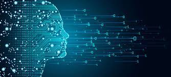

<p align="center">

<h1>
<p align="center">Data science projects</p>
</h1>

```python
import pandas as pd

df = pd.read_csv('projects.csv')
print(df.head())

```


### Guided projects from [DataCamp](https://www.datacamp.com) platform
* SQL
   * [What and Where Are the World's Oldest Businesses](https://github.com/SzymonKwiecinski/DataCamp-projects/blob/main/SQL/What%20and%20Where%20Are%20the%20World's%20Oldest%20Businesses_/notebook.ipynb)
* PYTHON / pandas / numpy / matplotlib / seaborn
   *  [Investigating Netflix Movies and Guest Stars in The Office](https://github.com/SzymonKwiecinski/DataCamp-projects/blob/main/PYTHON/Investigating%20Netflix%20Movies%20and%20Guest%20Stars%20in%20The%20Office/notebook.ipynb)
   *  [The GitHub History of the Scala Language](https://github.com/SzymonKwiecinski/DataCamp-projects/blob/main/PYTHON/The%20GitHub%20History%20of%20the%20Scala%20Language/notebook.ipynb)
   *  [The Android App Market on Google Play](https://github.com/SzymonKwiecinski/DataCamp-projects/blob/main/PYTHON/The%20Android%20App%20Market%20on%20Google%20Play/notebook.ipynb)
   *  [A Visual History of Nobel Prize Winners](https://github.com/SzymonKwiecinski/DataCamp-projects/blob/main/PYTHON/A%20Visual%20History%20of%20Nobel%20Prize%20Winners/notebook.ipynb)
   *  [Dr. Semmelweis and the Discovery of Handwashing](https://github.com/SzymonKwiecinski/DataCamp-projects/blob/main/PYTHON/Dr.%20Semmelweis%20and%20the%20Discovery%20of%20Handwashing/notebook.ipynb)
* PYTHON - Machine Learnig / sklearn
   *  [Predicting Credit Card Approvals](https://github.com/SzymonKwiecinski/DataCamp-projects/blob/main/PYTHON/Predicting%20Credit%20Card%20Approvals/notebook.ipynb)
   *  [Classify Song Genres from Audio Data](https://github.com/SzymonKwiecinski/DataCamp-projects/blob/main/PYTHON/Classify%20Song%20Genres%20from%20Audio%20Data/notebook.ipynb)
* PYTHON - Imagine preprocessing
   *  [Naïve Bees Image Loading and Processing](https://github.com/SzymonKwiecinski/DataCamp-projects/blob/main/PYTHON/DataNaïve%20Bees%20Image%20Loading%20and%20Processing/notebook.ipynb) 
